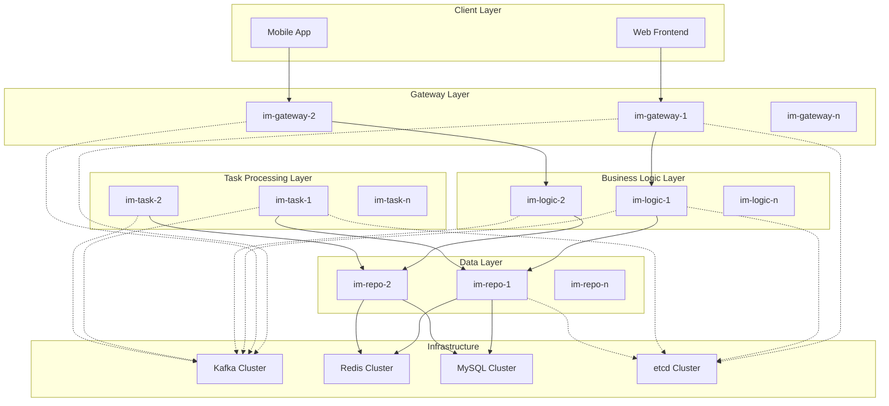

# 设计文档

## 概述

本设计文档概述了 GoChat 后端微服务系统的实现方法。设计遵循既定的架构原则，通过四个核心服务（im-gateway、im-logic、im-task、im-repo）和一个共享基础设施库（im-infra）来实现需求。

系统设计为高可用、可扩展和可维护，使用经过验证的模式，如微服务架构、事件驱动通信和分布式缓存。所有服务都是无状态的且可水平扩展，具有适当的关注点分离和定义良好的接口。

## 架构

### 系统架构图



### 服务通信模式

1. **客户端 ↔ 网关**: HTTP REST API 和 WebSocket 连接
2. **网关 ↔ 逻辑**: 非消息操作的 gRPC 同步调用
3. **网关 → Kafka**: 上游消息的异步消息发布
4. **逻辑 ↔ 仓储**: 数据操作的 gRPC 同步调用
5. **逻辑 → Kafka**: 下游分发和任务调度的异步消息发布
6. **任务 ↔ 仓储**: 数据操作的 gRPC 同步调用
7. **Kafka → 网关**: 下游投递的异步消息消费
8. **Kafka → 逻辑**: 上游处理的异步消息消费
9. **Kafka → 任务**: 后台任务的异步消息消费

## 组件和接口

### im-infra 库

共享基础设施库为所有服务提供通用工具和标准化接口。

#### 核心模块

**数据库模块 (`im-infra/db`)**
```go
type DBManager interface {
    Master() *gorm.DB
    Slave() *gorm.DB
    WithTransaction(ctx context.Context, fn func(*gorm.DB) error) error
    Health(ctx context.Context) error
}

type DBConfig struct {
    Master DBConnectionConfig `yaml:"master"`
    Slaves []DBConnectionConfig `yaml:"slaves"`
    MaxOpenConns int `yaml:"max_open_conns"`
    MaxIdleConns int `yaml:"max_idle_conns"`
    ConnMaxLifetime time.Duration `yaml:"conn_max_lifetime"`
}
```

**缓存模块 (`im-infra/cache`)**
```go
type CacheClient interface {
    Get(ctx context.Context, key string) (string, error)
    Set(ctx context.Context, key, value string, ttl time.Duration) error
    Del(ctx context.Context, keys ...string) error
    Incr(ctx context.Context, key string) (int64, error)
    ZAdd(ctx context.Context, key string, score float64, member string) error
    ZRevRange(ctx context.Context, key string, start, stop int64) ([]string, error)
    Pipeline() Pipeline
}
```

**消息队列模块 (`im-infra/mq`)**
```go
type Producer interface {
    SendMessage(ctx context.Context, topic string, msg *Message) error
    Close() error
}

type Consumer interface {
    Subscribe(topics []string, handler MessageHandler) error
    Start(ctx context.Context) error
    Stop() error
}

type MessageHandler func(ctx context.Context, msg *kafka.Message) error
```

**ID 生成模块 (`im-infra/idgen`)**
```go
type IDGenerator interface {
    NextID() int64
    NextUserID() int64
    NextMessageID() int64
    NextGroupID() int64
}
```

### im-repo 服务

数据仓储服务通过 gRPC 接口提供统一的数据访问。

#### gRPC 服务定义

**用户仓储服务**
```protobuf
service UserRepo {
    rpc CreateUser(CreateUserRequest) returns (CreateUserResponse);
    rpc GetUser(GetUserRequest) returns (GetUserResponse);
    rpc GetUserByUsername(GetUserByUsernameRequest) returns (GetUserResponse);
    rpc UpdateUser(UpdateUserRequest) returns (google.protobuf.Empty);
    rpc GetUserSession(GetUserSessionRequest) returns (GetUserSessionResponse);
    rpc SetUserSession(SetUserSessionRequest) returns (google.protobuf.Empty);
}
```

**消息仓储服务**
```protobuf
service MessageRepo {
    rpc SaveMessage(SaveMessageRequest) returns (google.protobuf.Empty);
    rpc GetMessage(GetMessageRequest) returns (GetMessageResponse);
    rpc GetMessages(GetMessagesRequest) returns (GetMessagesResponse);
    rpc GetConversationMessages(GetConversationMessagesRequest) returns (GetConversationMessagesResponse);
}
```

**群组仓储服务**
```protobuf
service GroupRepo {
    rpc CreateGroup(CreateGroupRequest) returns (CreateGroupResponse);
    rpc GetGroup(GetGroupRequest) returns (GetGroupResponse);
    rpc AddGroupMember(AddGroupMemberRequest) returns (google.protobuf.Empty);
    rpc RemoveGroupMember(RemoveGroupMemberRequest) returns (google.protobuf.Empty);
    rpc GetGroupMembers(GetGroupMembersRequest) returns (GetGroupMembersResponse);
    rpc GetOnlineGroupMembers(GetOnlineGroupMembersRequest) returns (GetOnlineGroupMembersResponse);
}
```

#### 数据访问模式

**Cache-Aside 实现**
```go
func (r *userRepoImpl) GetUser(ctx context.Context, userID int64) (*User, error) {
    // Try cache first
    cacheKey := fmt.Sprintf("user_info:%d", userID)
    if cached, err := r.cache.Get(ctx, cacheKey); err == nil {
        var user User
        if json.Unmarshal([]byte(cached), &user) == nil {
            return &user, nil
        }
    }
    
    // Fallback to database
    var user User
    err := r.db.Slave().WithContext(ctx).First(&user, userID).Error
    if err != nil {
        return nil, err
    }
    
    // Update cache (ignore errors)
    if data, _ := json.Marshal(user); data != nil {
        r.cache.Set(ctx, cacheKey, string(data), 24*time.Hour)
    }
    
    return &user, nil
}
```

### im-logic Service

The business logic service handles core messaging operations and business rules.

#### gRPC Service Definitions

**Authentication Service**
```protobuf
service AuthService {
    rpc Register(RegisterRequest) returns (RegisterResponse);
    rpc Login(LoginRequest) returns (LoginResponse);
    rpc RefreshToken(RefreshTokenRequest) returns (RefreshTokenResponse);
    rpc Logout(LogoutRequest) returns (google.protobuf.Empty);
}
```

**Conversation Service**
```protobuf
service ConversationService {
    rpc GetConversations(GetConversationsRequest) returns (GetConversationsResponse);
    rpc GetConversationMessages(GetConversationMessagesRequest) returns (GetConversationMessagesResponse);
    rpc MarkAsRead(MarkAsReadRequest) returns (google.protobuf.Empty);
    rpc CreateGroup(CreateGroupRequest) returns (CreateGroupResponse);
}
```

#### Message Processing Pipeline

**Upstream Message Processing**
```go
type MessageProcessor struct {
    repo     RepoClient
    cache    CacheClient
    producer Producer
    idgen    IDGenerator
}

func (p *MessageProcessor) ProcessMessage(ctx context.Context, msg *UpstreamMessage) error {
    // 1. Idempotency check
    if duplicate, _ := p.checkDuplicate(ctx, msg.ClientMsgID); duplicate {
        return nil
    }
    
    // 2. Generate IDs
    msg.MessageID = p.idgen.NextMessageID()
    msg.SeqID, _ = p.generateSeqID(ctx, msg.ConversationID)
    
    // 3. Persist message
    if err := p.repo.SaveMessage(ctx, msg); err != nil {
        return fmt.Errorf("failed to persist message: %w", err)
    }
    
    // 4. Distribute message
    return p.distributeMessage(ctx, msg)
}
```

**Message Distribution Strategy**
```go
func (p *MessageProcessor) distributeMessage(ctx context.Context, msg *Message) error {
    switch {
    case strings.HasPrefix(msg.ConversationID, "single_"):
        return p.distributeSingleMessage(ctx, msg)
    case strings.HasPrefix(msg.ConversationID, "group_"):
        return p.distributeGroupMessage(ctx, msg)
    case msg.ConversationID == "world":
        return p.distributeWorldMessage(ctx, msg)
    }
    return nil
}

func (p *MessageProcessor) distributeGroupMessage(ctx context.Context, msg *Message) error {
    groupInfo, err := p.repo.GetGroupInfo(ctx, extractGroupID(msg.ConversationID))
    if err != nil {
        return err
    }
    
    if groupInfo.MemberCount <= 500 {
        // Small group: real-time fanout
        return p.distributeSmallGroup(ctx, msg, groupInfo)
    } else {
        // Large group: async processing
        return p.scheduleLargeGroupTask(ctx, msg, groupInfo)
    }
}
```

### im-gateway Service

The gateway service handles client connections and protocol conversion.

#### HTTP API Endpoints

```go
// REST API routes
router.POST("/api/auth/register", h.Register)
router.POST("/api/auth/login", h.Login)
router.GET("/api/conversations", h.GetConversations)
router.GET("/api/conversations/:id/messages", h.GetMessages)
router.POST("/api/conversations/:id/read", h.MarkAsRead)
router.GET("/ws", h.HandleWebSocket)
```

#### WebSocket Connection Management

**Connection Structure**
```go
type Connection struct {
    conn     *websocket.Conn
    userID   int64
    send     chan []byte
    hub      *Hub
    producer Producer
}

type Hub struct {
    connections map[int64]*Connection
    register    chan *Connection
    unregister  chan *Connection
    mu          sync.RWMutex
}
```

**Message Flow**
```go
func (c *Connection) readPump() {
    for {
        var wsMsg WebSocketMessage
        if err := c.conn.ReadJSON(&wsMsg); err != nil {
            break
        }
        
        switch wsMsg.Type {
        case "send-message":
            c.handleSendMessage(wsMsg)
        case "ping":
            c.handlePing()
        }
    }
}

func (c *Connection) handleSendMessage(wsMsg WebSocketMessage) error {
    // Validate and convert to upstream message
    upstreamMsg := convertToUpstreamMessage(wsMsg, c.userID)
    
    // Send to Kafka
    if err := c.producer.SendMessage(context.Background(), "upstream-messages", upstreamMsg); err != nil {
        return err
    }
    
    // Send immediate acknowledgment
    ack := WebSocketMessage{
        Type: "message-ack",
        Data: map[string]interface{}{
            "tempMessageId": upstreamMsg.ClientMsgID,
            "messageId":     upstreamMsg.ClientMsgID, // Temporary ID
        },
    }
    
    return c.sendMessage(ack)
}
```

### im-task Service

The task processing service handles asynchronous operations.

#### Task Processing Framework

**Task Processor Interface**
```go
type TaskProcessor interface {
    ProcessTask(ctx context.Context, task *Task) error
    TaskType() string
}

type TaskManager struct {
    processors map[string]TaskProcessor
    consumer   Consumer
}

func (tm *TaskManager) RegisterProcessor(processor TaskProcessor) {
    tm.processors[processor.TaskType()] = processor
}
```

**Large Group Fanout Processor**
```go
type LargeGroupFanoutProcessor struct {
    repo     RepoClient
    producer Producer
}

func (p *LargeGroupFanoutProcessor) ProcessTask(ctx context.Context, task *Task) error {
    var fanoutTask LargeGroupFanoutTask
    if err := json.Unmarshal(task.Data, &fanoutTask); err != nil {
        return err
    }
    
    // Get group members in batches
    members, err := p.repo.GetGroupMembers(ctx, fanoutTask.GroupID)
    if err != nil {
        return err
    }
    
    // Get message details
    message, err := p.repo.GetMessage(ctx, fanoutTask.MessageID)
    if err != nil {
        return err
    }
    
    // Distribute to online members
    return p.distributeToMembers(ctx, message, members)
}
```

## Data Models

### Database Schema

**Users Table**
```sql
CREATE TABLE users (
    user_id BIGINT UNSIGNED PRIMARY KEY,
    username VARCHAR(50) UNIQUE NOT NULL,
    email VARCHAR(100) UNIQUE NOT NULL,
    password_hash VARCHAR(255) NOT NULL,
    display_name VARCHAR(100),
    avatar_url VARCHAR(255),
    status ENUM('active', 'inactive', 'banned') DEFAULT 'active',
    created_at TIMESTAMP DEFAULT CURRENT_TIMESTAMP,
    updated_at TIMESTAMP DEFAULT CURRENT_TIMESTAMP ON UPDATE CURRENT_TIMESTAMP,
    
    INDEX idx_username (username),
    INDEX idx_email (email),
    INDEX idx_status (status)
);
```

**Messages Table**
```sql
CREATE TABLE messages (
    message_id BIGINT UNSIGNED PRIMARY KEY,
    conversation_id VARCHAR(64) NOT NULL,
    sender_id BIGINT UNSIGNED NOT NULL,
    content TEXT NOT NULL,
    message_type ENUM('text', 'image', 'file', 'system') DEFAULT 'text',
    seq_id BIGINT UNSIGNED NOT NULL,
    client_msg_id VARCHAR(64) NOT NULL,
    created_at TIMESTAMP DEFAULT CURRENT_TIMESTAMP,
    
    UNIQUE KEY uk_conversation_seq (conversation_id, seq_id),
    INDEX idx_conversation_created (conversation_id, created_at),
    INDEX idx_sender (sender_id),
    INDEX idx_client_msg (client_msg_id)
);
```

**Groups Table**
```sql
CREATE TABLE groups (
    group_id BIGINT UNSIGNED PRIMARY KEY,
    group_name VARCHAR(100) NOT NULL,
    description TEXT,
    owner_id BIGINT UNSIGNED NOT NULL,
    member_count INT DEFAULT 0,
    max_members INT DEFAULT 500,
    group_type ENUM('private', 'public') DEFAULT 'private',
    created_at TIMESTAMP DEFAULT CURRENT_TIMESTAMP,
    updated_at TIMESTAMP DEFAULT CURRENT_TIMESTAMP ON UPDATE CURRENT_TIMESTAMP,
    
    INDEX idx_owner (owner_id),
    INDEX idx_type (group_type)
);
```

### Cache Data Structures

**User Session Cache**
```
Key: user_session:{user_id}
Type: HASH
Fields:
  - gateway_id: string
  - login_at: timestamp
  - last_seen: timestamp
TTL: 30 minutes
```

**Hot Messages Cache**
```
Key: hot_messages:{conversation_id}
Type: ZSET
Score: seq_id
Member: JSON serialized message
TTL: 7 days
Max Size: 300 messages
```

**Conversation Sequence Cache**
```
Key: conv_seq:{conversation_id}
Type: STRING
Value: current sequence number
TTL: None (persistent)
```

## Error Handling

### Error Classification

**Domain Errors**
```go
type ErrorCode int

const (
    ErrCodeInvalidInput ErrorCode = iota + 1000
    ErrCodeUserNotFound
    ErrCodePermissionDenied
    ErrCodeDuplicateMessage
    ErrCodeConversationNotFound
    ErrCodeGroupFull
)

type DomainError struct {
    Code    ErrorCode
    Message string
    Cause   error
}
```

**gRPC Error Mapping**
```go
func mapDomainErrorToGRPC(err error) error {
    if domainErr, ok := err.(*DomainError); ok {
        switch domainErr.Code {
        case ErrCodeInvalidInput:
            return status.Error(codes.InvalidArgument, domainErr.Message)
        case ErrCodeUserNotFound:
            return status.Error(codes.NotFound, domainErr.Message)
        case ErrCodePermissionDenied:
            return status.Error(codes.PermissionDenied, domainErr.Message)
        default:
            return status.Error(codes.Internal, domainErr.Message)
        }
    }
    return status.Error(codes.Internal, "internal server error")
}
```

### Circuit Breaker Implementation

```go
type CircuitBreaker struct {
    maxFailures int
    timeout     time.Duration
    state       CircuitState
    failures    int
    lastFailure time.Time
    mu          sync.RWMutex
}

func (cb *CircuitBreaker) Execute(fn func() error) error {
    if cb.shouldReject() {
        return ErrCircuitOpen
    }
    
    err := fn()
    cb.recordResult(err)
    return err
}
```

## Testing Strategy

### Unit Testing Approach

**Service Layer Testing**
- Mock all external dependencies (database, cache, message queue)
- Use table-driven tests for multiple scenarios
- Test both success and failure paths
- Achieve minimum 80% code coverage

**Repository Layer Testing**
- Use testcontainers for integration testing with real databases
- Test cache consistency and fallback mechanisms
- Verify transaction handling and rollback scenarios

### Integration Testing

**Service Integration Tests**
- Test gRPC service interactions with real dependencies
- Verify message flow through Kafka topics
- Test WebSocket connection handling and message delivery

**End-to-End Testing**
- Deploy all services in test environment
- Test complete user workflows (register, login, send message, receive message)
- Verify system behavior under load and failure conditions

### Performance Testing

**Load Testing Scenarios**
- Concurrent user connections (target: 10,000 WebSocket connections per gateway)
- Message throughput (target: 50,000 messages per second)
- Database query performance under load
- Cache hit ratio optimization (target: >95%)

**Scalability Testing**
- Horizontal scaling of each service
- Kafka partition scaling and consumer group rebalancing
- Database read replica scaling
- Redis cluster scaling