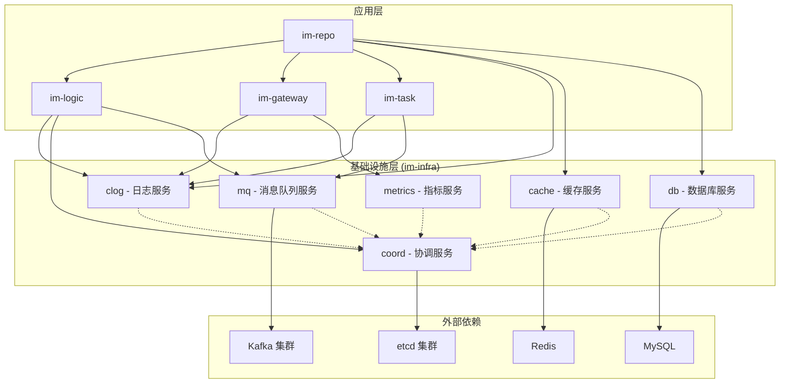
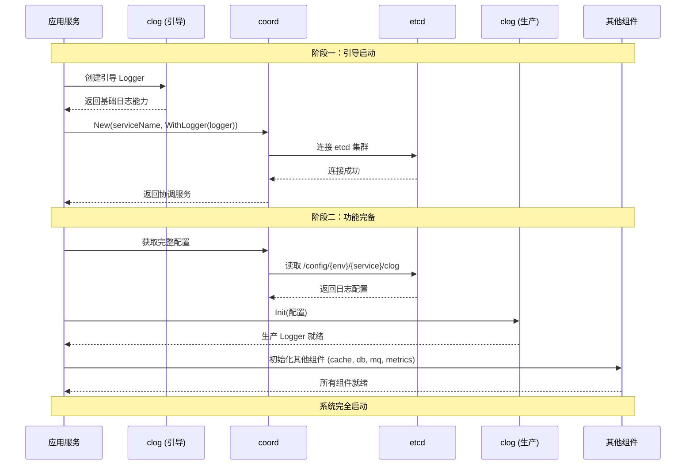
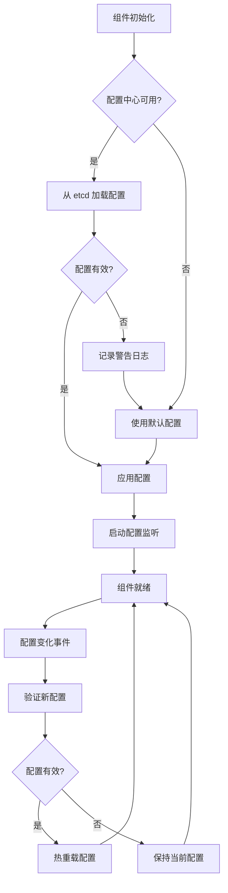

# 基础设施建设设计文档

## 概述

本设计文档基于 gochat 项目的基础设施建设需求，提供了一个完整的技术方案来实现高质量、生产就绪的基础设施系统。设计严格遵循 `im-infra.md` 中定义的核心理念和技术规范。

### 设计目标

1. **统一技术栈**：为所有微服务提供一致的基础设施接口
2. **动态配置管理**：支持从 etcd 动态加载配置，优雅降级到默认配置
3. **面向接口编程**：通过依赖注入实现高内聚、低耦合的架构
4. **生产就绪**：内置监控、日志、错误处理和优雅关闭机制
5. **开发友好**：提供清晰的 API 和完善的文档

### 核心架构原则

- **两阶段初始化**：引导阶段确保基础功能，功能完备阶段提供完整能力
- **依赖注入优先**：所有组件通过 Option 模式接收依赖
- **接口抽象**：业务代码依赖接口而非具体实现
- **配置中心集成**：优先从 etcd 加载配置，失败时优雅降级

## 架构设计

### 整体架构图



### 两阶段初始化流程



## 组件设计

### 1. 基础设施部署重构

#### 1.1 Docker Compose 架构重新设计

**目标**：将基础设施组件与应用服务分离，支持独立的生命周期管理。

**当前问题分析**：
- `build/docker-compose.yml` 混合了基础设施和应用服务
- `build/kafka.yml` 独立存在，缺乏统一管理
- 缺少开发环境的数据持久化配置

**新架构设计**：

```
deployment/
├── infrastructure/
│   ├── docker-compose.yml          # 基础设施主配置
│   ├── etcd.yml                    # etcd 集群配置
│   ├── kafka.yml                   # kafka 集群配置  
│   ├── storage.yml                 # 存储服务配置
│   └── monitoring.yml              # 监控服务配置
├── applications/
│   ├── docker-compose.yml          # 应用服务配置
│   └── services/
│       ├── im-repo.yml
│       ├── im-logic.yml
│       ├── im-gateway.yml
│       └── im-task.yml
└── scripts/
    ├── start-infra.sh              # 启动基础设施脚本
    ├── start-apps.sh               # 启动应用服务脚本
    └── health-check.sh             # 健康检查脚本
```

#### 1.2 网络和存储设计

**网络架构**：
```yaml
networks:
  infra-net:
    driver: bridge
    ipam:
      config:
        - subnet: 172.20.0.0/16
  app-net:
    driver: bridge
    ipam:
      config:
        - subnet: 172.21.0.0/16
  monitoring-net:
    driver: bridge
    ipam:
      config:
        - subnet: 172.22.0.0/16
```

**存储设计**：
```yaml
volumes:
  etcd-data-1:
    driver: local
  etcd-data-2:
    driver: local
  etcd-data-3:
    driver: local
  kafka-data-1:
    driver: local
  kafka-data-2:
    driver: local
  kafka-data-3:
    driver: local
  mysql-data:
    driver: local
  redis-data:
    driver: local
```

### 2. 配置管理重构

#### 2.1 配置中心架构

**配置路径规范**：
```
/config/{env}/{service}/{component}
```

**示例配置路径**：
```
/config/dev/im-repo/cache      # im-repo 服务的缓存配置
/config/dev/im-repo/db         # im-repo 服务的数据库配置
/config/dev/im-logic/mq        # im-logic 服务的消息队列配置
/config/dev/im-gateway/metrics # im-gateway 服务的指标配置
```

#### 2.2 配置管理器设计

```go
// ConfigManager 配置管理器接口
type ConfigManager interface {
    // GetCurrentConfig 获取当前配置（支持动态加载和降级）
    GetCurrentConfig() *Config
    
    // Watch 监听配置变化
    Watch(ctx context.Context) <-chan ConfigChangeEvent
    
    // Reload 重新加载配置
    Reload(ctx context.Context) error
}

// ConfigChangeEvent 配置变化事件
type ConfigChangeEvent struct {
    Key       string
    OldValue  interface{}
    NewValue  interface{}
    Timestamp time.Time
}
```

#### 2.3 配置加载流程



### 3. 基础组件实现和集成

#### 3.1 组件分类和设计模式

基于 `im-infra.md` 的三种原型，各组件的设计模式如下：

| 组件 | 原型 | 设计特点 |
|------|------|----------|
| clog | 全局单例工具型 | 包级别函数 + 两阶段初始化 |
| coord | 有状态服务型 | 长期运行 + 生命周期管理 |
| cache | 客户端包装型 | Redis 客户端包装 + 钩子集成 |
| db | 客户端包装型 | GORM 包装 + 钩子集成 |
| mq | 有状态服务型 | Kafka 客户端管理 + 连接池 |
| metrics | 有状态服务型 | OpenTelemetry + Prometheus |

#### 3.2 依赖注入设计

**Option 模式实现**：
```go
// Option 定义组件选项函数类型
type Option func(*options)

// options 内部选项结构
type options struct {
    logger   clog.Logger
    metrics  metrics.Provider
    // 其他依赖...
}

// WithLogger 注入日志器
func WithLogger(logger clog.Logger) Option {
    return func(o *options) {
        o.logger = logger
    }
}

// WithMetrics 注入指标提供者
func WithMetrics(provider metrics.Provider) Option {
    return func(o *options) {
        o.metrics = provider
    }
}

// New 组件构造函数
func New(cfg Config, opts ...Option) (Interface, error) {
    // 应用选项
    options := &options{}
    for _, opt := range opts {
        opt(options)
    }
    
    // 使用注入的依赖创建组件
    // ...
}
```

#### 3.3 接口设计规范

**缓存组件接口**：
```go
type Cache interface {
    // 基础操作
    Get(ctx context.Context, key string) (string, error)
    Set(ctx context.Context, key string, value any, expiration time.Duration) error
    Del(ctx context.Context, keys ...string) error
    
    // 高级操作
    HGet(ctx context.Context, key, field string) (string, error)
    HSet(ctx context.Context, key, field string, value any) error
    SAdd(ctx context.Context, key string, members ...any) error
    
    // 分布式锁
    Lock(ctx context.Context, key string, expiration time.Duration) (Lock, error)
    
    // 连接管理
    Ping(ctx context.Context) error
    Close() error
}
```

**数据库组件接口**：
```go
type DB interface {
    // GORM 访问
    GetDB() *gorm.DB
    WithContext(ctx context.Context) *gorm.DB
    
    // 事务管理
    Transaction(fn func(tx *gorm.DB) error) error
    
    // 迁移管理
    AutoMigrate(dst ...any) error
    
    // 连接管理
    Ping(ctx context.Context) error
    Close() error
    Stats() sql.DBStats
}
```

### 4. 现有代码重构和现代化

#### 4.1 缓存管理器重构

**当前问题**：
- 使用 `interface{}` 而非 `any`
- 缺少依赖注入支持
- 硬编码了配置获取方式

**重构方案**：
```go
// 重构后的 CacheManager
type CacheManager struct {
    cache  cache.Cache
    logger clog.Logger
    config *config.Config
}

// NewCacheManager 支持依赖注入的构造函数
func NewCacheManager(cfg *config.Config, opts ...Option) (*CacheManager, error) {
    options := &options{
        logger: clog.Module("cache-manager"), // 默认日志器
    }
    
    // 应用选项
    for _, opt := range opts {
        opt(options)
    }
    
    // 创建缓存实例，注入依赖
    cacheClient, err := cache.New(cfg.Cache, 
        cache.WithLogger(options.logger),
        cache.WithMetrics(options.metrics))
    if err != nil {
        return nil, fmt.Errorf("创建缓存连接失败: %w", err)
    }
    
    return &CacheManager{
        cache:  cacheClient,
        logger: options.logger,
        config: cfg,
    }, nil
}
```

#### 4.2 数据库管理器重构

**重构重点**：
- 添加依赖注入支持
- 实现接口抽象
- 支持配置中心集成

```go
// 重构后的 Database
type Database struct {
    db     db.DB
    logger clog.Logger
    config *config.Config
}

// NewDatabase 支持依赖注入的构造函数
func NewDatabase(cfg *config.Config, opts ...Option) (*Database, error) {
    options := &options{
        logger: clog.Module("database"), // 默认日志器
    }
    
    // 应用选项
    for _, opt := range opts {
        opt(options)
    }
    
    // 创建数据库实例，注入依赖
    database, err := db.New(cfg.Database,
        db.WithLogger(options.logger),
        db.WithMetrics(options.metrics))
    if err != nil {
        return nil, fmt.Errorf("创建数据库连接失败: %w", err)
    }
    
    return &Database{
        db:     database,
        logger: options.logger,
        config: cfg,
    }, nil
}
```

### 5. 开发环境集成和验证

#### 5.1 健康检查设计

**健康检查接口**：
```go
type HealthChecker interface {
    // Check 执行健康检查
    Check(ctx context.Context) HealthStatus
    
    // Name 返回检查器名称
    Name() string
}

type HealthStatus struct {
    Status  string                 `json:"status"`  // "healthy", "unhealthy", "degraded"
    Message string                 `json:"message"`
    Details map[string]interface{} `json:"details,omitempty"`
}
```

**健康检查聚合器**：
```go
type HealthAggregator struct {
    checkers []HealthChecker
    logger   clog.Logger
}

func (h *HealthAggregator) CheckAll(ctx context.Context) map[string]HealthStatus {
    results := make(map[string]HealthStatus)
    
    for _, checker := range h.checkers {
        status := checker.Check(ctx)
        results[checker.Name()] = status
    }
    
    return results
}
```

#### 5.2 集成测试框架

**测试配置**：
```go
// TestConfig 测试环境配置
type TestConfig struct {
    UseEmbeddedComponents bool // 是否使用嵌入式组件（如内存 Redis）
    ConfigCenterEnabled   bool // 是否启用配置中心
    LogLevel             string
}

// TestSuite 集成测试套件
type TestSuite struct {
    coordinator coord.Provider
    cache       cache.Cache
    db          db.DB
    mq          mq.MQ
    metrics     metrics.Provider
    logger      clog.Logger
}
```

**测试场景设计**：
1. **基础设施启动测试**：验证所有组件能够正常启动
2. **配置管理测试**：验证动态配置加载和降级机制
3. **依赖注入测试**：验证组件间的依赖关系
4. **两阶段初始化测试**：验证启动流程的正确性
5. **故障恢复测试**：验证组件的容错能力

## 数据模型

### 配置数据模型

```go
// BaseConfig 基础配置结构
type BaseConfig struct {
    Environment string `json:"environment" yaml:"environment"`
    Service     string `json:"service" yaml:"service"`
    Component   string `json:"component" yaml:"component"`
    Version     string `json:"version" yaml:"version"`
    UpdatedAt   int64  `json:"updated_at" yaml:"updated_at"`
}

// CacheConfig 缓存配置
type CacheConfig struct {
    BaseConfig `json:",inline" yaml:",inline"`
    Addr       string        `json:"addr" yaml:"addr"`
    Password   string        `json:"password" yaml:"password"`
    DB         int           `json:"db" yaml:"db"`
    PoolSize   int           `json:"poolSize" yaml:"poolSize"`
    Timeout    time.Duration `json:"timeout" yaml:"timeout"`
    // ... 其他配置字段
}

// DatabaseConfig 数据库配置
type DatabaseConfig struct {
    BaseConfig      `json:",inline" yaml:",inline"`
    DSN             string        `json:"dsn" yaml:"dsn"`
    Driver          string        `json:"driver" yaml:"driver"`
    MaxOpenConns    int           `json:"maxOpenConns" yaml:"maxOpenConns"`
    MaxIdleConns    int           `json:"maxIdleConns" yaml:"maxIdleConns"`
    ConnMaxLifetime time.Duration `json:"connMaxLifetime" yaml:"connMaxLifetime"`
    // ... 其他配置字段
}
```

### 监控数据模型

```go
// MetricData 指标数据
type MetricData struct {
    Name      string            `json:"name"`
    Type      string            `json:"type"` // counter, gauge, histogram
    Value     float64           `json:"value"`
    Labels    map[string]string `json:"labels"`
    Timestamp int64             `json:"timestamp"`
}

// HealthData 健康状态数据
type HealthData struct {
    Component string                 `json:"component"`
    Status    string                 `json:"status"`
    Message   string                 `json:"message"`
    Details   map[string]interface{} `json:"details"`
    Timestamp int64                  `json:"timestamp"`
}
```

## 错误处理

### 错误分类和处理策略

```go
// ErrorType 错误类型
type ErrorType string

const (
    ErrorTypeConfig      ErrorType = "CONFIG"      // 配置错误
    ErrorTypeConnection  ErrorType = "CONNECTION"  // 连接错误
    ErrorTypeTimeout     ErrorType = "TIMEOUT"     // 超时错误
    ErrorTypeValidation  ErrorType = "VALIDATION"  // 验证错误
    ErrorTypeInternal    ErrorType = "INTERNAL"    // 内部错误
)

// InfraError 基础设施错误
type InfraError struct {
    Type      ErrorType `json:"type"`
    Component string    `json:"component"`
    Message   string    `json:"message"`
    Cause     error     `json:"cause,omitempty"`
    Timestamp int64     `json:"timestamp"`
}

func (e *InfraError) Error() string {
    return fmt.Sprintf("[%s:%s] %s", e.Type, e.Component, e.Message)
}

// NewInfraError 创建基础设施错误
func NewInfraError(errType ErrorType, component, message string, cause error) *InfraError {
    return &InfraError{
        Type:      errType,
        Component: component,
        Message:   message,
        Cause:     cause,
        Timestamp: time.Now().Unix(),
    }
}
```

### 错误处理中间件

```go
// ErrorHandler 错误处理器
type ErrorHandler interface {
    Handle(ctx context.Context, err error) error
}

// DefaultErrorHandler 默认错误处理器
type DefaultErrorHandler struct {
    logger  clog.Logger
    metrics metrics.Provider
}

func (h *DefaultErrorHandler) Handle(ctx context.Context, err error) error {
    // 记录错误日志
    h.logger.Error("基础设施错误", clog.Err(err))
    
    // 记录错误指标
    if infraErr, ok := err.(*InfraError); ok {
        h.metrics.Inc("infra_errors_total",
            attribute.String("type", string(infraErr.Type)),
            attribute.String("component", infraErr.Component))
    }
    
    return err
}
```

## 测试策略

### 单元测试

**测试覆盖范围**：
- 所有公共 API 的功能测试
- 配置加载和验证逻辑
- 错误处理和边界条件
- 依赖注入机制

**测试工具**：
- Go 标准测试框架
- testify 断言库
- gomock 模拟框架

### 集成测试

**测试环境**：
- Docker Compose 测试环境
- 嵌入式组件（如 miniredis）
- 测试数据库

**测试场景**：
- 完整的两阶段初始化流程
- 配置中心故障和恢复
- 组件间通信和数据流
- 性能和压力测试

### 端到端测试

**测试流程**：
1. 启动完整的基础设施环境
2. 部署测试应用服务
3. 执行业务场景测试
4. 验证监控和日志数据
5. 清理测试环境

## 性能考虑

### 连接池优化

**数据库连接池**：
- 最大连接数：25（开发环境）
- 最大空闲连接数：10
- 连接最大生命周期：1小时
- 连接最大空闲时间：30分钟

**Redis 连接池**：
- 池大小：10（开发环境）
- 最小空闲连接数：5
- 最大空闲连接数：10
- 连接超时：5秒

### 缓存策略

**多级缓存**：
1. 本地缓存（内存）：热点数据，TTL 5分钟
2. Redis 缓存：常用数据，TTL 1小时
3. 数据库：持久化数据

**缓存更新策略**：
- Write-Through：写入时同步更新缓存
- Cache-Aside：读取时检查缓存，未命中时从数据库加载

### 监控和告警

**关键指标**：
- 连接池使用率
- 请求延迟分布
- 错误率和成功率
- 资源使用情况（CPU、内存、网络）

**告警规则**：
- 连接池使用率 > 80%
- 平均响应时间 > 200ms
- 错误率 > 1%
- 组件健康检查失败

## 安全考虑

### 配置安全

**敏感信息处理**：
- 数据库密码加密存储
- Redis 密码环境变量注入
- etcd 认证和授权

**配置访问控制**：
- 基于角色的访问控制（RBAC）
- 配置变更审计日志
- 敏感配置脱敏显示

### 网络安全

**网络隔离**：
- 基础设施网络与应用网络分离
- 监控网络独立部署
- 防火墙规则限制访问

**传输加密**：
- etcd 客户端 TLS 加密
- Redis 连接加密（生产环境）
- 内部服务间 mTLS

## 部署和运维

### 部署流程

**基础设施部署**：
1. 执行 `scripts/start-infra.sh`
2. 等待所有组件健康检查通过
3. 使用 config-cli 初始化配置
4. 验证配置中心连通性

**应用服务部署**：
1. 确保基础设施就绪
2. 执行 `scripts/start-apps.sh`
3. 验证服务注册和发现
4. 执行端到端健康检查

### 运维工具

**配置管理**：
```bash
# 初始化开发环境配置
./config-cli init --env dev --service im-repo

# 批量导入配置
./config-cli import --path config/dev

# 监听配置变化
./config-cli watch --key /config/dev/im-repo
```

**健康检查**：
```bash
# 检查基础设施状态
./scripts/health-check.sh --component infra

# 检查应用服务状态
./scripts/health-check.sh --component apps

# 生成健康报告
./scripts/health-check.sh --report
```

### 故障排除

**常见问题和解决方案**：

1. **etcd 连接失败**
   - 检查网络连通性
   - 验证认证信息
   - 查看 etcd 集群状态

2. **配置加载失败**
   - 检查配置路径格式
   - 验证配置内容格式
   - 查看降级日志

3. **组件初始化失败**
   - 检查依赖服务状态
   - 验证配置参数
   - 查看详细错误日志

**日志分析**：
- 结构化日志便于查询和分析
- 关键操作包含 TraceID
- 错误日志包含完整的调用栈

这个设计文档提供了完整的技术方案，涵盖了架构设计、组件实现、数据模型、错误处理、测试策略、性能优化、安全考虑和部署运维等各个方面，确保基础设施建设的高质量实施。