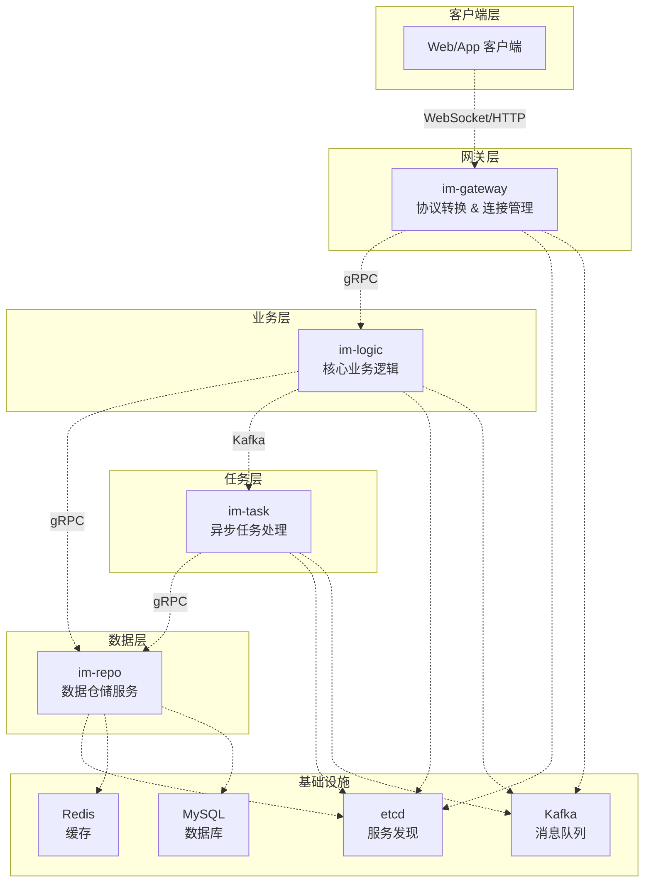

# 微服务架构设计文档

## 概述

本文档基于 IDD（接口驱动设计）原则，详细设计 GoChat 即时通讯系统的四个核心微服务架构。设计重点关注服务间接口定义、数据流转、技术选型和可扩展性，为后续的代码实现提供清晰的指导。

## 架构设计

### 整体架构图



## 组件和接口

### 1. im-gateway 网关服务

#### 1.1 服务职责
- **协议转换**：HTTP/WebSocket ↔ gRPC/Kafka
- **连接管理**：维护客户端 WebSocket 长连接
- **身份认证**：JWT Token 验证
- **消息路由**：上行消息投递到 Kafka，下行消息推送给客户端

#### 1.2 技术栈
- **HTTP 框架**：Gin
- **WebSocket**：gorilla/websocket
- **gRPC 客户端**：调用 im-logic 服务
- **Kafka 客户端**：im-infra/mq
- **服务发现**：im-infra/coord

#### 1.3 核心接口设计

##### 1.3.1 HTTP API 接口
```go
// HTTP 路由定义
type HTTPRoutes struct {
    // 用户认证相关
    POST   /api/v1/auth/login
    POST   /api/v1/auth/register
    POST   /api/v1/auth/refresh
    DELETE /api/v1/auth/logout

    // 会话管理
    GET    /api/v1/conversations
    GET    /api/v1/conversations/:id/messages
    POST   /api/v1/conversations/:id/read

    // 群组管理
    POST   /api/v1/groups
    GET    /api/v1/groups/:id
    POST   /api/v1/groups/:id/members
    DELETE /api/v1/groups/:id/members/:userId

    // WebSocket 升级
    GET    /ws
}
```

##### 1.3.2 WebSocket 消息协议
```go
// WebSocket 消息类型
type WSMessageType string

const (
    WSMsgTypeSendMessage    WSMessageType = "send-message"
    WSMsgTypeNewMessage     WSMessageType = "new-message"
    WSMsgTypeMessageAck     WSMessageType = "message-ack"
    WSMsgTypePing          WSMessageType = "ping"
    WSMsgTypePong          WSMessageType = "pong"
    WSMsgTypeOnlineStatus  WSMessageType = "online-status"
)

// WebSocket 消息结构
type WSMessage struct {
    Type      WSMessageType   `json:"type"`
    MessageID string         `json:"message_id,omitempty"`
    Data      json.RawMessage `json:"data"`
    Timestamp int64          `json:"timestamp"`
}

// 发送消息数据结构
type SendMessageData struct {
    ConversationID string `json:"conversation_id"`
    MessageType    int    `json:"message_type"`
    Content        string `json:"content"`
    ClientMsgID    string `json:"client_msg_id"`
}

// 新消息数据结构
type NewMessageData struct {
    MessageID      string `json:"message_id"`
    ConversationID string `json:"conversation_id"`
    SenderID       string `json:"sender_id"`
    MessageType    int    `json:"message_type"`
    Content        string `json:"content"`
    SeqID          int64  `json:"seq_id"`
    Timestamp      int64  `json:"timestamp"`
}
```

##### 1.3.3 Kafka 消息协议
```go
// Kafka 上行消息 Topic: im-upstream-topic
type UpstreamMessage struct {
    TraceID        string            `json:"trace_id"`
    UserID         string            `json:"user_id"`
    GatewayID      string            `json:"gateway_id"`
    ConversationID string            `json:"conversation_id"`
    MessageType    int               `json:"message_type"`
    Content        string            `json:"content"`
    ClientMsgID    string            `json:"client_msg_id"`
    Timestamp      int64             `json:"timestamp"`
    Headers        map[string]string `json:"headers"`
}

// Kafka 下行消息 Topic: im-downstream-topic-{gateway_id}
type DownstreamMessage struct {
    TraceID        string            `json:"trace_id"`
    TargetUserID   string            `json:"target_user_id"`
    MessageID      string            `json:"message_id"`
    ConversationID string            `json:"conversation_id"`
    SenderID       string            `json:"sender_id"`
    MessageType    int               `json:"message_type"`
    Content        string            `json:"content"`
    SeqID          int64             `json:"seq_id"`
    Timestamp      int64             `json:"timestamp"`
    Headers        map[string]string `json:"headers"`
}
```

### 2. im-logic 业务逻辑服务

#### 2.1 服务职责
- **业务编排**：协调各种业务流程
- **消息处理**：处理消息发送、接收、存储逻辑
- **会话管理**：管理单聊、群聊、世界聊天室
- **消息分发**：根据策略进行实时或异步消息分发

#### 2.2 gRPC 服务接口定义

```protobuf
// im_logic.proto
syntax = "proto3";

package im.logic.v1;

option go_package = "github.com/ceyewan/gochat/im-logic/api/v1";

// 用户认证服务
service AuthService {
  // 用户登录
  rpc Login(LoginRequest) returns (LoginResponse);
  // 用户注册
  rpc Register(RegisterRequest) returns (RegisterResponse);
  // 刷新令牌
  rpc RefreshToken(RefreshTokenRequest) returns (RefreshTokenResponse);
  // 用户登出
  rpc Logout(LogoutRequest) returns (LogoutResponse);
}

// 会话管理服务
service ConversationService {
  // 获取会话列表
  rpc GetConversations(GetConversationsRequest) returns (GetConversationsResponse);
  // 获取会话详情
  rpc GetConversation(GetConversationRequest) returns (GetConversationResponse);
  // 获取历史消息
  rpc GetMessages(GetMessagesRequest) returns (GetMessagesResponse);
  // 标记消息已读
  rpc MarkAsRead(MarkAsReadRequest) returns (MarkAsReadResponse);
}

// 群组管理服务
service GroupService {
  // 创建群组
  rpc CreateGroup(CreateGroupRequest) returns (CreateGroupResponse);
  // 获取群组信息
  rpc GetGroup(GetGroupRequest) returns (GetGroupResponse);
  // 加入群组
  rpc JoinGroup(JoinGroupRequest) returns (JoinGroupResponse);
  // 离开群组
  rpc LeaveGroup(LeaveGroupRequest) returns (LeaveGroupResponse);
  // 获取群组成员
  rpc GetGroupMembers(GetGroupMembersRequest) returns (GetGroupMembersResponse);
}

// 消息类型定义
enum MessageType {
  MESSAGE_TYPE_UNSPECIFIED = 0;
  MESSAGE_TYPE_TEXT = 1;
  MESSAGE_TYPE_IMAGE = 2;
  MESSAGE_TYPE_FILE = 3;
  MESSAGE_TYPE_SYSTEM = 4;
}

// 会话类型定义
enum ConversationType {
  CONVERSATION_TYPE_UNSPECIFIED = 0;
  CONVERSATION_TYPE_SINGLE = 1;      // 单聊
  CONVERSATION_TYPE_GROUP = 2;       // 群聊
  CONVERSATION_TYPE_WORLD = 3;       // 世界聊天室
}

// 登录请求
message LoginRequest {
  string username = 1;
  string password = 2;
}

// 登录响应
message LoginResponse {
  string access_token = 1;
  string refresh_token = 2;
  int64 expires_in = 3;
  User user = 4;
}

// 用户信息
message User {
  string id = 1;
  string username = 2;
  string nickname = 3;
  string avatar_url = 4;
  int64 created_at = 5;
}

// 获取会话列表请求
message GetConversationsRequest {
  string user_id = 1;
  int32 page = 2;
  int32 page_size = 3;
}

// 会话信息
message Conversation {
  string id = 1;
  ConversationType type = 2;
  string name = 3;
  string avatar_url = 4;
  Message last_message = 5;
  int64 unread_count = 6;
  int64 updated_at = 7;
}

// 消息信息
message Message {
  string id = 1;
  string conversation_id = 2;
  string sender_id = 3;
  MessageType type = 4;
  string content = 5;
  int64 seq_id = 6;
  int64 created_at = 7;
  User sender = 8;
}
```

#### 2.3 Kafka 消息处理

```go
// 消息处理器接口
type MessageProcessor interface {
    ProcessUpstreamMessage(ctx context.Context, msg *UpstreamMessage) error
}

// 消息分发策略
type MessageDistributionStrategy interface {
    ShouldDistributeAsync(conversationType ConversationType, memberCount int) bool
}

// 默认分发策略：群组成员超过500人时异步处理
type DefaultDistributionStrategy struct{}

func (s *DefaultDistributionStrategy) ShouldDistributeAsync(
    conversationType ConversationType, 
    memberCount int,
) bool {
    return conversationType == ConversationType_GROUP && memberCount > 500
}
```

### 3. im-repo 数据仓储服务

#### 3.1 服务职责
- **数据访问统一入口**：封装所有 MySQL 和 Redis 操作
- **缓存策略实现**：Cache-Aside 模式
- **数据一致性保证**：更新数据库 + 删除缓存策略
- **连接池管理**：数据库和 Redis 连接池优化

#### 3.2 gRPC 服务接口定义

```protobuf
// im_repo.proto
syntax = "proto3";

package im.repo.v1;

option go_package = "github.com/ceyewan/gochat/im-repo/api/v1";

// 用户数据服务
service UserService {
  // 创建用户
  rpc CreateUser(CreateUserRequest) returns (CreateUserResponse);
  // 获取用户信息
  rpc GetUser(GetUserRequest) returns (GetUserResponse);
  // 批量获取用户信息
  rpc GetUsers(GetUsersRequest) returns (GetUsersResponse);
  // 更新用户信息
  rpc UpdateUser(UpdateUserRequest) returns (UpdateUserResponse);
  // 验证用户密码
  rpc VerifyPassword(VerifyPasswordRequest) returns (VerifyPasswordResponse);
}

// 消息数据服务
service MessageService {
  // 保存消息
  rpc SaveMessage(SaveMessageRequest) returns (SaveMessageResponse);
  // 获取消息
  rpc GetMessage(GetMessageRequest) returns (GetMessageResponse);
  // 获取会话消息列表
  rpc GetConversationMessages(GetConversationMessagesRequest) returns (GetConversationMessagesResponse);
  // 生成序列号
  rpc GenerateSeqID(GenerateSeqIDRequest) returns (GenerateSeqIDResponse);
  // 检查消息幂等性
  rpc CheckMessageIdempotency(CheckMessageIdempotencyRequest) returns (CheckMessageIdempotencyResponse);
}

// 群组数据服务
service GroupService {
  // 创建群组
  rpc CreateGroup(CreateGroupRequest) returns (CreateGroupResponse);
  // 获取群组信息
  rpc GetGroup(GetGroupRequest) returns (GetGroupResponse);
  // 添加群组成员
  rpc AddGroupMember(AddGroupMemberRequest) returns (AddGroupMemberResponse);
  // 移除群组成员
  rpc RemoveGroupMember(RemoveGroupMemberRequest) returns (RemoveGroupMemberResponse);
  // 获取群组成员列表
  rpc GetGroupMembers(GetGroupMembersRequest) returns (GetGroupMembersResponse);
  // 批量获取群组成员在线状态
  rpc GetMembersOnlineStatus(GetMembersOnlineStatusRequest) returns (GetMembersOnlineStatusResponse);
}

// 会话数据服务
service ConversationService {
  // 获取用户会话列表
  rpc GetUserConversations(GetUserConversationsRequest) returns (GetUserConversationsResponse);
  // 更新已读位置
  rpc UpdateReadPointer(UpdateReadPointerRequest) returns (UpdateReadPointerResponse);
  // 获取未读消息数
  rpc GetUnreadCount(GetUnreadCountRequest) returns (GetUnreadCountResponse);
}

// 在线状态服务
service OnlineStatusService {
  // 设置用户在线状态
  rpc SetUserOnline(SetUserOnlineRequest) returns (SetUserOnlineResponse);
  // 设置用户离线状态
  rpc SetUserOffline(SetUserOfflineRequest) returns (SetUserOfflineResponse);
  // 获取用户在线状态
  rpc GetUserOnlineStatus(GetUserOnlineStatusRequest) returns (GetUserOnlineStatusResponse);
  // 批量获取用户在线状态
  rpc GetUsersOnlineStatus(GetUsersOnlineStatusRequest) returns (GetUsersOnlineStatusResponse);
}

// 保存消息请求
message SaveMessageRequest {
  string message_id = 1;
  string conversation_id = 2;
  string sender_id = 3;
  int32 message_type = 4;
  string content = 5;
  int64 seq_id = 6;
  string client_msg_id = 7;
}

// 在线状态信息
message OnlineStatus {
  string user_id = 1;
  bool is_online = 2;
  string gateway_id = 3;
  int64 last_seen = 4;
}
```

#### 3.3 数据模型设计

```go
// 数据库表结构定义
type User struct {
    ID           uint64    `gorm:"primaryKey;column:id" json:"id"`
    Username     string    `gorm:"uniqueIndex;size:50;not null;column:username" json:"username"`
    PasswordHash string    `gorm:"size:255;not null;column:password_hash" json:"-"`
    Nickname     string    `gorm:"size:50;column:nickname" json:"nickname"`
    AvatarURL    string    `gorm:"size:255;column:avatar_url" json:"avatar_url"`
    CreatedAt    time.Time `gorm:"column:created_at" json:"created_at"`
    UpdatedAt    time.Time `gorm:"column:updated_at" json:"updated_at"`
}

type Group struct {
    ID          uint64    `gorm:"primaryKey;column:id" json:"id"`
    Name        string    `gorm:"size:50;not null;column:name" json:"name"`
    OwnerID     uint64    `gorm:"index;not null;column:owner_id" json:"owner_id"`
    MemberCount int       `gorm:"not null;default:0;column:member_count" json:"member_count"`
    CreatedAt   time.Time `gorm:"column:created_at" json:"created_at"`
    UpdatedAt   time.Time `gorm:"column:updated_at" json:"updated_at"`
}

type GroupMember struct {
    ID       uint64    `gorm:"primaryKey;column:id" json:"id"`
    GroupID  uint64    `gorm:"uniqueIndex:idx_group_user;column:group_id" json:"group_id"`
    UserID   uint64    `gorm:"uniqueIndex:idx_group_user;index;column:user_id" json:"user_id"`
    Role     int       `gorm:"not null;default:1;column:role" json:"role"` // 1:成员, 2:管理员
    JoinedAt time.Time `gorm:"column:joined_at" json:"joined_at"`
}

type Message struct {
    ID             uint64    `gorm:"primaryKey;column:id" json:"id"`
    ConversationID string    `gorm:"uniqueIndex:idx_conv_seq;index:idx_conv_time;size:64;column:conversation_id" json:"conversation_id"`
    SenderID       uint64    `gorm:"not null;column:sender_id" json:"sender_id"`
    MessageType    int       `gorm:"not null;default:1;column:message_type" json:"message_type"`
    Content        string    `gorm:"type:text;not null;column:content" json:"content"`
    SeqID          uint64    `gorm:"uniqueIndex:idx_conv_seq;not null;column:seq_id" json:"seq_id"`
    CreatedAt      time.Time `gorm:"index:idx_conv_time;column:created_at" json:"created_at"`
}

type UserReadPointer struct {
    ID             uint64    `gorm:"primaryKey;column:id" json:"id"`
    UserID         uint64    `gorm:"uniqueIndex:idx_user_conv;column:user_id" json:"user_id"`
    ConversationID string    `gorm:"uniqueIndex:idx_user_conv;size:64;column:conversation_id" json:"conversation_id"`
    LastReadSeqID  uint64    `gorm:"not null;column:last_read_seq_id" json:"last_read_seq_id"`
    UpdatedAt      time.Time `gorm:"column:updated_at" json:"updated_at"`
}
```

#### 3.4 缓存策略设计

```go
// Redis 缓存键定义
const (
    // 用户信息缓存 - HASH
    UserInfoKey = "user_info:%s"
    
    // 用户在线状态 - HASH
    UserSessionKey = "user_session:%s"
    
    // 会话序列号 - STRING
    ConvSeqKey = "conv_seq:%s"
    
    // 群组成员列表 - SET
    GroupMembersKey = "group_members:%s"
    
    // 消息去重 - STRING with TTL
    MsgDedupKey = "msg_dedup:%s"
    
    // 热点消息缓存 - ZSET
    HotMessagesKey = "hot_messages:%s"
    
    // 未读消息数 - STRING
    UnreadCountKey = "unread:%s:%s"
)

// 缓存操作接口
type CacheManager interface {
    // 用户信息缓存
    GetUserInfo(ctx context.Context, userID string) (*User, error)
    SetUserInfo(ctx context.Context, user *User) error
    DelUserInfo(ctx context.Context, userID string) error
    
    // 在线状态管理
    SetUserOnline(ctx context.Context, userID, gatewayID string) error
    SetUserOffline(ctx context.Context, userID string) error
    GetUserOnlineStatus(ctx context.Context, userID string) (*OnlineStatus, error)
    
    // 序列号生成
    GenerateSeqID(ctx context.Context, conversationID string) (uint64, error)
    
    // 消息去重
    CheckAndSetMessageDedup(ctx context.Context, clientMsgID string, ttl time.Duration) (bool, error)
}
```

### 4. im-task 异步任务服务

#### 4.1 服务职责
- **异步任务处理**：处理重负载、非实时任务
- **大群消息扩散**：超大群消息的异步分发
- **外部服务集成**：推送服务、内容审核等
- **数据索引**：Elasticsearch 数据同步

#### 4.2 任务分发器设计

```go
// 任务类型定义
type TaskType string

const (
    TaskTypeFanout     TaskType = "fanout"      // 大群消息扩散
    TaskTypePush       TaskType = "push"        // 离线推送
    TaskTypeAudit      TaskType = "audit"       // 内容审核
    TaskTypeIndex      TaskType = "index"       // 数据索引
    TaskTypeRecommend  TaskType = "recommend"   // 推荐更新
)

// Kafka 任务消息结构 Topic: im-task-topic
type TaskMessage struct {
    TraceID   string            `json:"trace_id"`
    TaskType  TaskType          `json:"task_type"`
    TaskID    string            `json:"task_id"`
    Data      json.RawMessage   `json:"data"`
    Headers   map[string]string `json:"headers"`
    CreatedAt int64             `json:"created_at"`
}

// 任务处理器接口
type TaskProcessor interface {
    Process(ctx context.Context, task *TaskMessage) error
    GetTaskType() TaskType
}

// 任务分发器
type TaskDispatcher struct {
    processors map[TaskType]TaskProcessor
    logger     clog.Logger
}

func (d *TaskDispatcher) Register(taskType TaskType, processor TaskProcessor) {
    d.processors[taskType] = processor
}

func (d *TaskDispatcher) Dispatch(ctx context.Context, task *TaskMessage) error {
    processor, exists := d.processors[task.TaskType]
    if !exists {
        return fmt.Errorf("未找到任务类型 %s 的处理器", task.TaskType)
    }
    return processor.Process(ctx, task)
}
```

#### 4.3 具体任务处理器

```go
// 大群消息扩散任务数据
type FanoutTaskData struct {
    GroupID   string `json:"group_id"`
    MessageID string `json:"message_id"`
}

// 大群消息扩散处理器
type FanoutProcessor struct {
    repoClient repo.GroupServiceClient
    mqProducer mq.Producer
    logger     clog.Logger
}

func (p *FanoutProcessor) Process(ctx context.Context, task *TaskMessage) error {
    var data FanoutTaskData
    if err := json.Unmarshal(task.Data, &data); err != nil {
        return fmt.Errorf("解析扩散任务数据失败: %w", err)
    }

    // 分批获取群组成员
    batchSize := 200
    offset := 0
    
    for {
        // 获取一批成员
        resp, err := p.repoClient.GetGroupMembers(ctx, &repo.GetGroupMembersRequest{
            GroupId: data.GroupID,
            Offset:  int32(offset),
            Limit:   int32(batchSize),
        })
        if err != nil {
            return fmt.Errorf("获取群组成员失败: %w", err)
        }
        
        if len(resp.Members) == 0 {
            break
        }
        
        // 批量查询在线状态
        userIDs := make([]string, len(resp.Members))
        for i, member := range resp.Members {
            userIDs[i] = member.UserId
        }
        
        statusResp, err := p.repoClient.GetUsersOnlineStatus(ctx, &repo.GetUsersOnlineStatusRequest{
            UserIds: userIDs,
        })
        if err != nil {
            p.logger.Error("获取用户在线状态失败", clog.Err(err))
            continue
        }
        
        // 生产下行消息到对应网关
        for _, status := range statusResp.Statuses {
            if status.IsOnline {
                downstreamMsg := &DownstreamMessage{
                    TraceID:      task.TraceID,
                    TargetUserID: status.UserId,
                    MessageID:    data.MessageID,
                    // ... 其他字段
                }
                
                topic := fmt.Sprintf("im-downstream-topic-%s", status.GatewayId)
                msgBytes, _ := json.Marshal(downstreamMsg)
                
                p.mqProducer.SendAsync(ctx, topic, msgBytes, func(err error) {
                    if err != nil {
                        p.logger.Error("发送下行消息失败", 
                            clog.String("user_id", status.UserId),
                            clog.Err(err))
                    }
                })
            }
        }
        
        offset += batchSize
    }
    
    return nil
}

// 数据索引任务数据
type IndexTaskData struct {
    MessageID string `json:"message_id"`
    Action    string `json:"action"` // create, update, delete
}

// 数据索引处理器
type IndexProcessor struct {
    repoClient repo.MessageServiceClient
    esClient   *elasticsearch.Client
    logger     clog.Logger
}

func (p *IndexProcessor) Process(ctx context.Context, task *TaskMessage) error {
    var data IndexTaskData
    if err := json.Unmarshal(task.Data, &data); err != nil {
        return fmt.Errorf("解析索引任务数据失败: %w", err)
    }

    switch data.Action {
    case "create":
        return p.indexMessage(ctx, data.MessageID)
    case "delete":
        return p.deleteMessage(ctx, data.MessageID)
    default:
        return fmt.Errorf("不支持的索引操作: %s", data.Action)
    }
}
```

## 数据模型

### 数据库设计

#### 核心表结构
1. **users** - 用户信息表
2. **groups** - 群组信息表  
3. **group_members** - 群组成员关系表
4. **messages** - 消息表
5. **user_read_pointers** - 用户已读位置表

#### 索引策略
- `messages` 表：`(conversation_id, seq_id)` 唯一索引，`(conversation_id, created_at)` 复合索引
- `group_members` 表：`(group_id, user_id)` 唯一索引，`user_id` 单独索引
- `user_read_pointers` 表：`(user_id, conversation_id)` 唯一索引

### 缓存设计

#### Redis 数据结构
- **HASH**：用户信息、在线状态
- **SET**：群组成员列表
- **STRING**：序列号生成、消息去重、未读计数
- **ZSET**：热点消息缓存

#### 缓存策略
- **读策略**：Cache-Aside 模式
- **写策略**：更新数据库 + 删除缓存
- **TTL 策略**：根据数据访问频率设置不同过期时间

## 错误处理

### 错误码设计

```go
// 错误码定义
const (
    // 通用错误码 1000-1999
    ErrCodeInternalError     = 1000
    ErrCodeInvalidParameter  = 1001
    ErrCodeUnauthorized     = 1002
    ErrCodeForbidden        = 1003
    ErrCodeNotFound         = 1004
    
    // 用户相关错误码 2000-2999
    ErrCodeUserNotFound     = 2000
    ErrCodeUserExists       = 2001
    ErrCodeInvalidPassword  = 2002
    
    // 消息相关错误码 3000-3999
    ErrCodeMessageNotFound  = 3000
    ErrCodeDuplicateMessage = 3001
    ErrCodeInvalidMessage   = 3002
    
    // 群组相关错误码 4000-4999
    ErrCodeGroupNotFound    = 4000
    ErrCodeNotGroupMember   = 4001
    ErrCodeGroupFull        = 4002
)

// 错误响应结构
type ErrorResponse struct {
    Code    int    `json:"code"`
    Message string `json:"message"`
    TraceID string `json:"trace_id,omitempty"`
}
```

### 重试策略

```go
// 重试配置
type RetryConfig struct {
    MaxRetries    int           `json:"max_retries"`
    InitialDelay  time.Duration `json:"initial_delay"`
    MaxDelay      time.Duration `json:"max_delay"`
    BackoffFactor float64       `json:"backoff_factor"`
}

// 默认重试配置
func DefaultRetryConfig() *RetryConfig {
    return &RetryConfig{
        MaxRetries:    3,
        InitialDelay:  100 * time.Millisecond,
        MaxDelay:      5 * time.Second,
        BackoffFactor: 2.0,
    }
}
```

## 测试策略

### 单元测试
- 每个服务的核心业务逻辑单元测试
- gRPC 接口的 mock 测试
- 缓存策略的单元测试

### 集成测试
- 服务间 gRPC 调用集成测试
- Kafka 消息生产消费集成测试
- 数据库操作集成测试

### 性能测试
- WebSocket 连接压力测试
- 消息吞吐量性能测试
- 数据库查询性能测试

## 部署架构

### 容器化部署
- 每个服务独立的 Docker 镜像
- Kubernetes 部署配置
- 服务发现和负载均衡

### 配置管理
- 基于 etcd 的配置中心
- 环境变量配置
- 配置热更新支持

### 监控和日志
- 结构化日志输出
- Prometheus 指标收集
- 分布式链路追踪

这个设计文档为四个微服务提供了完整的架构指导，包括接口定义、数据模型、错误处理和部署策略。每个服务都有明确的职责边界和标准化的通信协议，为后续的代码实现奠定了坚实的基础。