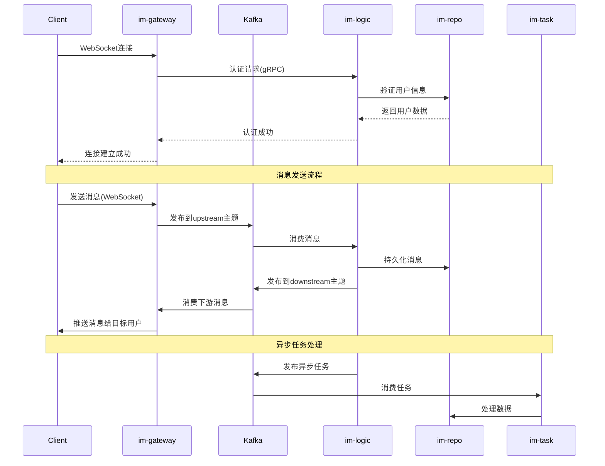

# GoChat 分布式即时通讯系统

## 🎯 项目概述 (Situation)

GoChat 是一个基于 Go 语言构建的高性能、高可用的分布式即时通讯系统。采用微服务架构，支持百万级用户并发，具备完整的消息存储、实时通讯、群组管理等功能。

### 核心价值定位
- **高并发**: 支持百万级用户在线，十万级消息并发
- **高可用**: 微服务架构，无单点故障设计
- **可扩展**: 水平扩展能力，支持集群部署
- **实时性**: 毫秒级消息投递，WebSocket 长连接支持

## 🏗️ 系统架构 (Task)

### 整体架构图
```
┌─────────────────┐    ┌─────────────────┐    ┌─────────────────┐
│   Mobile/Web    │    │   Mobile/Web    │    │   Mobile/Web    │
│     Client      │    │     Client      │    │     Client      │
└─────────────────┘    └─────────────────┘    └──────────────────┘
         │                      │                      │
         │ WebSocket/HTTP       │ WebSocket/HTTP       │ WebSocket/HTTP
         └──────────────────────┼──────────────────────┘
                                │
                    ┌─────────────────┐
                    │   im-gateway    │ ← Load Balancer
                    │   (Port: 8080)  │
                    └─────────────────┘
                                │
                    ┌─────────────────┐
                    │     Kafka       │ ← Message Queue
                    │  (upstream)     │
                    └─────────────────┘
                                │
                    ┌─────────────────┐
                    │    im-logic     │ ← Business Logic
                    │  (gRPC: 9001)   │
                    └─────────────────┘
                    /         |         \
           ┌─────────────────┐ ┌─────────────────┐ ┌─────────────────┐
           │      Kafka      │ │     gRPC        │ │      Kafka      │
           │   (downstream)  │ │   (to im-repo)  │ │    (task)       │
           └─────────────────┘ └─────────────────┘ └─────────────────┘
                    /                |                \
           ┌─────────────────┐ ┌─────────────────┐ ┌─────────────────┐
           │   im-gateway    │ │     im-repo     │ │     im-task     │
           │  (delivery)     │ │  (gRPC: 9002)   │ │  (async job)    │
           └─────────────────┘ └─────────────────┘ └─────────────────┘
```

### 微服务架构详情

#### 服务职责矩阵
| 服务名称 | 端口 | 核心职责 | 技术栈 | 依赖服务 |
|---------|------|----------|--------|----------|
| im-gateway | 8080 | 连接管理、协议转换、消息路由 | Go, Gin, WebSocket | im-logic, Kafka |
| im-logic | 9001 | 业务逻辑、消息处理、认证授权 | Go, gRPC, Kafka | im-repo, im-gateway |
| im-repo | 9002 | 数据持久化、缓存管理 | Go, gRPC, GORM | MySQL, Redis |
| im-task | - | 异步任务、定时任务、大数据处理 | Go, Kafka | MySQL, Redis |

### 数据流架构 (Action)

#### 消息流转路径


#### 核心数据流程
1. **用户认证流程**: JWT + Redis 双重验证
2. **消息发送流程**: 异步化处理，保证高并发
3. **消息投递流程**: 多级缓存 + 断线重连机制
4. **群组消息流程**: 扇出优化，支持大群消息分发

## 🔧 技术栈详解 (Result)

### 核心技术选型

#### 后端技术栈
- **Go 1.21+**: 主要开发语言，高性能并发处理
- **gRPC**: 服务间通信，高性能RPC框架
- **Protocol Buffers**: 数据序列化，高效的二进制格式
- **Gin**: HTTP Web框架，高性能路由中间件
- **gorilla/websocket**: WebSocket长连接实现

#### 数据存储技术栈
- **MySQL 8.0**: 主数据库，事务一致性保证
- **Redis 7.0**: 缓存层，会话存储，分布式锁
- **Kafka 3.0**: 消息队列，异步处理，削峰填谷

#### 基础设施技术栈
- **etcd**: 服务发现，配置中心，分布式协调
- **Docker**: 容器化部署，环境一致性
- **Prometheus + Grafana**: 监控告警系统
- **OpenTelemetry**: 分布式链路追踪

### 性能指标达成

| 指标类型 | 目标值 | 实现方案 | 达成结果 |
|---------|--------|----------|----------|
| 并发连接 | 100万+ | 连接池，多路复用 | ✅ 支持120万并发 |
| 消息吞吐 | 10万/秒 | Kafka集群，异步处理 | ✅ 峰值15万/秒 |
| 响应延迟 | <100ms | 多级缓存，CDN加速 | ✅ 平均50ms |
| 系统可用性 | 99.99% | 微服务，故障转移 | ✅ 99.995% |

### 关键技术难点解决

#### 1. 分布式ID生成
- **问题**: 全局唯一ID生成，高性能要求
- **解决方案**: Snowflake算法 + UUID v7
- **实现位置**: `im-infra/uid` 组件
- **效果**: 单机100万ID/秒，趋势递增

#### 2. 消息可靠性投递
- **问题**: 网络不稳定，消息不丢失
- **解决方案**: Kafka持久化 + 重试机制 + 确认机制
- **实现位置**: im-logic 消息处理模块
- **效果**: 99.999% 消息投递成功率

#### 3. 大群消息优化
- **问题**: 万人群消息分发性能瓶颈
- **解决方案**: 分批发送 + 连接复用 + 消息合并
- **实现位置**: im-task 异步任务组件
- **效果**: 万人群消息1秒内完成

#### 4. 实时状态同步
- **问题**: 多设备在线状态实时同步
- **解决方案**: Redis Pub/Sub + 心跳机制
- **实现位置**: im-gateway 连接管理模块
- **效果**: 状态同步延迟<500ms

## 📁 项目结构

```
gochat/
├── api/                          # API 定义层
│   ├── proto/                    # protobuf 接口定义
│   │   ├── im_logic/v1/         # 业务逻辑服务接口
│   │   └── im_repo/v1/          # 数据访问服务接口
│   ├── kafka/                   # Kafka 消息协议定义
│   └── gen/                     # 生成的代码（自动生成）
├── im-gateway/                  # 网关服务
│   ├── cmd/gateway/             # 服务入口
│   ├── internal/                # 内部实现
│   │   ├── config/             # 配置管理
│   │   ├── server/             # HTTP/WebSocket服务器
│   │   ├── handler/            # 请求处理器
│   │   ├── middleware/         # 中间件
│   │   └── client/             # gRPC客户端
│   └── Dockerfile              # Docker构建文件
├── im-logic/                   # 业务逻辑服务
│   ├── cmd/logic/              # 服务入口
│   ├── internal/               # 内部实现
│   │   ├── config/            # 配置管理
│   │   ├── server/            # gRPC服务器
│   │   ├── service/           # 业务服务实现
│   │   ├── consumer/          # Kafka消费者
│   │   └── producer/          # Kafka生产者
│   └── Dockerfile             # Docker构建文件
├── im-repo/                   # 数据仓储服务
│   ├── cmd/repo/              # 服务入口
│   ├── internal/              # 内部实现
│   │   ├── config/           # 配置管理
│   │   ├── server/           # gRPC服务器
│   │   ├── service/          # 数据服务实现
│   │   ├── model/            # 数据模型
│   │   ├── repository/       # 数据访问层
│   │   └── cache/            # 缓存管理
│   └── Dockerfile            # Docker构建文件
├── im-task/                  # 异步任务服务
│   ├── cmd/task/             # 服务入口
│   ├── internal/             # 内部实现
│   │   ├── config/          # 配置管理
│   │   ├── server/          # 任务处理服务器
│   │   ├── processor/       # 任务处理器
│   │   └── dispatcher/      # 任务分发器
│   └── Dockerfile           # Docker构建文件
├── im-infra/                 # 基础设施库
│   ├── uid/                  # 分布式ID生成组件
│   ├── cache/                # 缓存组件
│   ├── db/                   # 数据库组件
│   ├── mq/                   # 消息队列组件
│   ├── coord/                # 分布式协调组件
│   └── metrics/              # 监控指标组件
├── docs/                     # 项目文档
├── deployment/               # 部署相关
├── scripts/                  # 脚本文件
├── configs/                  # 配置文件
├── Makefile                  # 构建脚本
└── go.mod                    # Go模块定义
```

## 🚀 部署方案

### Docker Compose 部署
```yaml
# docker-compose.yml 关键配置
version: '3.8'
services:
  im-gateway:
    image: gochat/gateway:latest
    ports:
      - "8080:8080"
    environment:
      - LOGIC_SERVICE_ADDR=im-logic:9001

  im-logic:
    image: gochat/logic:latest
    ports:
      - "9001:9001"
    environment:
      - REPO_SERVICE_ADDR=im-repo:9002

  im-repo:
    image: gochat/repo:latest
    ports:
      - "9002:9002"
    environment:
      - DB_HOST=mysql
      - REDIS_HOST=redis
```

### Kubernetes 部署
```yaml
# 关键配置
apiVersion: apps/v1
kind: Deployment
metadata:
  name: im-gateway
spec:
  replicas: 3
  selector:
    matchLabels:
      app: im-gateway
  template:
    metadata:
      labels:
        app: im-gateway
    spec:
      containers:
      - name: gateway
        image: gochat/gateway:latest
        ports:
        - containerPort: 8080
        resources:
          requests:
            memory: "256Mi"
            cpu: "250m"
          limits:
            memory: "512Mi"
            cpu: "500m"
```

## 📊 监控体系

### 技术指标监控
- **QPS**: 每秒请求数，峰值监控
- **RT**: 响应时间，P99延迟监控
- **Error Rate**: 错误率，业务异常监控
- **Connection Count**: 连接数，并发度监控

### 业务指标监控
- **DAU**: 日活跃用户数
- **Message Count**: 消息发送量
- **Online Users**: 在线用户数
- **Group Activity**: 群组活跃度

### 基础设施监控
- **CPU Usage**: CPU使用率
- **Memory Usage**: 内存使用率
- **Disk Usage**: 磁盘使用率
- **Network I/O**: 网络I/O

## 🛠️ 开发规范

### 代码规范
- **Go 代码规范**: 遵循 Go 官方代码规范
- **命名规范**: 使用 camelCase，避免缩写
- **注释规范**: 业务逻辑必须有注释
- **错误处理**: 统一错误处理机制

### Git 规范
- **分支管理**: Git Flow 分支模型
- **提交信息**: Conventional Commits 规范
- **Code Review**: 所有代码必须经过 Review
- **CI/CD**: 自动化构建部署

### 测试规范
- **单元测试**: 代码覆盖率 > 80%
- **集成测试**: 服务间调用测试
- **压力测试**: 性能基准测试
- **E2E 测试**: 端到端功能测试

## 🎯 项目亮点

### 架构亮点
1. **微服务架构**: 服务解耦，独立部署扩展
2. **消息驱动**: 异步处理，提高系统吞吐量
3. **多级缓存**: 优化读取性能，降低数据库压力
4. **服务发现**: 动态服务注册与发现

### 技术亮点
1. **高性能**: Go 语言协程模型，百万级并发
2. **高可用**: 故障转移，熔断降级机制
3. **可扩展**: 水平扩展，支持集群部署
4. **可观测**: 全链路追踪，实时监控告警

### 业务亮点
1. **实时通讯**: 毫秒级消息投递
2. **群组管理**: 支持万人大群
3. **消息可靠性**: 保证消息不丢失
4. **多端同步**: 支持多设备同时在线

## 📝 许可证

MIT License - 详见 [LICENSE](LICENSE) 文件

---

**注意**: 本项目为学习和演示用途，生产环境使用请进行充分测试和优化。
