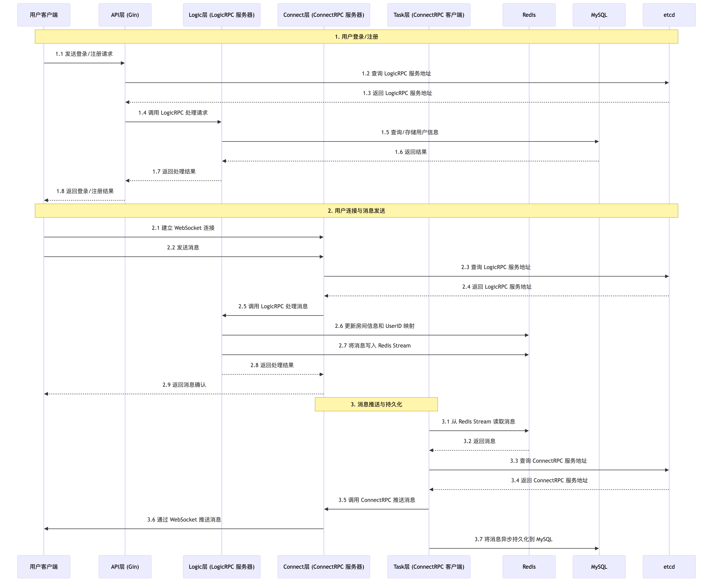

# 项目详细描述

## 1. 架构设计

我设计并实现了一套基于分布式微服务架构的即时通讯（IM）系统，以应对传统单体架构难以支撑的高并发消息推送与实时通信需求。系统采用四层服务架构：

- **API 接入层**：使用 **Gin** 框架实现 Web 服务器，负责处理用户的 HTTP 请求，如登录、注册等。API 层通过 **RPC** 与 **Logic 层** 通信，将用户的请求转发给 Logic 层进行处理。

- **逻辑处理层（Logic 层）**：作为 **LogicRPC** 服务器，负责处理业务逻辑，如用户认证、权限验证、消息处理等。Logic 层通过 **etcd + gRPC resolver** 实现服务发现，确保 API 层和 Connect 层能够动态发现并调用 Logic 层的服务。

- **任务调度层（Task 层）**：负责从消息队列中读取消息，并将消息推送到 **Connect 层**。Task 层通过 **ConnectRPC** 与 Connect 层通信，确保消息能够准确投递到目标用户。

- **长连接层（Connect 层）**：使用 **WebSocket** 实现长连接通信，负责与客户端保持实时连接，并将消息推送给用户。Connect 层通过 **LogicRPC** 与 Logic 层通信，获取用户的消息并推送给客户端。

## 2. 服务发现与负载均衡

为了实现服务的高可用性和动态扩展，我基于 **etcd + gRPC resolver** 实现了动态服务发现。每个服务实例在启动时都会向 **etcd** 注册自己的服务地址，客户端通过 **gRPC resolver** 从 **etcd** 中获取可用的服务实例列表，并根据 **InstanceID** 路由策略将消息精准投递到目标服务实例。这种设计有效提升了系统的吞吐能力，并支持服务的独立扩缩容。

## 3. 消息队列

为了确保消息的实时性和可靠性，我基于 **Redis Stream** 实现了双消费组架构的消息队列：

- **推送组**：负责实时消息投递，确保消息能够以低延迟推送给目标用户。

- **持久化组**：负责将消息异步写入 **MySQL**，确保消息的可靠存储，即使系统发生故障，消息也不会丢失。

## 4. 长连接优化

为了提升长连接的稳定性和资源利用率，我使用 **WebSocket** 实现长连接通信，并结合心跳检测与连接复用机制：

- **心跳检测**：定期发送心跳包，检测连接是否正常，避免因网络波动导致的连接中断。

- **连接复用**：通过复用 WebSocket 连接，减少连接建立和断开的开销，提升系统的资源利用率。

## 5. 容器化部署

为了提升部署效率和系统的可扩展性，我使用 **Docker Compose** 进行多实例集群编排。通过容器化部署，系统能够快速扩展和缩容，支持弹性扩展与高可用性。

## 6. 项目成果

通过上述设计和实现，系统整体吞吐量达到 **5W+ QPS**，单条消息投递延迟稳定控制在 **50ms** 以内。系统实现了消息的持久化存储，具备秒级故障恢复能力，为用户提供了流畅的实时通信体验。

## 7. 个人收获

在这个项目中，我深入掌握了分布式微服务系统的设计与实现，尤其在服务解耦、服务发现、负载均衡等方面积累了丰富经验。我理解并实践了 **etcd**、**Redis**、消息队列等核心组件的底层原理，并通过实际项目验证了这些技术的可行性和有效性。

## 详细流程

1. **用户登录与注册**：
   - 用户通过 **API 层** 的 HTTP 接口进行登录或注册。
   - **API 层** 通过 **LogicRPC** 将请求转发给 **Logic 层**。
   - **Logic 层** 验证用户信息，并将用户数据持久化存储到 **MySQL** 中。

2. **用户连接与消息发送**：
   - 用户登录成功后，通过 **WebSocket** 连接到 **Connect 层**。
   - 用户发送消息时，**Connect 层** 通过 **LogicRPC** 将消息推送到 **Logic 层**。
   - **Logic 层** 为消息生成分布式 ID，并在 **Redis** 中实时更新房间信息和 **UserID** 到 **InstanceID** 的映射。
   - **Logic 层** 将消息写入 **Redis Stream** 消息队列。

3. **消息推送与持久化**：
   - **Task 层** 从 **Redis Stream** 中读取消息。
   - **推送组** 负责实时将消息推送给目标用户，确保低延迟。
   - **持久化组** 负责将消息异步写入 **MySQL**，确保消息的可靠存储。

4. **消息投递**：
   - **Task 层** 通过 **ConnectRPC** 根据 **InstanceID** 路由策略，将消息发送到特定的 **Connect 服务器**。
   - **Connect 层** 通过 **WebSocket** 将消息推送给用户。

## 技术栈总结

- **编程语言**：Golang
- **RPC 框架**：gRPC
- **服务发现**：etcd
- **消息队列**：Redis Stream
- **数据库**：MySQL
- **Web 框架**：Gin
- **长连接**：WebSocket
- **容器化**：Docker Compose

通过这个项目，我不仅提升了技术能力，还积累了丰富的分布式系统设计与实践经验，为未来的项目开发奠定了坚实的基础。
