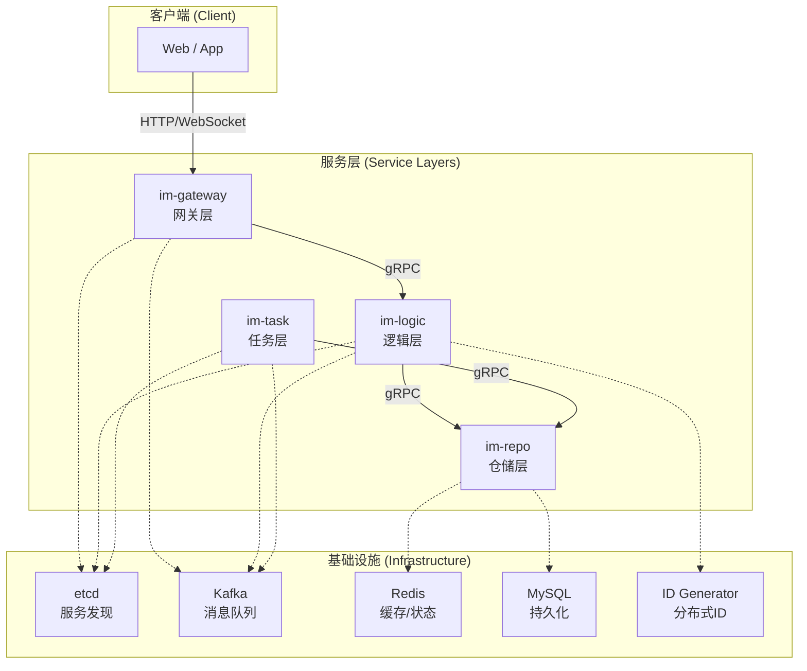

# GoChat 分布式即时通讯系统

## 项目概述

GoChat 是一个基于 Go 语言构建的现代化、分布式即时通讯（IM）系统。采用微服务架构设计，通过服务解耦、水平扩展和高可用性设计，为用户提供稳定可靠的实时通信体验。

### 核心特性

- **分布式微服务架构**：四大核心服务独立部署，支持水平扩展
- **高性能实时通信**：基于 WebSocket 的长连接，消息延迟 < 50ms
- **高可用性设计**：服务发现、故障转移、数据持久化保障
- **多种聊天模式**：支持私聊、群聊、世界聊天室
- **用户体系完整**：注册用户 + 游客模式，灵活的权限控制

## 系统架构

### 微服务架构图



### 核心服务职责

| 服务 | 职责 | 技术栈 |
|------|------|--------|
| **im-gateway** | 协议转换、用户认证、WebSocket 连接管理 | Gin + Gorilla WebSocket |
| **im-logic** | 核心业务逻辑、消息处理与分发、会话管理 | gRPC + Kafka |
| **im-task** | 异步任务处理、超大群扩散、离线推送 | Kafka Consumer |
| **im-repo** | 统一数据访问、缓存策略、数据持久化 | GORM + Redis |

## 技术栈

### 后端技术
- **编程语言**：Go 1.24
- **微服务框架**：gRPC
- **Web 框架**：Gin
- **服务发现**：etcd
- **消息队列**：Kafka
- **数据库**：MySQL 8.0
- **缓存**：Redis 7.0
- **实时通信**：WebSocket
- **容器化**：Docker + Docker Compose

### 前端技术
- **框架**：Vue 3 + Vuex 4 + Vue Router 4
- **HTTP 客户端**：Axios
- **实时通信**：WebSocket
- **构建工具**：Vite

### 基础设施
- **服务注册发现**：etcd
- **分布式 ID**：Snowflake 算法
- **日志系统**：Zap + 结构化日志
- **监控追踪**：Prometheus + Jaeger
- **配置管理**：Viper + etcd

## 项目结构

```
GoChat/
├── docs/                           # 架构设计文档
│   ├── architecture.md             # 系统架构设计
│   ├── detailed-design.md          # 详细设计文档
│   ├── api.md                      # API 接口文档
│   └── im-*-plan.md                # 各模块开发计划
├── im-frontend/                    # 前端项目（已完成）
│   ├── src/                        # Vue 3 源码
│   ├── mock-server/                # Mock 后端服务
│   └── docs/                       # 前端文档
├── old/                            # 旧版代码（参考用）
│   ├── api/                        # 旧版 API 层
│   ├── logic/                      # 旧版 Logic 层
│   ├── connect/                    # 旧版 Connect 层
│   └── task/                       # 旧版 Task 层
├── docker-compose.yml              # 容器编排配置
├── Dockerfile                      # 容器构建文件
└── go.mod                          # Go 模块依赖
```

## 开发状态

### ✅ 已完成
- **架构设计**：完整的微服务架构设计文档
- **前端开发**：基于 Vue 3 的完整前端应用
- **API 设计**：详细的 RESTful API 和 WebSocket 协议
- **数据模型**：MySQL 表结构和 Redis 缓存设计

### 🚧 开发中
- **后端服务**：四大核心微服务的实现
  - `im-gateway`：网关服务（待开发）
  - `im-logic`：业务逻辑服务（待开发）
  - `im-task`：异步任务服务（待开发）
  - `im-repo`：数据仓储服务（待开发）

### 📋 待开发
- **基础设施**：服务发现、消息队列、监控系统集成
- **部署脚本**：K8s 部署配置和 CI/CD 流水线
- **性能测试**：压力测试和性能优化

## 快速开始

### 前端体验（当前可用）

```bash
# 启动前端开发环境
cd im-frontend
npm install
npm run dev

# 启动 Mock 后端服务
cd mock-server
npm install
npm start
```

访问：http://localhost:5173

### 完整部署（开发完成后）

```bash
# 启动基础设施
docker-compose up -d etcd mysql redis kafka

# 启动后端服务
docker-compose up -d im-gateway im-logic im-task im-repo

# 启动前端
cd im-frontend && npm run build
```

## 核心功能

### 用户系统
- **注册用户**：完整的用户注册、登录、认证体系
- **游客模式**：快速体验，无需注册即可使用世界聊天室
- **权限控制**：基于用户类型的功能权限管理

### 聊天功能
- **私聊**：一对一实时聊天，支持消息历史
- **群聊**：多人群组聊天，支持群管理
- **世界聊天室**：所有用户共享的公共聊天空间
- **消息类型**：文本消息（可扩展图片、文件等）

### 实时通信
- **WebSocket 长连接**：低延迟实时消息推送
- **消息可靠性**：消息持久化、去重、确认机制
- **在线状态**：实时用户在线状态同步
- **连接管理**：心跳检测、自动重连、故障转移

## 性能指标

- **系统吞吐量**：5W+ QPS
- **消息延迟**：< 50ms（正常网络环境）
- **并发连接**：支持万级 WebSocket 长连接
- **可用性**：99.9%+ 服务可用性
- **故障恢复**：秒级故障检测和恢复

## 开发指南

### 后端开发
1. 阅读 `docs/architecture.md` 了解整体架构
2. 参考 `docs/im-*-plan.md` 进行模块开发
3. 遵循 `docs/detailed-design.md` 中的设计规范

### 前端开发
1. 参考 `im-frontend/docs/` 中的前端文档
2. 使用 Mock 服务器进行开发测试
3. 遵循 Vue 3 + Composition API 开发规范

### API 接口
- 详细接口文档：`docs/api.md`
- WebSocket 协议：参考架构文档中的协议设计
- 认证方式：JWT Bearer Token

## 贡献指南

1. Fork 项目仓库
2. 创建功能分支：`git checkout -b feature/your-feature`
3. 提交更改：`git commit -am 'Add some feature'`
4. 推送分支：`git push origin feature/your-feature`
5. 创建 Pull Request

## 许可证

MIT License

---

**项目状态**：架构设计完成，前端开发完成，后端微服务开发中

**最后更新**：2025-01-19
