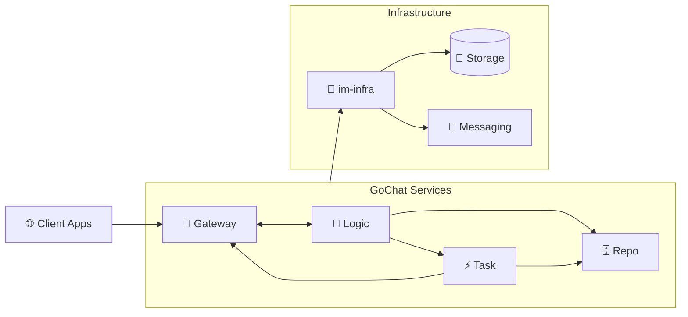

# GoChat - 分布式即时通讯系统

[](https://golang.org/)
[](https://vuejs.org/)
[](LICENSE)

GoChat 是一个基于 Go 语言构建的现代化分布式即时通讯系统，采用微服务架构，支持私聊、群聊和世界聊天室，为用户提供高性能、低延迟的实时通信体验。

## ✨ 核心特性

- 🏗️ **微服务架构** - 四大核心服务，独立部署，水平扩展
- ⚡ **高性能通信** - WebSocket 长连接，消息延迟 < 50ms  
- 🔄 **高可用设计** - 服务发现、故障转移、数据持久化
- 💬 **多种聊天模式** - 私聊、群聊、世界聊天室
- 👥 **灵活用户体系** - 注册用户 + 游客模式

## 🏛️ 系统架构



### 服务职责

| 服务 | 职责 | 状态 |
|------|------|------|
| **im-gateway** | WebSocket 连接管理、协议转换、用户认证 | 🔄 待开发 |
| **im-logic** | 核心业务逻辑、消息处理与分发 | 🔄 待开发 |
| **im-task** | 异步任务处理、大群扩散、离线推送 | 🔄 待开发 |
| **im-repo** | 统一数据访问、缓存策略、数据持久化 | 🔄 待开发 |
| **im-infra** | 基础设施库、公共组件 | ✅ 已完成（重构中） |

## 🛠️ 技术栈

**后端**
- Go 1.24 + gRPC + Gin
- etcd (服务发现) + Kafka (消息队列)
- MySQL 8.0 + Redis 7.0
- Docker + Kubernetes

**前端**  
- Vue 3 + Vuex 4 + Vue Router 4
- Axios + WebSocket + Vite

**基础设施**
- Snowflake ID 生成 + Zap 日志
- Prometheus 监控 + Jaeger 链路追踪

## 📁 项目结构

```
GoChat/
├── docs/                    # 📚 架构设计文档
│   ├── architecture.md      # 系统架构设计
│   ├── api.md              # API 接口文档
│   └── *.md                # 各模块设计文档
├── im-frontend/            # 🎨 前端项目 (已完成)
│   ├── src/                # Vue 3 源码
│   ├── mock-server/        # Mock 后端服务
│   └── docs/               # 前端文档
├── im-infra/              # 🔧 基础设施库 (已完成)
│   ├── cache/             # 缓存组件
│   ├── clog/              # 日志组件
│   ├── coord/             # 协调组件
│   ├── db/                # 数据库组件
│   ├── idgen/             # ID生成器
│   ├── metrics/           # 监控指标
│   ├── mq/                # 消息队列
│   └── ratelimit/         # 限流组件
├── cmd/                   # 🔨 命令行工具
├── config/                # ⚙️ 配置文件
├── build/                 # 📦 构建脚本
├── main.go               # 🚀 主程序入口
└── docker-compose.yml    # 🐳 容器编排
```

## 🚀 快速开始

### 前端体验 (当前可用)

```bash
# 克隆项目
git clone <repository-url>
cd GoChat

# 启动前端开发环境
cd im-frontend
npm install
npm run dev

# 启动 Mock 后端 (新终端)
cd mock-server  
npm install
npm start
```

访问 http://localhost:5173 体验完整前端功能

### 开发环境搭建

```bash
# 安装 Go 1.24+
go version

# 启动基础设施 (需要 Docker)
docker-compose up -d mysql redis kafka etcd

# 运行测试
go test ./...

# 构建项目
go build -o bin/gochat main.go
```

## 📋 开发状态

### ✅ 已完成
- **架构设计** - 完整的微服务架构设计文档
- **前端应用** - 基于 Vue 3 的完整前端，支持所有核心功能
- **基础设施库** - im-infra 基础组件库 (正在重构优化中)
- **API 设计** - 详细的 RESTful API 和 WebSocket 协议规范

### 🚧 开发中  
- **后端微服务** - 四大核心服务的具体实现
- **基础设施重构** - im-infra 配置管理和依赖注入优化

### 📋 计划中
- **部署配置** - Kubernetes 部署配置和 CI/CD 流水线
- **性能测试** - 压力测试和性能调优
- **监控系统** - 完整的可观测性体系

## 💡 核心功能

### 用户系统
- **注册登录** - JWT 认证，bcrypt 密码加密
- **游客模式** - 无需注册即可体验世界聊天室
- **权限控制** - 基于用户类型的功能权限管理

### 实时通信
- **私聊** - 一对一实时聊天，消息历史记录
- **群聊** - 多人群组，支持群管理和成员管理
- **世界聊天室** - 全局公共聊天空间
- **消息可靠性** - 消息持久化、去重、确认机制

### 性能指标
- 消息延迟 < 50ms (正常网络)
- 支持万级并发 WebSocket 连接  
- 系统可用性 99.9%+
- 支持水平扩展

## 🔧 开发指南

### 后端开发
1. 阅读 `docs/architecture.md` 了解整体设计
2. 参考 `docs/im-*-plan.md` 进行模块开发
3. 使用 `im-infra` 基础库保持代码一致性

### 前端开发  
1. 查看 `im-frontend/docs/` 了解前端架构
2. 使用 Mock 服务器进行独立开发
3. 遵循 Vue 3 Composition API 最佳实践

### API 文档
- 完整接口文档: `docs/api.md`
- WebSocket 协议: 参考架构文档
- 认证方式: JWT Bearer Token

## 🤝 贡献指南

1. Fork 项目并创建功能分支
2. 遵循项目代码规范和测试要求
3. 提交 PR 前确保所有测试通过
4. 详细描述变更内容和影响

## 📄 许可证

MIT License - 详见 [LICENSE](LICENSE) 文件

---

**当前状态**: 前端完成，基础库完成，后端微服务开发中  
**最后更新**: 2025-01-25