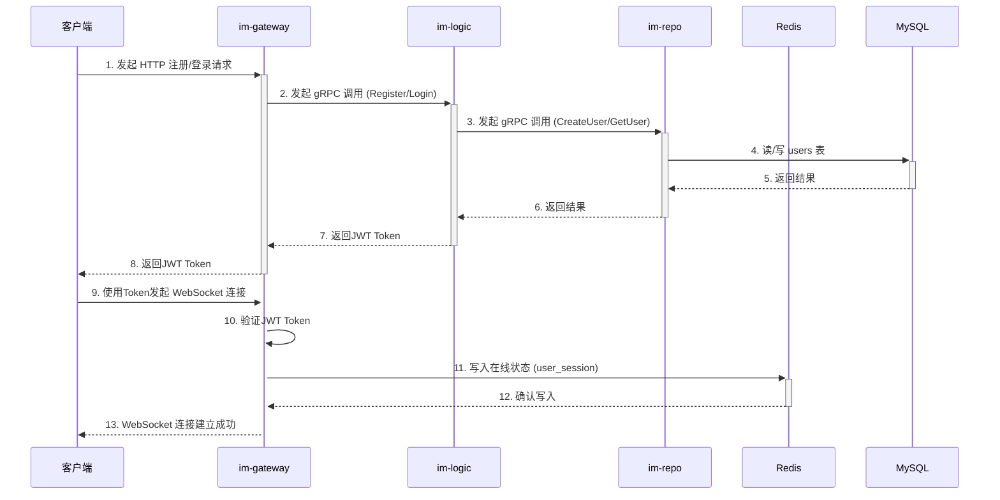
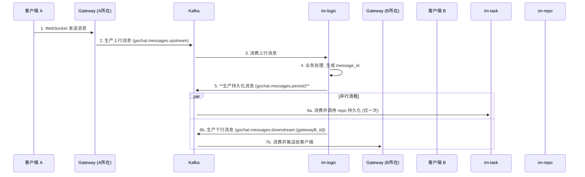
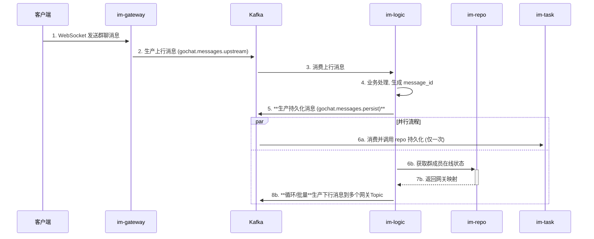

# 核心场景数据流

本文档使用 Mermaid 序列图详细描述了 GoChat 系统中几个核心业务场景的数据流转过程。

### 1. 用户注册与登录认证流程

此图描述了用户从客户端发起注册或登录，到最终完成认证并建立 WebSocket 连接的全过程。



### 2. 单聊消息发送与接收流程

此流程描述了单聊消息的生命周期。核心原则是**持久化先行，推送解耦**。



### 3. 群聊消息发送流程 (中小群)

此图描述了中小群的消息流程。`im-logic` 在确保消息被持久化后，负责计算和分发推送。



### 4. 群聊消息发送流程 (超大群)

此图描述了超大群的消息流程。`im-logic` 将持久化任务和扇出任务同时交由 Kafka，实现了自身的快速响应。

```mermaid
sequenceDiagram
    participant Client as 客户端
    participant Gateway as im-gateway
    participant Kafka as Kafka
    participant Logic as im-logic
    participant Task as im-task
    participant Repo as im-repo

    Client->>+Gateway: 1. WebSocket 发送群聊消息
    Gateway->>+Kafka: 2. 生产上行消息 (gochat.messages.upstream)

    Kafka->>+Logic: 3. 消费上行消息
    Logic->>Logic: 4. 业务处理, 生成 message_id
    
    Logic->>+Kafka: 5. **生产持久化消息 (gochat.messages.persist)**
    
    par 并行流程
        Kafka->>+Task: 6a. 消费并调用 repo 持久化 (仅一次)

    and
        Logic->>+Kafka: 6b. 生产异步扇出任务 (gochat.tasks.fanout)
        Kafka->>+Task: 7b. 消费扇出任务
        Task->>+Repo: 8b. 分批获取群成员
        Task->>+Kafka: 9b. **循环/批量**生产下行消息到多个网关Topic
    end
