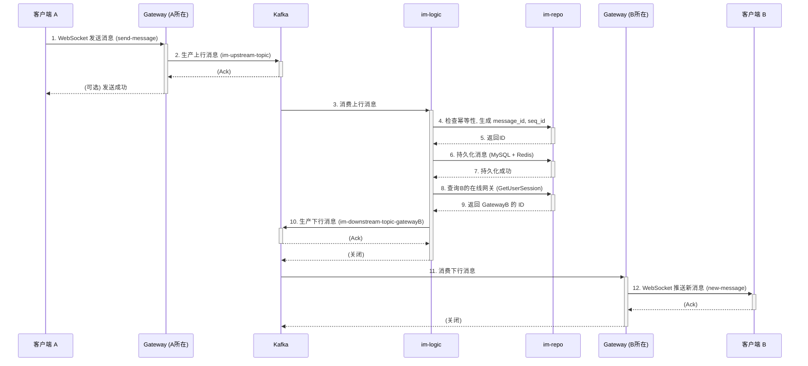
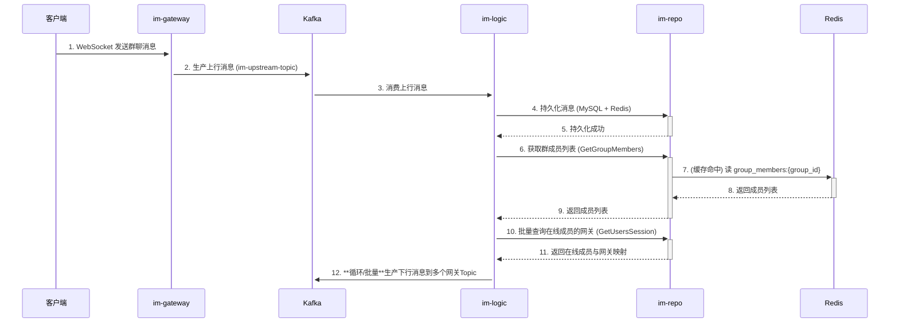
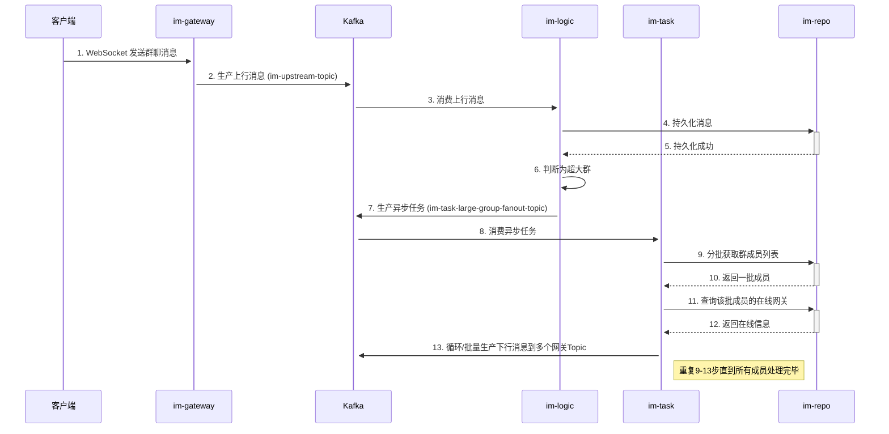
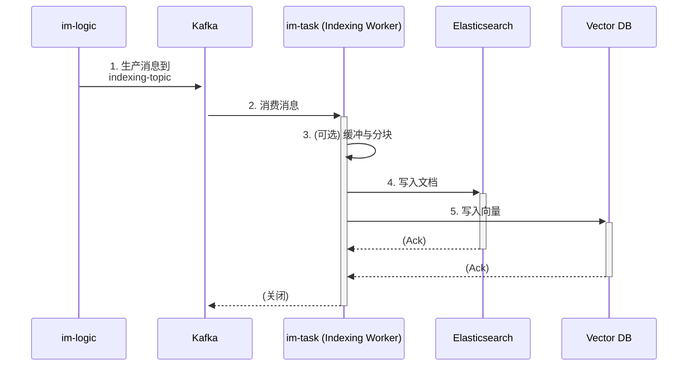
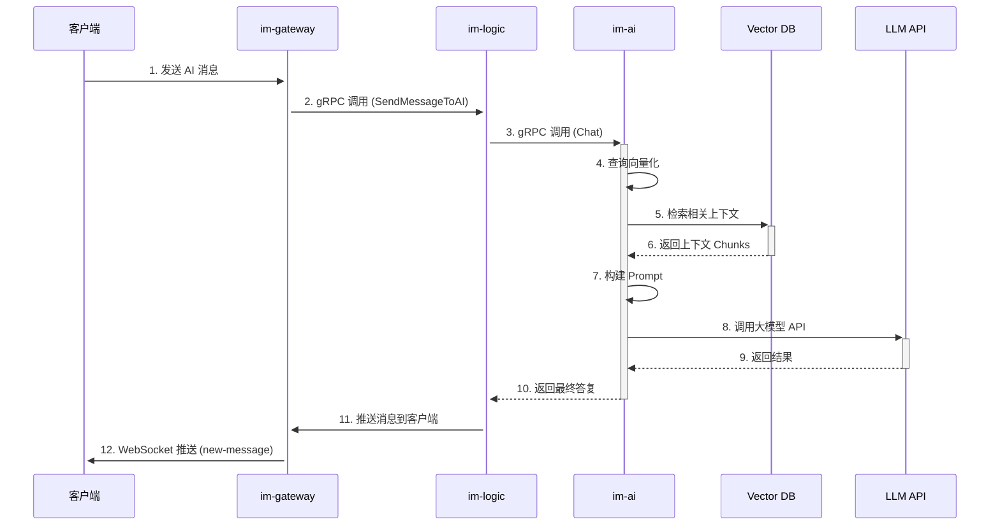
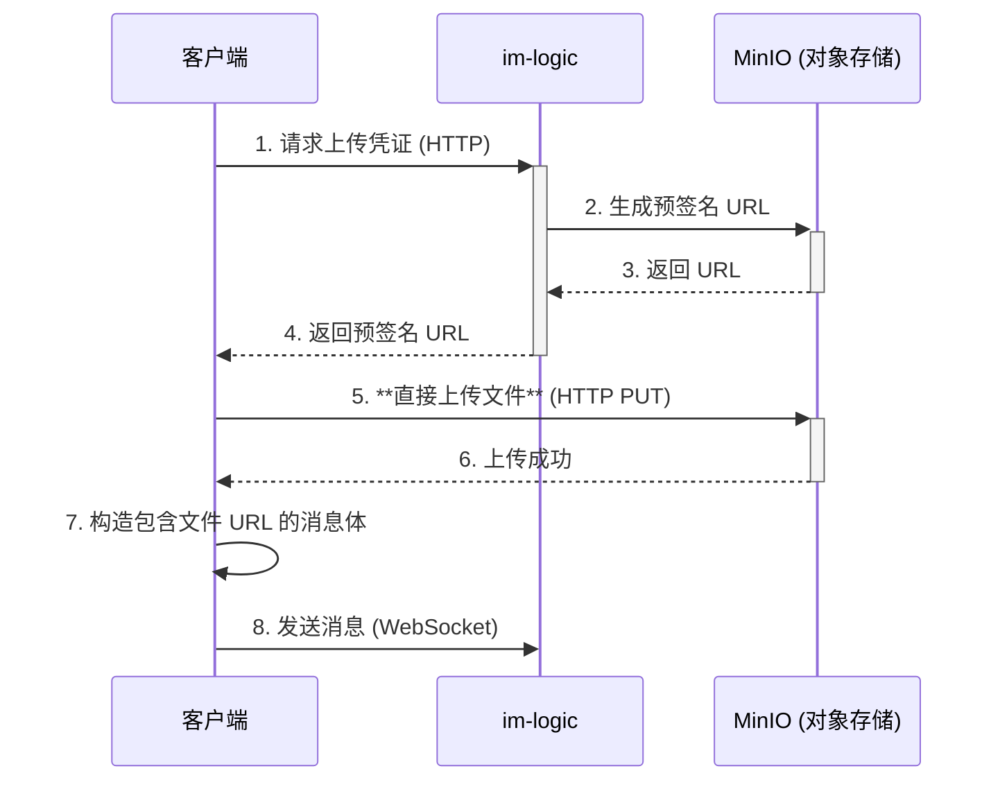

# 核心场景数据流

本文档使用 Mermaid 序列图详细描述了 GoChat 系统中几个核心业务场景的数据流转过程。

### 1. 用户注册与登录认证流程

此图描述了用户从客户端发起注册或登录，到最终完成认证并建立 WebSocket 连接的全过程。

### 2. 单聊消息发送与接收流程

此图描述了用户A发送一条单聊消息给用户B的完整生命周期。

### 3. 群聊消息发送流程 (中小群)

此图描述了在一个成员数小于阈值（如500人）的群聊中，消息被实时扩散的流程。

### 4. 群聊消息发送流程 (超大群)

此图描述了在一个成员数超过阈值的群聊中，消息扩散任务被异步处理的流程。

### 5. 异步消息索引流程 (搜索与AI)

此图描述了消息如何被异步地索引到 Elasticsearch 和向量数据库中。

### 6. AI 对话交互流程

此图描述了用户与 AI Agent 对话时的后端处理流程。

### 7. 文件上传流程

此图描述了客户端上传图片或文件并发送消息的流程。

