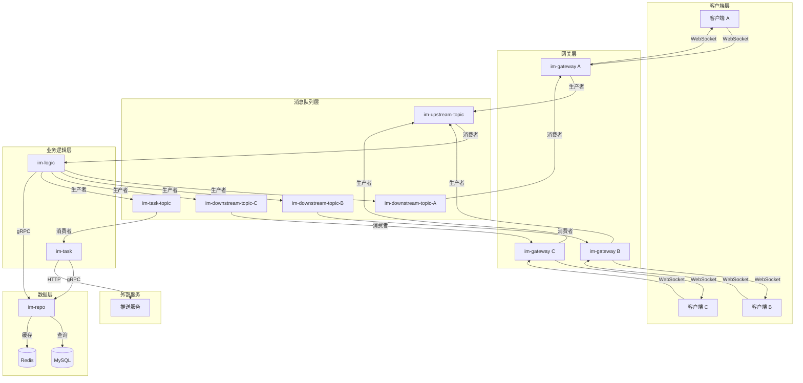
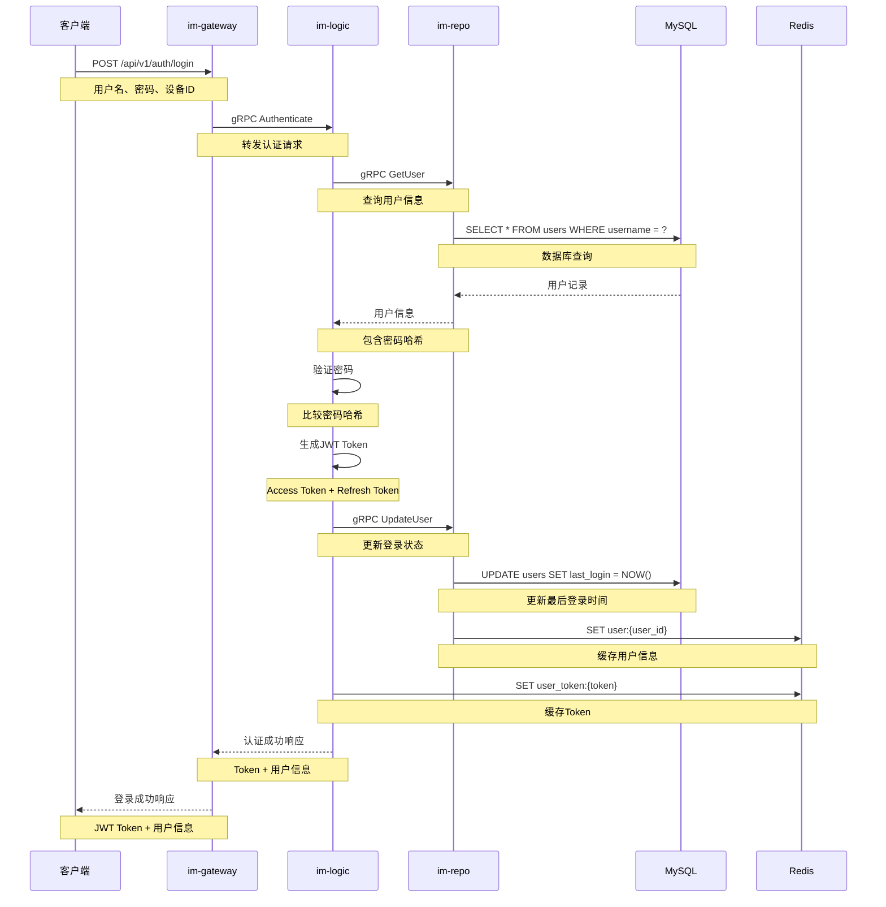
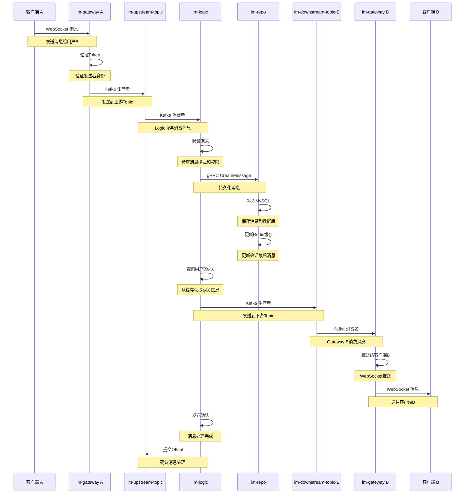
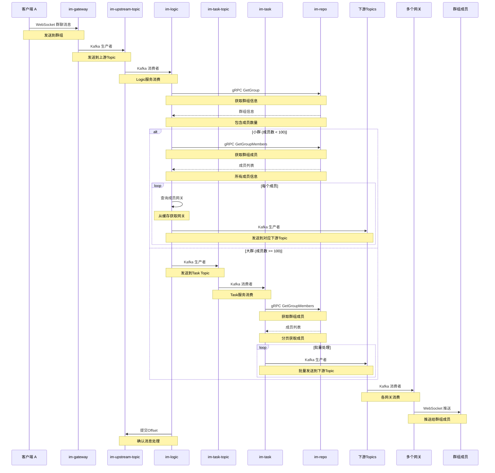
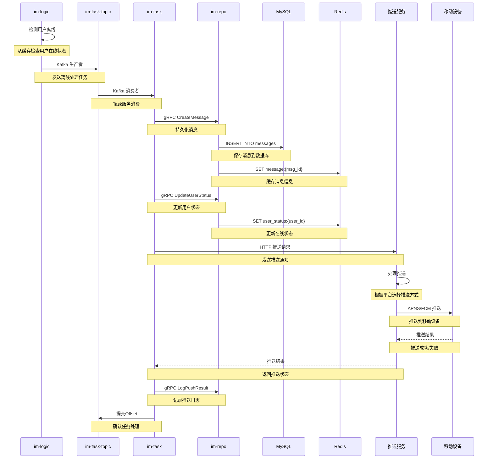
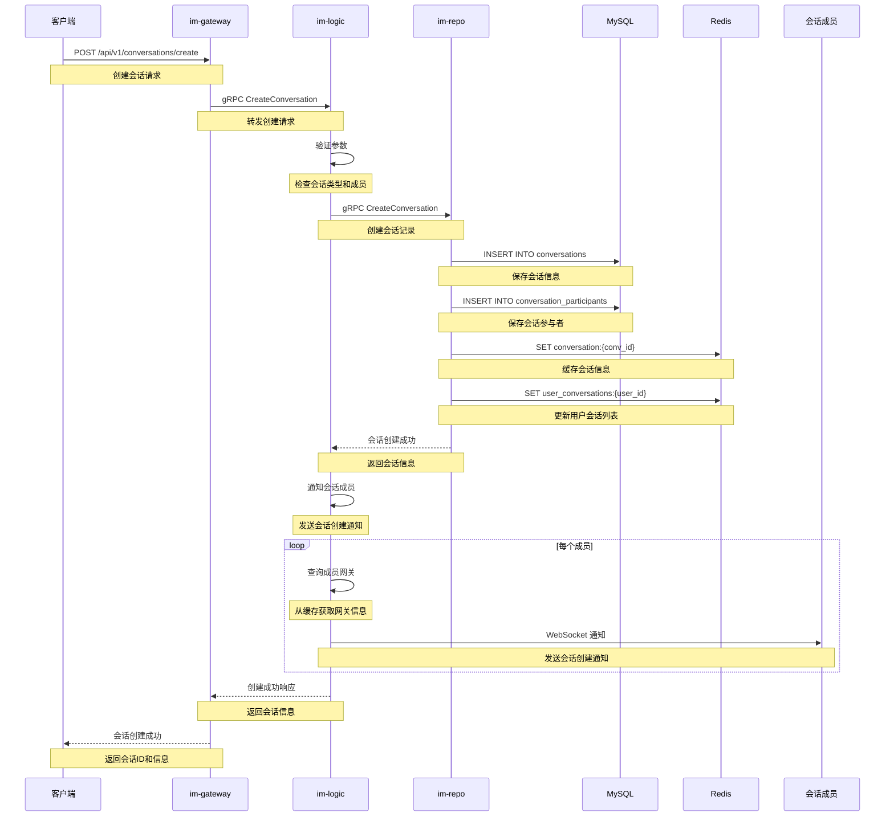
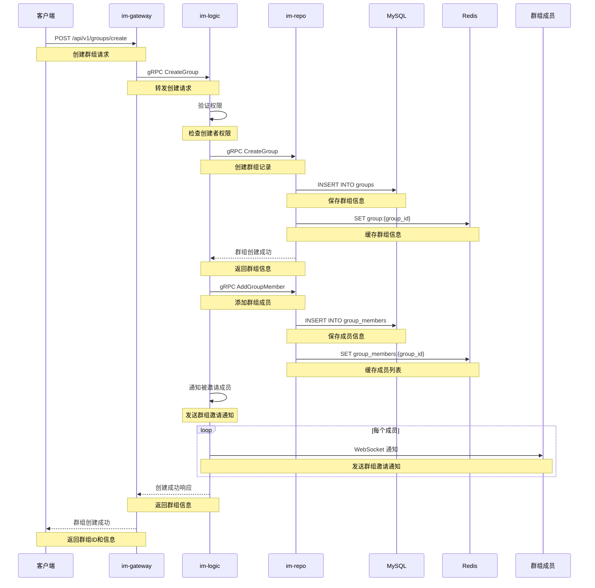
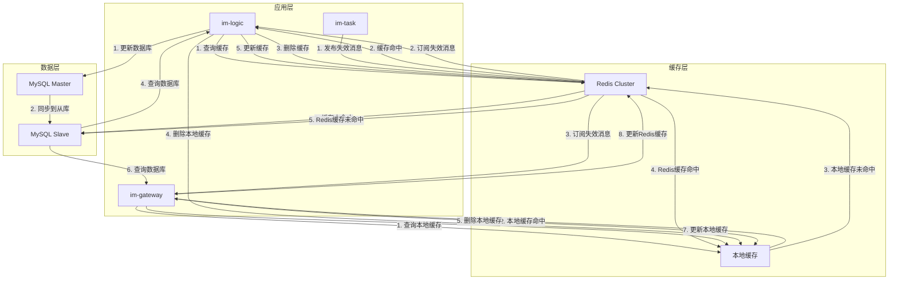
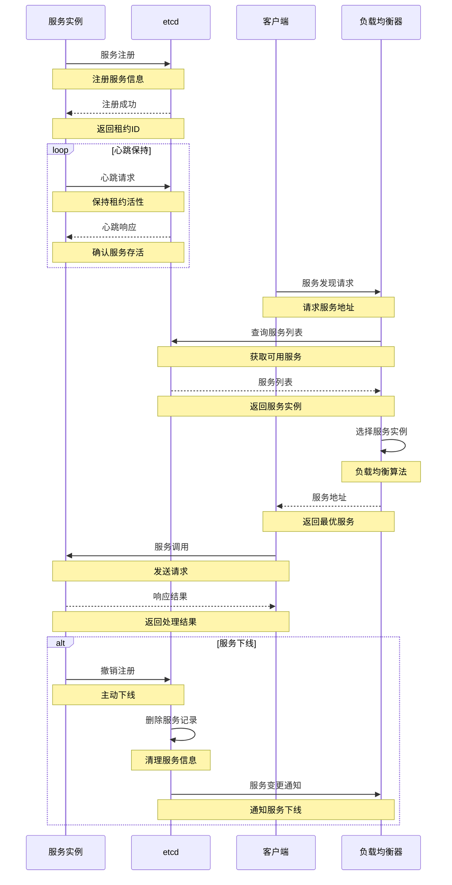
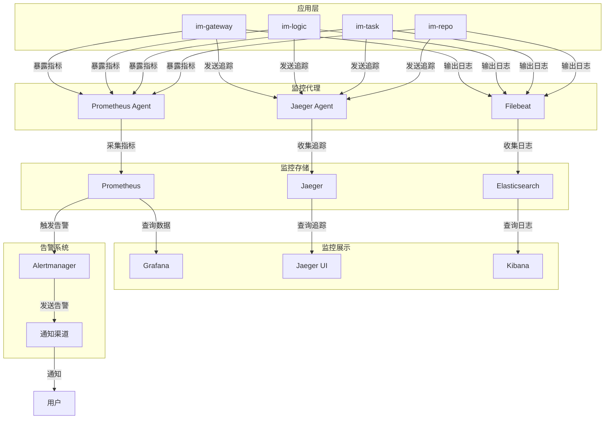

# 数据流图

## 1. 整体数据流图

## 2. 用户认证数据流图

## 3. 单聊消息数据流图

## 4. 群聊消息数据流图

## 5. 离线消息数据流图

## 6. 会话管理数据流图

## 7. 群组管理数据流图

## 8. 数据缓存流图

## 9. 服务发现数据流图

## 10. 监控数据流图

这些数据流图展示了 GoChat 系统中各个组件之间的数据流转过程，包括：
1. 整体架构数据流
2. 用户认证流程
3. 单聊消息处理
4. 群聊消息处理
5. 离线消息处理
6. 会话管理
7. 群组管理
8. 缓存策略
9. 服务发现
10. 监控系统

每个数据流图都详细描述了数据在系统中的流转路径和处理过程，有助于理解系统的工作原理和数据流向。