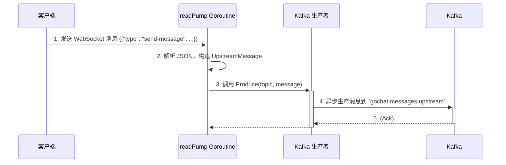
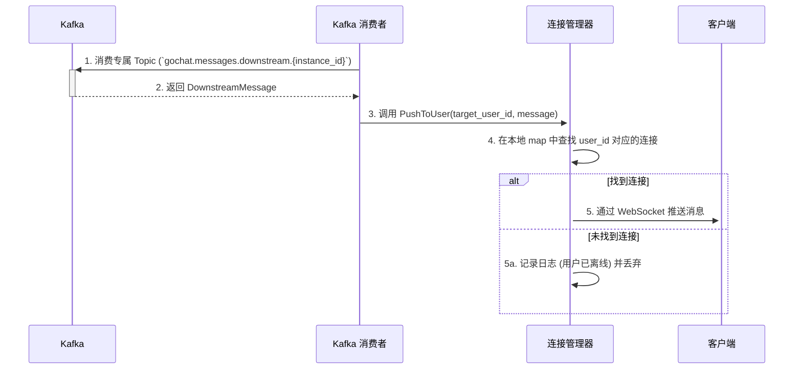
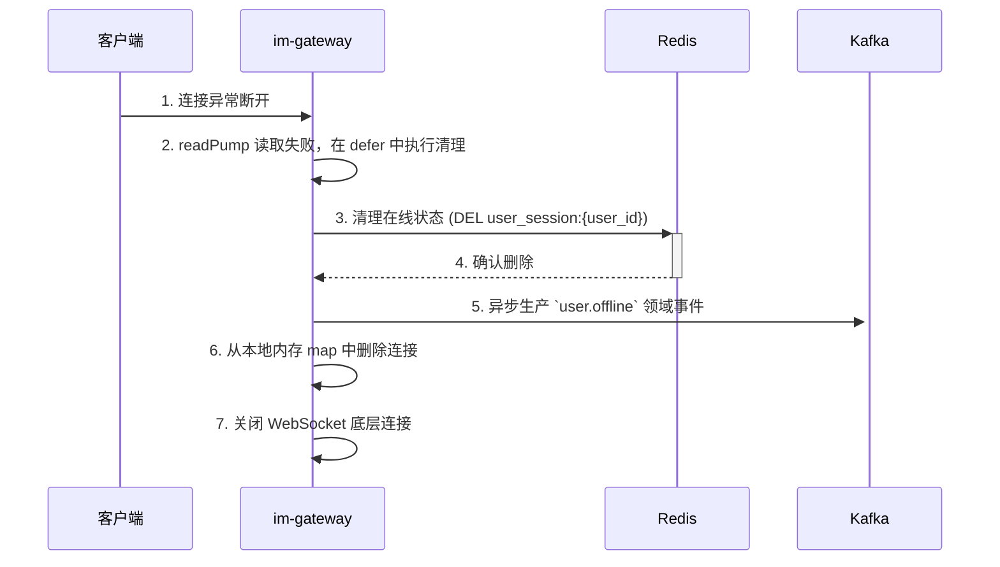

# im-gateway 网关服务设计文档

`im-gateway` 是 GoChat 系统的统一流量入口和协议转换层。所有客户端（Web, Mobile）的请求都首先经过此服务。它的核心职责是管理海量客户端长连接，处理 API 请求，并作为内外网络协议的桥梁。

**设计目标**: `im-gateway` 被设计为一个**无状态、高可用、可水平扩展**的网关服务，它不包含任何业务逻辑，专注于网络 I/O 和协议转换。

## 1. 核心职责

1.  **协议转换器 (Protocol Translator)**: 作为连接“外部世界”（客户端）和“内部世界”（后端微服务）的桥梁。
    *   **外部协议**: 对客户端暴露 **HTTP/RESTful API** 和 **WebSocket** 协议。
    *   **内部协议**: 与后端服务（如 `im-logic`）通过 **gRPC** 通信；与消息系统通过 **Kafka** 通信。
2.  **连接管理器 (Connection Manager)**: 稳定地维护成千上万个来自客户端的 WebSocket 长连接，处理心跳和连接的完整生命周期。
3.  **用户认证官 (Authentication Officer)**: 作为安全的第一道防线，负责验证所有传入的 HTTP 和 WebSocket 请求的合法性（基于 JWT Token）。
4.  **消息路由器 (Message Router)**:
    *   **上行**: 将客户端通过 WebSocket 发来的消息可靠地投递到 Kafka 的上行 Topic (`gochat.messages.upstream`)。
    *   **下行**: 从 Kafka 消费只属于本节点用户的下行 Topic (`gochat.messages.downstream.{instanceID}`) 消息，并精确地推送给他们。

## 2. 架构与模块设计

### 2.1 内部模块图

```mermaid
graph TD
    subgraph Client [客户端]
        direction LR
        C1[HTTP Client]
        C2[WebSocket Client]
    end

    subgraph im-gateway [im-gateway 服务]
        direction TB
        
        subgraph Entrypoints [入口层]
            direction LR
            HttpServer[HTTP Server (Gin)]
            WsServer[WebSocket Server (Gorilla/gobwas)]
        end

        subgraph Core [核心层]
            direction LR
            ConnManager[连接管理器]
            Router[HTTP 路由]
        end

        subgraph Connectors [连接器层]
            direction LR
            LogicClient[Logic gRPC Client]
            KafkaProducer[Kafka 生产者]
            KafkaConsumer[Kafka 消费者]
            RedisClient[Redis 客户端]
        end

        subgraph Shared [共享基础设施 (im-infra)]
            direction LR
            Config[配置]
            Logger[日志]
            Metrics[监控]
            ServiceRegistry[服务注册]
        end

        HttpServer --> Router
        WsServer --> ConnManager
        
        Router --> LogicClient
        
        ConnManager -- "上行消息" --> KafkaProducer
        ConnManager -- "管理连接状态" --> RedisClient
        
        KafkaConsumer -- "下行消息" --> ConnManager
        
        ConnManager -- "推送消息" --> WsServer
        
        Entrypoints -- "使用" --> Shared
        Core -- "使用" --> Shared
        Connectors -- "使用" --> Shared
    end

    subgraph Backend [后端服务]
        direction TB
        B1[im-logic (gRPC)]
        B2[Kafka]
        B3[Redis]
        B4[etcd]
    end

    Client -- "HTTP/WSS 请求" --> Entrypoints
    LogicClient -- "gRPC 调用" --> B1
    KafkaProducer -- "生产消息" --> B2
    KafkaConsumer -- "消费消息" --> B2
    RedisClient -- "读/写在线状态" --> B3
    ServiceRegistry -- "注册/发现" --> B4
```

### 2.2 模块职责

*   **入口层 (Entrypoints)**:
    *   `HttpServer`: 基于 Gin，监听 HTTP 端口，处理 RESTful API 请求，分发给 `Router`。
    *   `WsServer`: 处理 `/ws` 端点的连接升级请求，并将建立的 WebSocket 连接交给 `ConnManager` 管理。
*   **核心层 (Core)**:
    *   `Router`: 定义 HTTP 路由规则，每个 Handler 负责解析请求、调用 `LogicClient`、转换并返回响应。
    *   `ConnManager`: 网关核心。负责 WebSocket 连接的注册/注销，维护 `UserID -> Conn` 的本地内存映射，处理上行消息的读取和下行消息的推送，以及心跳检测。
*   **连接器层 (Connectors)**:
    *   `LogicClient`: `im-logic` 服务的 gRPC 客户端封装。
    *   `KafkaProducer`: 向上行 Topic (`gochat.messages.upstream`) 和领域事件 Topic (`gochat.user-events`) 异步生产消息。
    *   `KafkaConsumer`: 消费本实例专属的下行 Topic (`gochat.messages.downstream.{instanceID}`)。
    *   `RedisClient`: 读写 Redis 中的 `user_session` 哈希表，维护全局用户在线状态。
*   **共享基础设施 (Shared)**:
    *   由 `im-infra` 提供，包括配置、日志、监控、服务注册等通用能力。

## 3. 关键流程设计

### 3.1 WebSocket 连接建立与认证

```mermaid
sequenceDiagram
    participant Client as 客户端
    participant Gateway as im-gateway
    participant Logic as im-logic
    participant Redis as Redis
    participant Kafka as Kafka

    Client->>+Gateway: 1. 发起 WSS 连接请求 (ws://.../ws?token=<JWT>)
    Gateway->>+Logic: 2. gRPC 调用 ValidateToken(token)
    Logic-->>-Gateway: 3. 返回 UserInfo {id, username, ...}
    
    alt Token 无效
        Gateway-->>-Client: 4a. 返回 HTTP 401 并关闭连接
    else Token 有效
        Gateway->>Gateway: 4b. 升级 HTTP 连接为 WebSocket
        Gateway->>+Redis: 5. 写入在线状态 (HSET user_session:{user_id} gateway_id {instance_id})
        Redis-->>-Gateway: 6. 确认写入
        Gateway->>+Kafka: 7. 异步生产 `user.online` 领域事件
        Gateway->>Gateway: 8. 在本地内存注册连接 (ConnManager.Register)
        Gateway-->>-Client: 9. 连接建立成功
        Gateway->>Gateway: 10. 启动 readPump Goroutine 监听上行消息
    end
```

### 3.2 消息上行流程 (Client -> Kafka)



### 3.3 消息下行流程 (Kafka -> Client)



### 3.4 连接断开与状态清理



## 4. 高可用、性能与安全

### 4.1 高可用与水平扩展

*   **无状态**: 网关自身不存储业务状态，依赖 Redis 存储全局在线状态，易于水平扩展和故障恢复。
*   **服务发现**: 通过 etcd 实现服务注册与发现。`im-logic` 可动态感知所有存活的 `im-gateway` 实例。
*   **水平扩展**: 可随时增减 `im-gateway` 实例数量，由负载均衡器分发新连接。
*   **故障转移**: 实例宕机后，客户端自动重连到其他健康实例。新实例会更新 Redis 中的在线状态，`im-logic` 自动将消息路由到新实例，实现无缝转移。

### 4.2 性能优化

*   **内存管理**: 对高频创建和销毁的对象（如消息结构体、读写缓冲区）全面使用 `sync.Pool`，极大降低 GC 压力。
*   **WebSocket 库**: 采用高性能的 WebSocket 库（如 `github.com/gobwas/ws`），并合理设置读写缓冲区大小，减少系统调用。
*   **并发模型**: 采用 `Goroutine-per-connection` 模型处理读操作，写操作通过 channel 和集中的 `writePump` 避免并发写冲突。

### 4.3 安全策略

*   **传输加密**: 强制使用 WSS (WebSocket Secure) 协议，所有网络传输都经过 TLS 加密。
*   **认证**: 严格校验所有 HTTP 和 WebSocket 连接请求中的 JWT Token，无有效 Token 的请求一律拒绝。
*   **分布式限流**: 基于 Redis 实现分布式限流，对 IP、UserID、API 路径等多维度进行请求频率限制，防范 DoS 攻击和消息轰炸。
*   **消息大小限制**: 设置合理的 WebSocket 消息读取大小上限，防止恶意客户端发送超大消息耗尽服务器内存。
