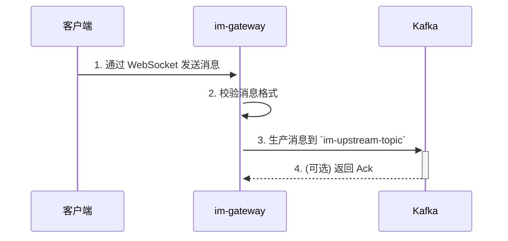
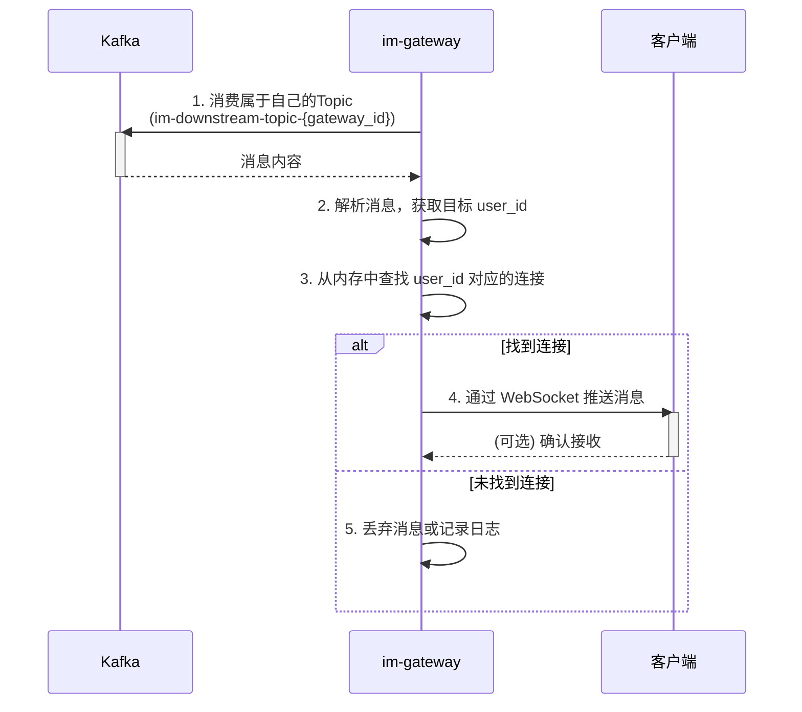

# im-gateway 网关服务设计

`im-gateway` 是 GoChat 系统的流量入口和协议转换层，所有客户端的请求都首先经过此服务。它的核心职责是管理海量客户端连接，并作为内外网络协议的桥梁。

## 1. 核心职责

1.  **协议转换器**: 它是连接“外部世界”（客户端）和“内部世界”（后端服务）的桥梁。
    *   **外部**: 对客户端暴露 **HTTP/RESTful API** 和 **WebSocket** 协议。
    *   **内部**: 与后端服务（如 `im-logic`）通过 **gRPC** 通信；与消息系统通过 **Kafka** 通信。
2.  **用户认证官**: 它是安全的第一道防线，负责验证所有传入请求的合法性（JWT Token）。
3.  **连接管理器**: 它需要稳定地维护成千上万个来自客户端的 WebSocket 长连接，并处理心跳和连接生命周期。
4.  **消息代理人**:
    *   **上行**: 将客户端发来的消息可靠地投递到 Kafka 的上行 Topic。
    *   **下行**: 从 Kafka 消费只属于本节点用户的下行 Topic 消息，并精确地推送给他们。

**设计目标**: `im-gateway` 被设计为一个**无状态、高可用、可水平扩展**的网关服务。

## 2. 架构与技术栈

`im-gateway` 作为一个纯粹的网关，不包含任何业务逻辑。它的主要工作是I/O密集型的。

| 用途 | 库/工具 | 说明 |
| :--- | :--- | :--- |
| **基础库** | `im-infra` | 统一的基础能力封装，如配置、日志、RPC等。 |
| **HTTP 框架** | `github.com/gin-gonic/gin` | 用于实现 RESTful API。 |
| **WebSocket** | `github.com/gorilla/websocket` | 用于管理客户端长连接。 |
| **gRPC 客户端** | `google.golang.org/grpc` | 用于调用 `im-logic` 等内部服务的同步接口。 |
| **Kafka 客户端** | `github.com/segmentio/kafka-go` | 用于与消息队列交互，生产上行消息，消费下行消息。 |
| **服务发现** | `im-infra/coord` | 通过 etcd 发现下游服务，并向 `im-logic` 注册自身。 |

## 3. 核心流程

### 3.1 连接建立与状态注册

1.  客户端使用 JWT Token 发起 WebSocket 连接请求。
2.  `im-gateway` 的认证中间件验证 Token 的合法性。
3.  验证通过后，HTTP 连接被升级为 WebSocket 长连接。
4.  `im-gateway` 生成一个唯一的 `gateway_id`。
5.  **关键步骤**: `im-gateway` 将用户的在线状态写入 Redis: `HSET user_session:{user_id} gateway_id {current_gateway_id}`。这个信息是 `im-logic` 进行消息路由的关键依据。
6.  `im-gateway` 在本地内存中维护 `user_id -> websocket_connection` 的映射，用于快速推送下行消息。

### 3.2 消息上行流程

### 3.3 消息下行流程

## 4. 高可用与水平扩展

`im-gateway` 的无状态设计是其高可用的基石。

- **无状态**: `im-gateway` 自身不存储任何业务状态。用户的会话信息、在线状态等都存储在外部的 Redis 中。
- **服务发现**: 每个 `im-gateway` 实例启动时，都会向 etcd 注册自己的信息。`im-logic` 通过 etcd 感知所有可用的 `im-gateway` 实例。
- **水平扩展**: 当流量增加时，可以直接增加 `im-gateway` 的实例数量。新的实例会处理新的客户端连接，并向 Redis 注册在线状态，从而被 `im-logic` 自动纳入消息路由范围。
- **故障转移**: 如果某个 `im-gateway` 实例宕机，其维护的 WebSocket 连接会断开。客户端会自动进行重连，此时可能会连接到另一个健康的 `im-gateway` 实例上。新的实例会更新 Redis 中的在线状态，`im-logic` 会自动将消息路由到新的实例，从而实现故障转移。

## 5. 性能与安全

### 5.1 性能优化
- **高并发连接**: 通过优化 Linux 内核参数、使用 `epoll` I/O 多路复用，并利用 `sync.Pool` 复用 WebSocket 读写的缓冲区和消息结构体，最大化单机性能。
- **内存管理**: 对所有频繁创建和销毁的对象使用对象池技术，减少 GC 压力。

### 5.2 安全与可靠性
- **DDoS 防护**: 网关部署在云厂商的负载均衡器之后，利用其提供的基础 DDoS 防护能力。
- **限流 (Rate Limiting)**:
    - `im-gateway` 是执行限流策略的理想位置。它使用 `im-infra/ratelimit` 组件，基于 Redis 实现分布式限流。
    - **多维度限流**: 可根据 IP、用户ID、接口路径等多个维度进行配置。
    - **优先级降级**: 在系统高负载时，可以对来自特定群组（如超大群）或非核心业务的请求进行限流，甚至可以将其路由到低优先级的 Kafka Topic，优先保障单聊和核心API的稳定性。
