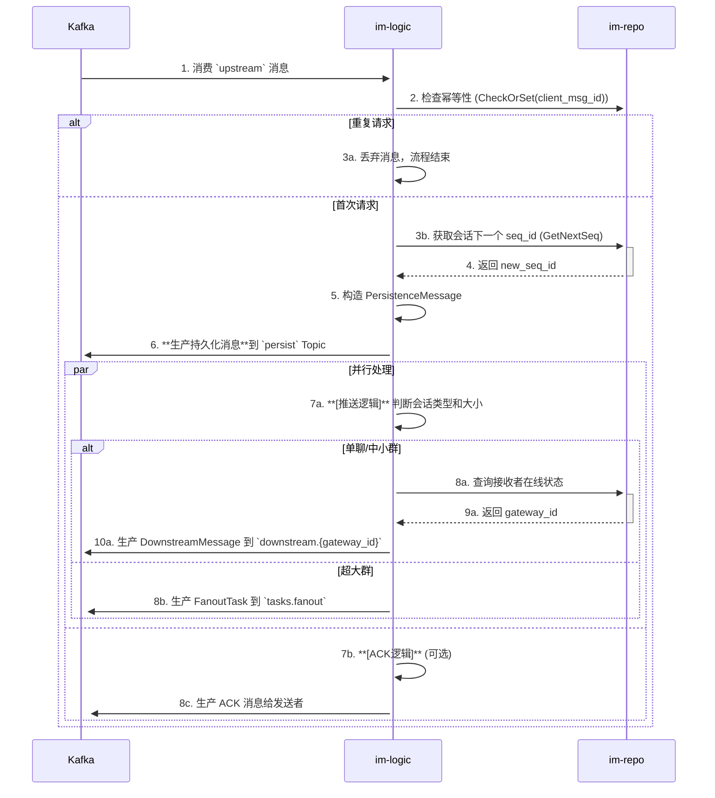
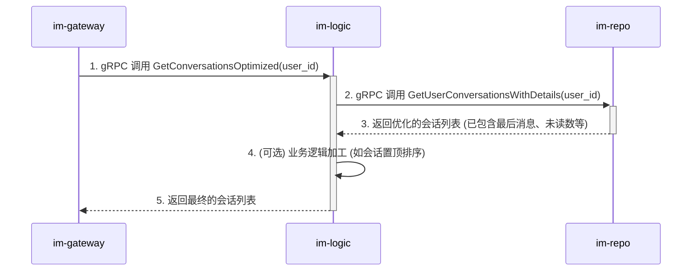

# im-logic 业务逻辑服务设计文档

`im-logic` 是 GoChat 系统的“大脑”，负责处理所有核心业务逻辑。它作为中心协调器，响应来自 `im-gateway` 的同步请求和 Kafka 的异步消息，编排对 `im-repo` 的数据访问，并驱动整个系统的业务流程。

**设计目标**: 开发一个**无状态、高可用、可扩展**的业务逻辑服务，清晰地封装业务规则，并与其他服务高效协作。

## 1. 核心职责

1.  **业务逻辑处理 (Business Logic Processing)**:
    *   执行所有核心业务规则，如用户认证、会话管理、权限检查（如是否禁言）、消息处理等。
    *   是所有业务策略的决策中心，例如判断一个群是否为“超大群”并执行不同的推送策略。

2.  **服务编排与协调 (Service Orchestration)**:
    *   作为中心协调器，接收来自上游（`im-gateway` 或 `im-task`）的请求。
    *   调用下游的 `im-repo` 服务来执行所有的数据读写操作。
    *   将需要异步处理的任务（如消息持久化、大群扇出）或领域事件发布到 Kafka。

3.  **消息流转的核心枢纽 (Message Flow Hub)**:
    *   **消费上行消息**: 从 Kafka 的 `gochat.messages.upstream` 主题消费来自 `im-gateway` 的原始 WebSocket 消息。
    *   **生产持久化消息**: 在处理完业务逻辑（如分配 `seq_id`）后，将消息生产到 `gochat.messages.persist` 主题，交由 `im-task` 进行持久化。
    *   **生产下行消息/任务**: 根据推送策略，将下行消息直接推送到目标网关的 Topic，或将扇出任务交由 `im-task` 处理。

## 2. 架构与模块设计

### 2.1 内部模块图

```mermaid
graph TD
    subgraph Upstream [上游服务]
        direction LR
        U1[im-gateway]
        U2[Kafka: upstream]
    end

    subgraph im-logic [im-logic 服务]
        direction TB
        
        subgraph Entrypoints [入口层]
            direction LR
            GrpcServer[gRPC Server]
            KafkaConsumer[Kafka 消费者]
        end

        subgraph ServiceLayer [服务层]
            direction LR
            AuthSvc[Auth Service]
            ConvSvc[Conversation Service]
            MsgSvc[Message Service]
        end
        
        subgraph BizLogic [业务逻辑层]
            direction LR
            UserLogic[User Logic]
            ConvLogic[Conversation Logic]
            MsgLogic[Message Logic]
            PushLogic[Push Logic]
        end

        subgraph Connectors [连接器层]
            direction LR
            RepoClient[Repo gRPC Client]
            KafkaProducer[Kafka 生产者]
        end

        GrpcServer --> ServiceLayer
        KafkaConsumer -- "上行消息" --> MsgLogic
        ServiceLayer -- "调用" --> BizLogic
        BizLogic -- "数据操作" --> RepoClient
        BizLogic -- "异步任务/推送" --> KafkaProducer
    end

    subgraph Downstream [下游服务]
        direction TB
        D1[im-repo (gRPC)]
        D2[Kafka: persist, downstream, tasks]
    end

    U1 -- "gRPC 请求" --> GrpcServer
    U2 -- "消费" --> KafkaConsumer
    RepoClient -- "gRPC 调用" --> D1
    KafkaProducer -- "生产" --> D2
```

### 2.2 模块职责

*   **入口层 (Entrypoints)**:
    *   `GrpcServer`: 实现 `im_logic` 的 gRPC 接口，接收来自 `im-gateway` 的同步请求。
    *   `KafkaConsumer`: 消费 `gochat.messages.upstream` 主题，处理来自 WebSocket 的异步消息。
*   **服务层 (Service Layer)**:
    *   作为 gRPC 服务的门面，负责协议转换（Protobuf <> 内部模型），并调用 `BizLogic` 层。
*   **业务逻辑层 (Business Logic Layer)**:
    *   `im-logic` 的核心，实现所有业务规则。
    *   `MsgLogic` 负责处理消息的完整生命周期：幂等性检查、获取序列号、持久化、触发推送。
    *   `PushLogic` 封装推送策略，根据群规模决定是同步推送还是异步扇出。
*   **连接器层 (Connectors)**:
    *   `RepoClient`: `im-repo` 服务的 gRPC 客户端封装。
    *   `KafkaProducer`: 用于向 Kafka 各个 Topic 生产消息。

## 3. 关键业务流程

### 3.1 发送消息流程 (核心异步流程)


**核心原则**: **持久化先行**。在执行任何推送逻辑前，必须先将带有 `seq_id` 的消息发送到持久化队列，确保消息的可靠存储。

### 3.2 获取会话列表流程 (核心同步流程)


**核心原则**: **职责委托**。`im-logic` 将复杂的 N+1 查询问题完全委托给 `im-repo`，自身只负责上层的、纯粹的业务逻辑加工。

## 4. 容错与扩展性

### 4.1 业务容错

*   **下游服务依赖**:
    *   对 `im-repo` 的 gRPC 调用集成**超时、重试、熔断**机制。
    *   在 `im-repo` 故障时，执行**服务降级**，优先保障核心功能（如消息收发），牺牲非核心功能（如获取历史消息）。
*   **消息队列**:
    *   **生产者**: 对持久化消息的生产失败执行**重试和死信队列**策略。
    *   **消费者**: 采用**手动提交Offset**，确保业务逻辑成功处理后再确认消费，保证消息至少被处理一次。对无法处理的“毒消息”记录日志并跳过，避免阻塞消费。

### 4.2 扩展性

*   **无状态设计**: `im-logic` 是无状态服务，可以根据 CPU 负载进行**水平扩展**。gRPC 的负载均衡和 Kafka 的消费者组机制可以自动将流量和任务分配到新实例。
*   **业务模块化**: 当前的内部分层设计为未来将 `im-logic` 按业务领域（如用户、好友、群组）**拆分为更小的微服务**奠定了基础，以应对业务复杂度的持续增长。
*   **配置中心化**: 业务策略中的可变参数（如大群阈值、功能开关）通过配置中心进行管理，实现动态调整，提高系统灵活性。
