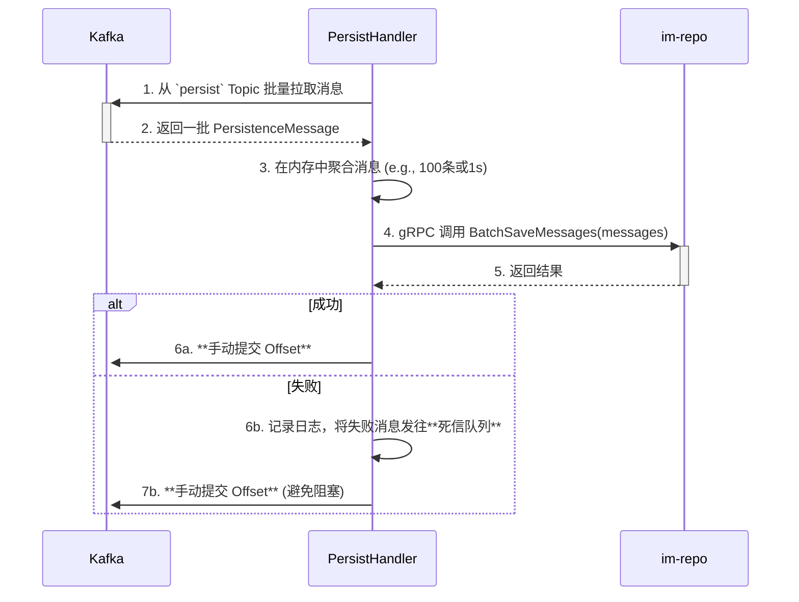

# im-task 异步任务服务设计文档

`im-task` 是 GoChat 系统的后台任务处理中心，一个纯粹的消费者服务。它的核心职责是将耗时的、非实时的、可并行的任务从主业务流程（`im-logic`）中剥离出来，以提高主流程的响应速度和系统的整体吞吐量。

**设计目标**: 开发一个**可靠、可扩展、易于维护**的通用异步任务处理服务，确保任务不丢失、不阻塞，并能随着业务增长而水平扩展。

## 1. 核心职责

1.  **消息持久化 (Message Persistence)**:
    *   作为消息写入数据库的**唯一入口**，消费 `gochat.messages.persist` 主题。
    *   调用 `im-repo` 的 `BatchSaveMessages` 接口，将消息批量、可靠地存入 MySQL。
    *   这是 `im-task` 最高优先级的任务，确保了 `im-logic` 可以“发后即忘”。

2.  **大群消息扇出 (Large Group Fan-out)**:
    *   消费 `gochat.tasks.fanout` 主题，处理超大群的消息扩散任务。
    *   通过分批拉取群成员、查询在线状态、批量生产下行消息的方式，高效地完成消息扩散，避免阻塞 `im-logic`。

3.  **通用后台任务处理 (General Background Tasks)**:
    *   作为一个通用的任务处理框架，未来可轻松扩展以支持更多任务，例如：
        *   **推送通知**: 调用第三方服务（APNs, FCM）发送移动端推送。
        *   **数据聚合**: 定期执行统计分析任务。
        *   **数据清理**: 清理过期的临时数据。

## 2. 架构与模块设计

### 2.1 内部模块图

```mermaid
graph TD
    subgraph Upstream [上游服务]
        direction LR
        U1[Kafka: persist, fanout, ...]
    end

    subgraph im-task [im-task 服务]
        direction TB
        
        subgraph Entrypoint [入口层]
            KafkaConsumer[Kafka 消费者]
        end

        subgraph Dispatcher [任务分发器]
            TaskDispatcher[Task Dispatcher]
        end
        
        subgraph Handlers [任务处理器]
            PersistHandler[持久化处理器]
            FanoutHandler[扇出处理器]
            NotificationHandler[...]
        end

        subgraph Connectors [连接器层]
            RepoClient[Repo gRPC Client]
            KafkaProducer[Kafka 生产者]
        end

        KafkaConsumer --> TaskDispatcher
        TaskDispatcher -- "分发任务" --> Handlers
        
        PersistHandler --> RepoClient
        FanoutHandler --> RepoClient
        FanoutHandler --> KafkaProducer
    end

    subgraph Downstream [下游服务]
        direction TB
        D1[im-repo (gRPC)]
        D2[Kafka: downstream]
    end

    U1 -- "消费" --> KafkaConsumer
    RepoClient -- "gRPC 调用" --> D1
    KafkaProducer -- "生产" --> D2
```

### 2.2 模块职责

*   **入口层 (`KafkaConsumer`)**: 唯一入口。订阅所有任务 Topic，并将消费到的原始消息传递给 `TaskDispatcher`。
*   **任务分发器 (`TaskDispatcher`)**: 核心路由。根据消息来源的 Topic 或消息体内的类型字段，将任务分发给对应的 `Handler`。
*   **任务处理器 (`Handlers`)**:
    *   **插件化设计**，每个 `Handler` 负责一种特定任务。
    *   `PersistHandler`: 负责批量处理持久化任务。
    *   `FanoutHandler`: 负责处理大群扇出任务。
*   **连接器层 (`Connectors`)**:
    *   `RepoClient`: `im-repo` 服务的 gRPC 客户端封装。
    *   `KafkaProducer`: 主要由 `FanoutHandler` 使用，向 `downstream` Topic 生产消息。

## 3. 关键任务处理流程

### 3.1 消息持久化流程 (批量处理)



### 3.2 大群消息扇出流程

```mermaid
sequenceDiagram
    participant Kafka as Kafka
    participant Handler as FanoutHandler
    participant Repo as im-repo

    Handler->>+Kafka: 1. 从 `fanout` Topic 消费 FanoutTask
    
    loop 分批获取群成员
        Handler->>+Repo: 2. 分页调用 GetGroupMembers
        Repo-->>-Handler: 3. 返回一批成员 user_ids
        
        Handler->>+Repo: 4. 批量调用 BatchGetUsersOnlineStatus
        Repo-->>-Handler: 5. 返回在线成员及 gateway_id
        
        Handler->>Handler: 6. 按 gateway_id 对消息分组
        
        loop 遍历每个 gateway_id
            Handler->>+Kafka: 7. **批量生产** DownstreamMessage 到 `downstream.{gateway_id}`
        end
        
        alt 还有更多成员
            continue
        else
            break
        end
    end
    
    Handler->>+Kafka: 8. **手动提交 Offset**
```

## 4. 可靠性与扩展性

### 4.1 可靠性设计

*   **At-Least-Once 语义**: 强制采用**手动提交 Offset** 机制，确保任务在处理完成后才确认消费，防止服务崩溃导致任务丢失。
*   **死信队列 (DLQ)**: 对于处理失败（如格式错误、数据库写入失败）的任务，将其转发到死信队列，以便后续分析和人工干预，同时避免阻塞主消费流程。
*   **优雅停机**: 服务能响应 `SIGTERM` 信号，确保在退出前完成当前正在处理的任务并提交 Offset。

### 4.2 扩展性设计

*   **水平扩展**: `im-task` 是无状态服务，可以随时增减实例。Kafka 的**消费者组 (Consumer Group)** 机制会自动将 Topic 分区 rebalance 到所有实例，实现处理能力的线性扩展。
*   **分区规划**: `im-task` 的最大并发度受限于其消费的 Topic 的分区数。核心 Topic（如 `gochat.messages.persist`）在创建时就应规划足够多的分区（如 64, 128）。
*   **任务隔离**:
    *   **Topic 隔离**: 将不同优先级或资源消耗模型的任务放入不同的 Topic，并使用不同的消费者组进行消费，实现物理隔离。
    *   **线程池隔离**: 在服务内部，为不同类型的任务分配独立的 Goroutine Pool，防止低优先级或耗时长的任务阻塞高优先级任务。
