# GoChat 核心业务流程与数据流

本文档详细阐述了基于统一会话抽象设计的 GoChat 系统中各项核心 IM 功能的实现流程。系统将单聊、群聊、世界聊天室统一为 conversation 概念，通过事件驱动架构实现业务解耦和高可扩展性。

## 核心理念：统一会话抽象 + 事件驱动

系统采用**统一会话抽象**设计，所有社交交互都基于 `conversation` 概念：
- **单聊**：两人之间的 conversation (type=1)
- **群聊**：多人参与的 conversation (type=2)  
- **世界聊天室**：特殊的群聊 conversation (type=3)

同时遵循**事件驱动**设计模式，核心业务服务完成本职工作后发布领域事件到 Kafka，`im-task` 服务作为异步任务处理中心订阅这些事件并处理衍生任务，实现业务解耦和系统弹性。

---

## 1. 统一会话创建流程

**目标**: 展示单聊、群聊创建的统一处理流程，体现"添加好友 = 创建单聊"的设计理念。

### 1.1 好友申请 = 单聊会话邀请

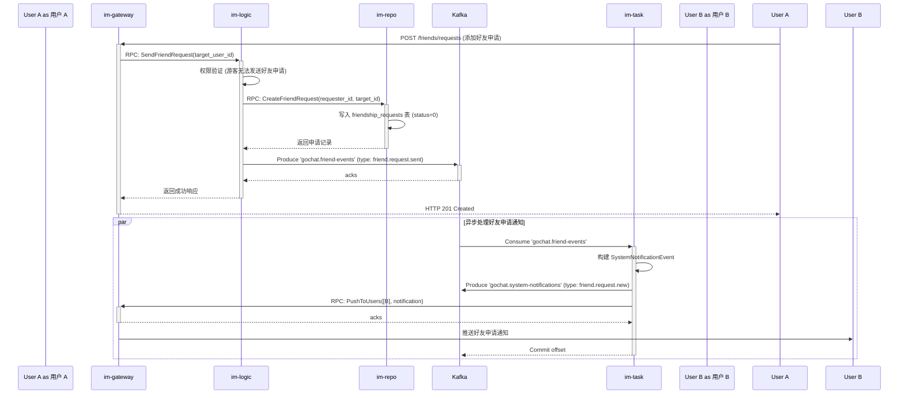

### 1.2 好友申请同意 = 自动创建单聊会话

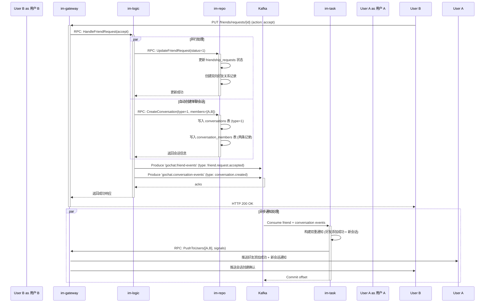

### 1.3 群聊创建流程

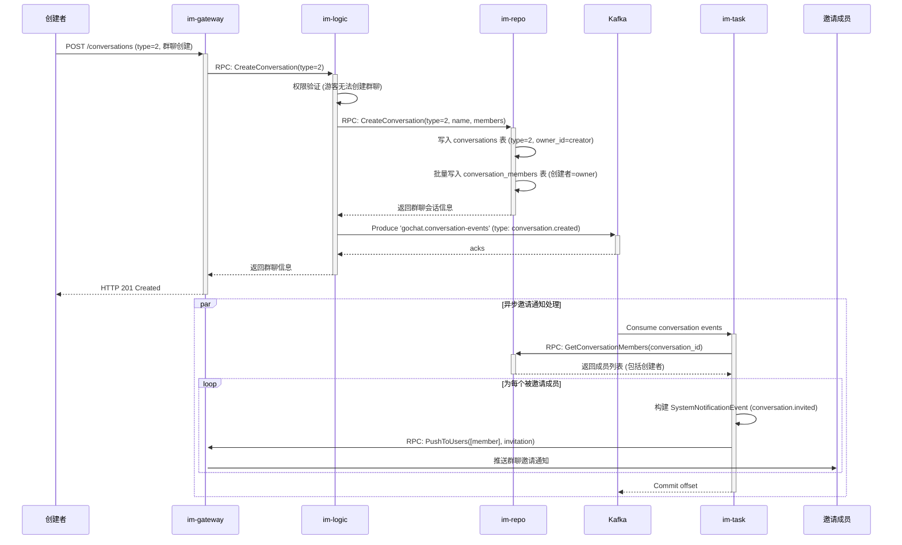

---

## 2. 统一消息收发流程

**目标**: 展示单聊、群聊、世界聊天室消息的统一处理流程，体现架构的一致性。

### 2.1 统一消息发送流程

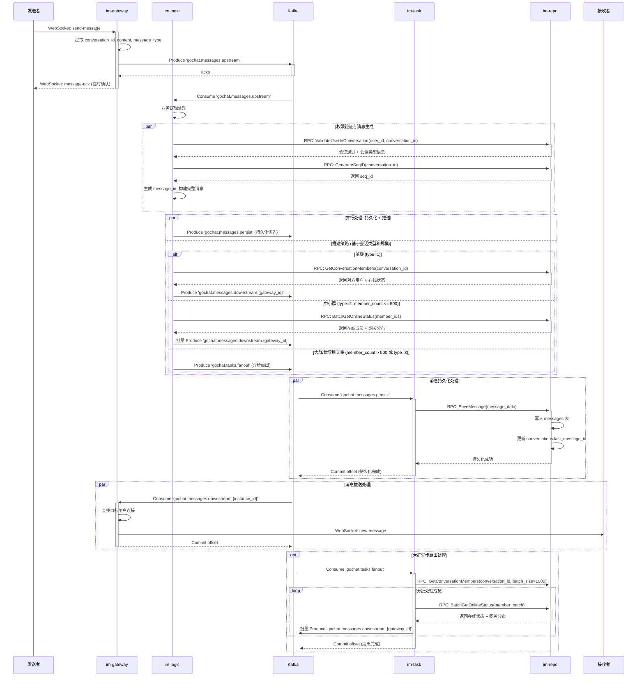

### 2.2 已读状态更新流程

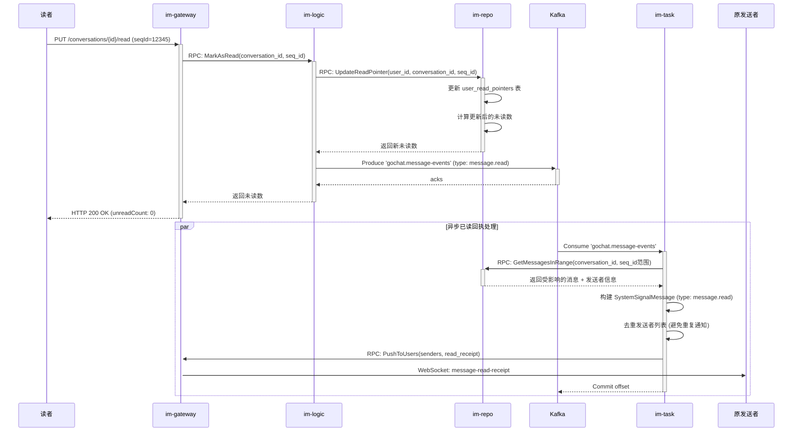

---

## 3. 会话成员管理流程

**目标**: 展示群聊成员的添加、移除、角色变更等管理操作的统一处理。

### 3.1 添加会话成员流程

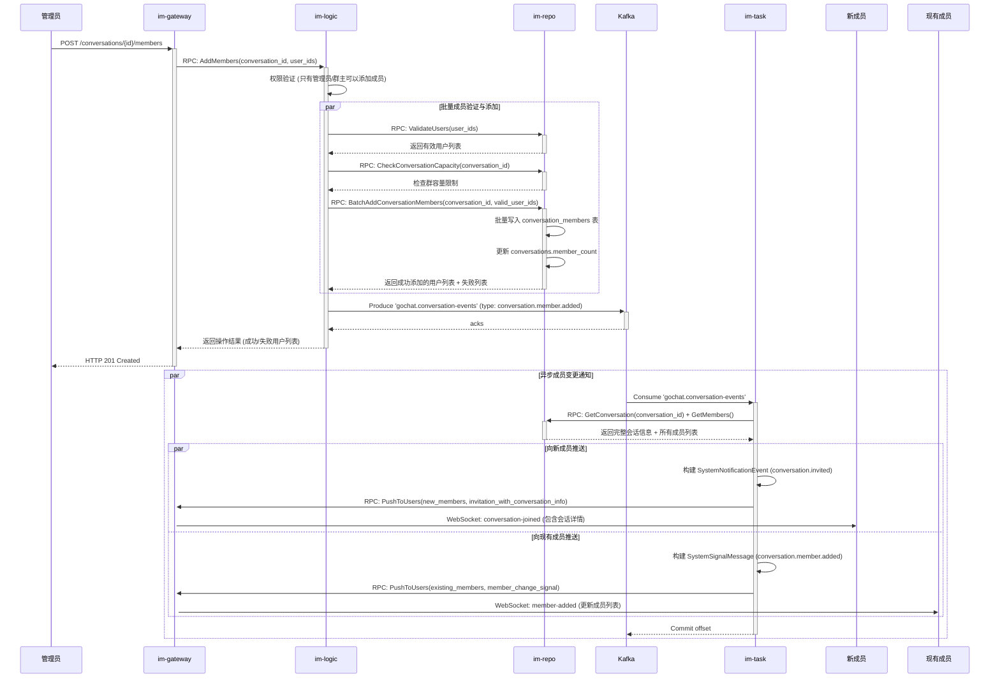

### 3.2 移除会话成员流程

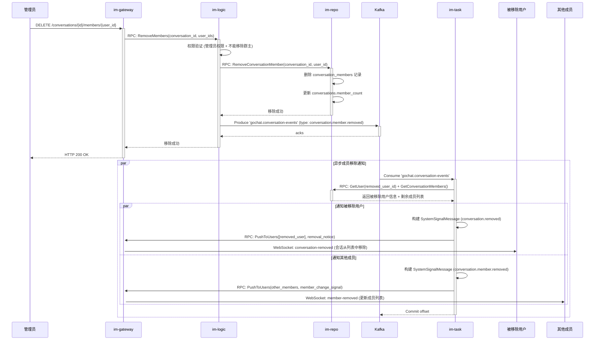

### 3.3 成员角色变更流程

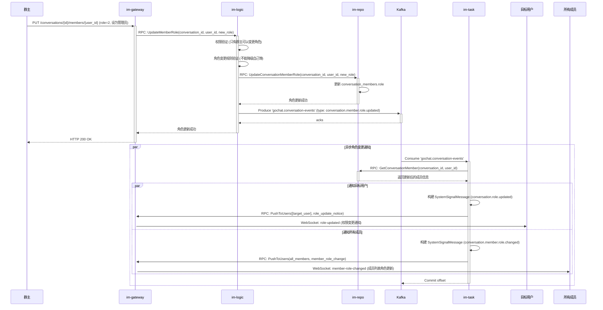

---

## 4. 用户在线状态与好友通知流程

**目标**: 展示基于好友关系的在线状态通知机制。

### 4.1 用户上线通知流程

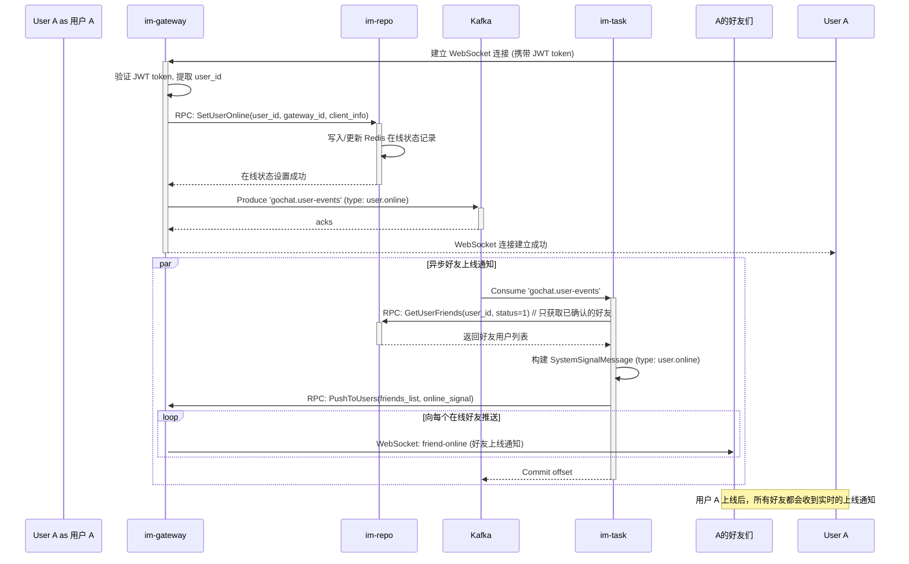

### 4.2 用户下线通知流程

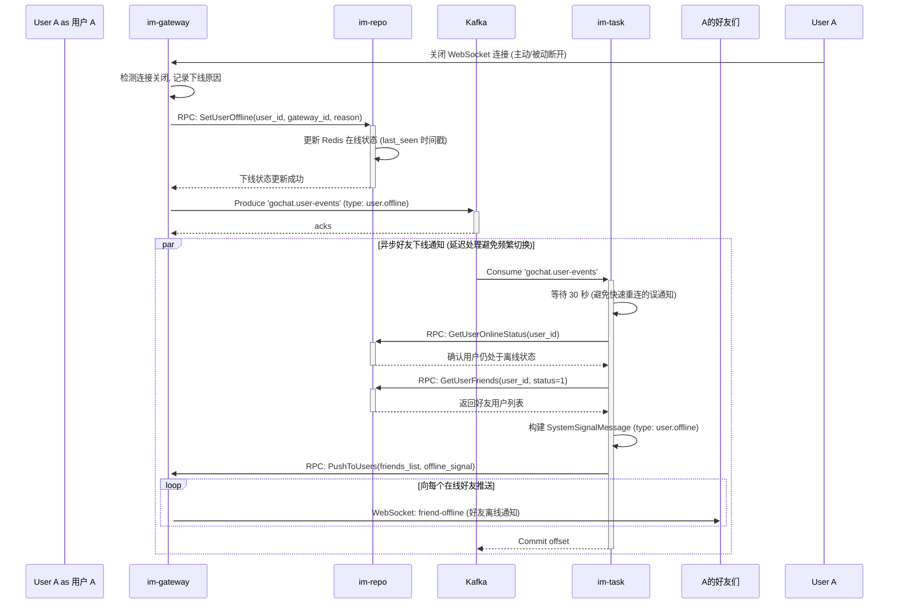

---

## 5. 世界聊天室特殊处理流程

**目标**: 展示世界聊天室作为特殊群聊的自动加入和高并发消息处理机制。

### 5.1 游客自动加入世界聊天室

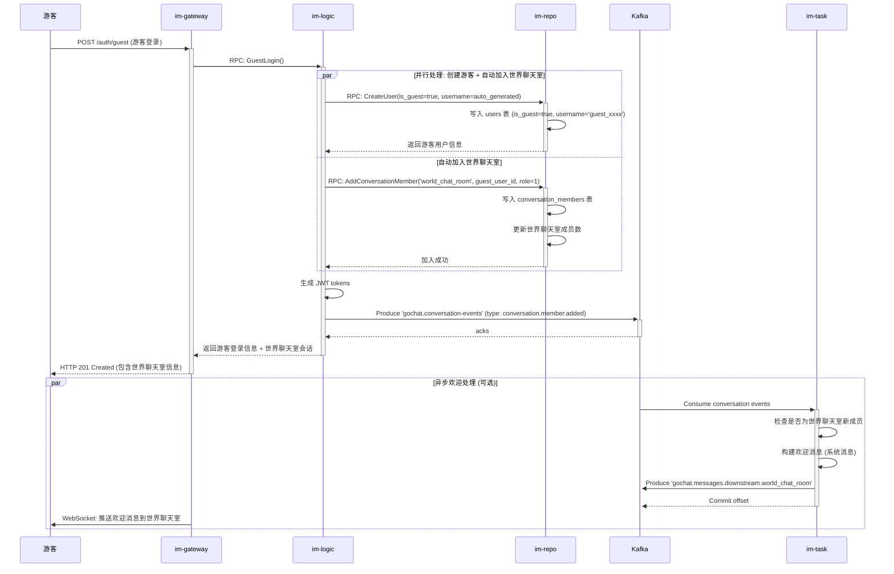

### 5.2 世界聊天室高并发消息处理

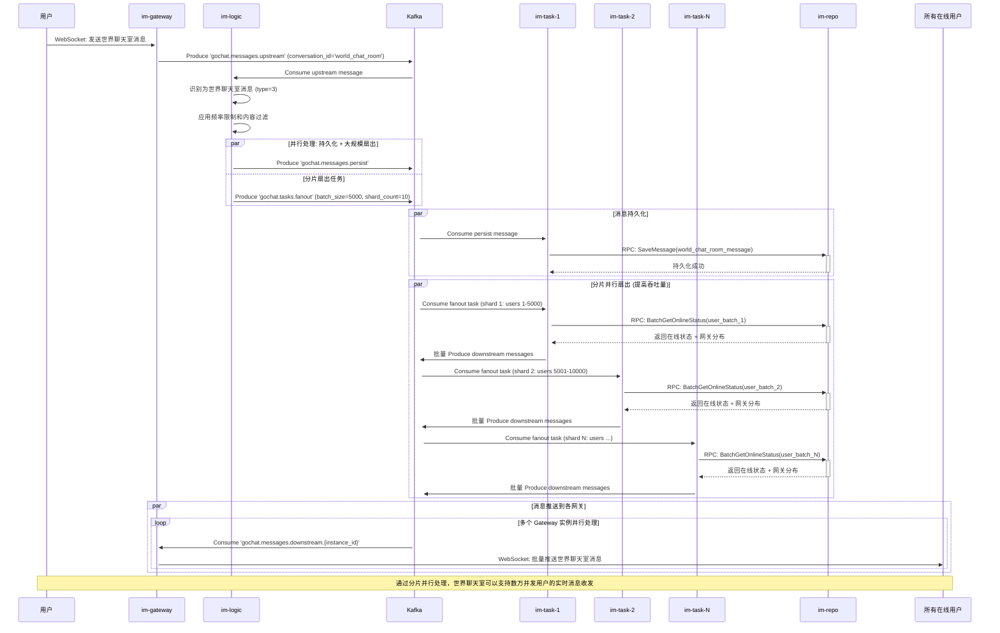

---

## 6. 错误处理与回退机制

### 6.1 消息发送失败回退

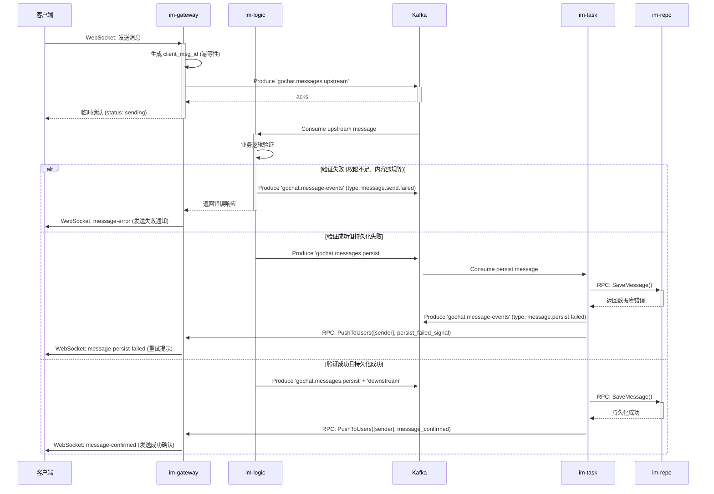

### 6.2 服务降级与熔断机制

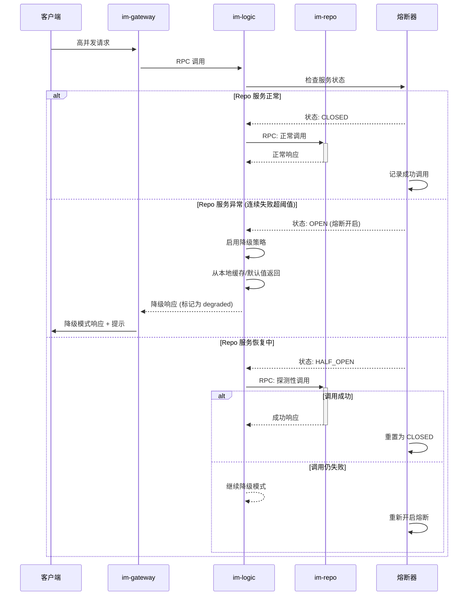

---

## 7. 性能优化策略

### 7.1 缓存策略优化

#### Redis 缓存层次设计
```markdown
1. **L1 缓存 (热点数据, TTL=5min)**:
   - `user:online:{user_id}` - 用户在线状态
   - `conversation:members:{conversation_id}` - 会话成员列表
   - `message:latest:{conversation_id}` - 会话最新消息

2. **L2 缓存 (温数据, TTL=30min)**:
   - `user:profile:{user_id}` - 用户基本信息
   - `conversation:info:{conversation_id}` - 会话元信息
   - `user:conversations:{user_id}` - 用户会话列表

3. **L3 缓存 (冷数据, TTL=2hour)**:
   - `conversation:messages:{conversation_id}:latest:50` - 会话最新50条消息
   - `user:friends:{user_id}` - 用户好友列表
```

#### 缓存更新策略
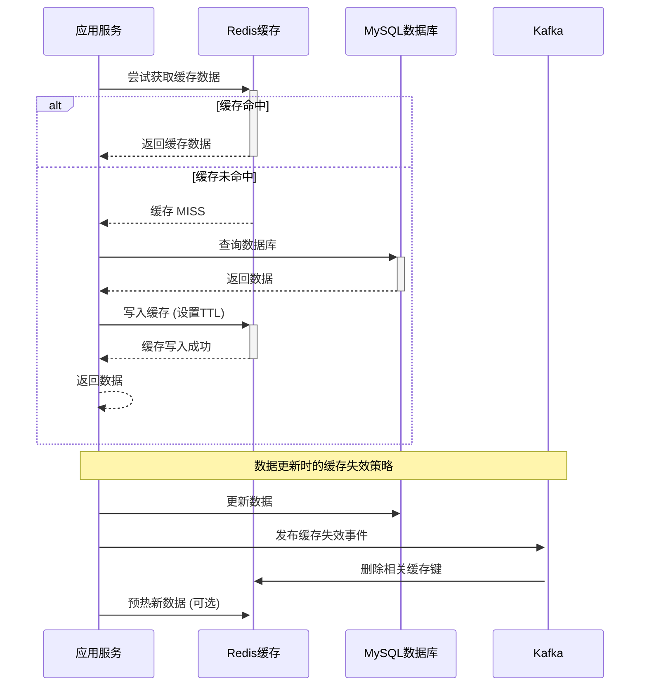

### 7.2 数据库查询优化

#### 会话列表查询优化
```sql
-- 优化前: 多次 JOIN 查询
SELECT c.*, m.content as last_content, 
       COUNT(msg.id) as unread_count
FROM conversation_members cm
JOIN conversations c ON cm.conversation_id = c.id
LEFT JOIN messages m ON c.last_message_id = m.id
LEFT JOIN messages msg ON (msg.conversation_id = c.id 
    AND msg.seq_id > COALESCE(urp.last_read_seq_id, 0))
LEFT JOIN user_read_pointers urp ON (urp.user_id = ? AND urp.conversation_id = c.id)
WHERE cm.user_id = ?
GROUP BY c.id
ORDER BY c.updated_at DESC;

-- 优化后: 分层查询 + 批量获取
-- Step 1: 快速获取会话ID列表 (使用覆盖索引)
SELECT conversation_id, updated_at 
FROM conversation_members 
WHERE user_id = ? 
ORDER BY updated_at DESC 
LIMIT 20;

-- Step 2: 批量获取会话基本信息
SELECT * FROM conversations WHERE id IN (?, ?, ...);

-- Step 3: 批量获取未读数 (通过 Redis 计数器)
MGET unread_count:user_123:conv_456 unread_count:user_123:conv_789 ...

-- Step 4: 批量获取最新消息 (通过 Redis 缓存)
MGET latest_message:conv_456 latest_message:conv_789 ...
```

#### 消息查询分片策略
```sql
-- 分片路由逻辑 (在应用层实现)
function getShardForConversation(conversationId) {
    return crc32(conversationId) % SHARD_COUNT;
}

-- 各分片的查询 (相同结构)
SELECT id, sender_id, content, seq_id, created_at
FROM messages_shard_${shardId}
WHERE conversation_id = ? 
  AND seq_id < ? 
  AND deleted = false
ORDER BY seq_id DESC 
LIMIT ?;
```

### 7.3 Kafka 消息处理优化

#### 批量处理优化
```go
// im-task 服务中的批量消息处理
type MessageBatch struct {
    ConversationID string
    Messages       []DownstreamMessage
    BatchSize      int
    ProcessedAt    time.Time
}

// 批量持久化消息
func (s *TaskService) processPersistenceBatch(batch []PersistenceMessage) error {
    // 按会话ID分组批量处理
    groupedByConversation := groupMessagesByConversation(batch)
    
    for conversationID, messages := range groupedByConversation {
        // 批量生成 seq_id (减少数据库调用)
        seqIDs := s.generateSequentialIDs(conversationID, len(messages))
        
        // 批量插入消息
        err := s.repo.BatchSaveMessages(conversationID, messages, seqIDs)
        if err != nil {
            return fmt.Errorf("batch save failed: %w", err)
        }
        
        // 异步更新缓存
        go s.updateConversationCache(conversationID, messages[len(messages)-1])
    }
    
    return nil
}
```

#### 消息扇出优化
```go
// 智能扇出策略
func (s *TaskService) processFanoutTask(task FanoutTask) error {
    conversation, err := s.repo.GetConversation(task.ConversationID)
    if err != nil {
        return err
    }
    
    switch {
    case conversation.MemberCount <= 100:
        // 小群: 直接获取所有成员并推送
        return s.processSmallGroupFanout(task)
        
    case conversation.MemberCount <= 1000:
        // 中群: 分批处理，每批200人
        return s.processMediumGroupFanout(task, 200)
        
    case conversation.Type == ConversationTypeWorld:
        // 世界聊天室: 特殊优化，基于地理位置/在线时长分片
        return s.processWorldChatFanout(task)
        
    default:
        // 大群: 最大分片并行处理
        return s.processLargeGroupFanout(task, 500)
    }
}
```

### 7.4 WebSocket 连接优化

#### 连接池管理
```go
// Gateway 中的连接管理优化
type ConnectionManager struct {
    // 按用户ID索引的连接
    userConnections map[string]*Connection
    // 按会话ID索引的连接 (用于群推送)
    conversationConnections map[string]map[string]*Connection
    // 连接统计信息
    stats ConnectionStats
    // 读写锁保护
    mu sync.RWMutex
}

// 智能推送优化
func (cm *ConnectionManager) PushToConversation(conversationID string, message []byte) {
    cm.mu.RLock()
    connections := cm.conversationConnections[conversationID]
    cm.mu.RUnlock()
    
    if len(connections) == 0 {
        return
    }
    
    // 并发推送优化 (批量+协程池)
    semaphore := make(chan struct{}, 100) // 限制并发数
    var wg sync.WaitGroup
    
    for userID, conn := range connections {
        wg.Add(1)
        semaphore <- struct{}{} // 获取信号量
        
        go func(uid string, c *Connection) {
            defer func() {
                <-semaphore // 释放信号量
                wg.Done()
            }()
            
            if err := c.WriteMessage(message); err != nil {
                // 连接失败时自动清理
                cm.removeConnection(uid)
                log.Warn("Failed to push message to user", "user_id", uid, "error", err)
            }
        }(userID, conn)
    }
    
    wg.Wait()
}
```

---

## 8. 监控与可观测性

### 8.1 关键指标监控

#### 业务指标
```markdown
1. **消息处理指标**:
   - 消息发送成功率 (>99.9%)
   - 消息端到端延迟 (P95 < 100ms)
   - 消息持久化延迟 (P95 < 50ms)

2. **会话管理指标**:
   - 会话创建成功率 (>99.5%)
   - 会话列表加载时间 (P95 < 200ms)
   - 成员变更操作延迟 (P95 < 500ms)

3. **用户体验指标**:
   - 用户上线通知延迟 (P95 < 2s)
   - 好友申请处理时间 (P95 < 1s)
   - WebSocket 连接成功率 (>99.8%)
```

#### 系统指标
```markdown
1. **服务健康度**:
   - 各微服务可用性 (>99.9%)
   - gRPC 调用成功率 (>99.5%)
   - Kafka 消费延迟 (<1s)

2. **资源使用**:
   - 内存使用率 (<80%)
   - CPU 使用率 (<70%)
   - 数据库连接池使用率 (<85%)

3. **缓存效率**:
   - Redis 缓存命中率 (>95%)
   - 缓存更新延迟 (<10ms)
   - 缓存内存使用率 (<90%)
```

### 8.2 告警策略

```yaml
# Prometheus 告警规则示例
groups:
  - name: gochat.rules
    rules:
      - alert: MessageSendFailureHigh
        expr: rate(gochat_message_send_failures_total[5m]) > 0.01
        for: 2m
        labels:
          severity: warning
        annotations:
          summary: "消息发送失败率过高"
          
      - alert: ConversationLoadSlow
        expr: histogram_quantile(0.95, rate(gochat_conversation_load_duration_seconds_bucket[5m])) > 0.5
        for: 1m
        labels:
          severity: critical
        annotations:
          summary: "会话加载延迟过高"
          
      - alert: KafkaConsumerLag
        expr: kafka_consumer_lag_sum > 1000
        for: 30s
        labels:
          severity: critical
        annotations:
          summary: "Kafka 消费积压严重"
```

通过这套完整的业务流程设计，GoChat 系统实现了：

1. **统一的会话抽象**: 单聊、群聊、世界聊天室使用相同的处理逻辑
2. **事件驱动架构**: 通过 Kafka 实现服务解耦和异步处理
3. **高性能优化**: 多层缓存、数据库分片、批量处理等
4. **容错机制**: 熔断、降级、重试等保证系统稳定性
5. **可观测性**: 全面的监控和告警体系

整个系统设计体现了"简单而不简陋"的设计哲学，通过统一抽象降低复杂度，通过事件驱动提升扩展性，通过性能优化保证用户体验。