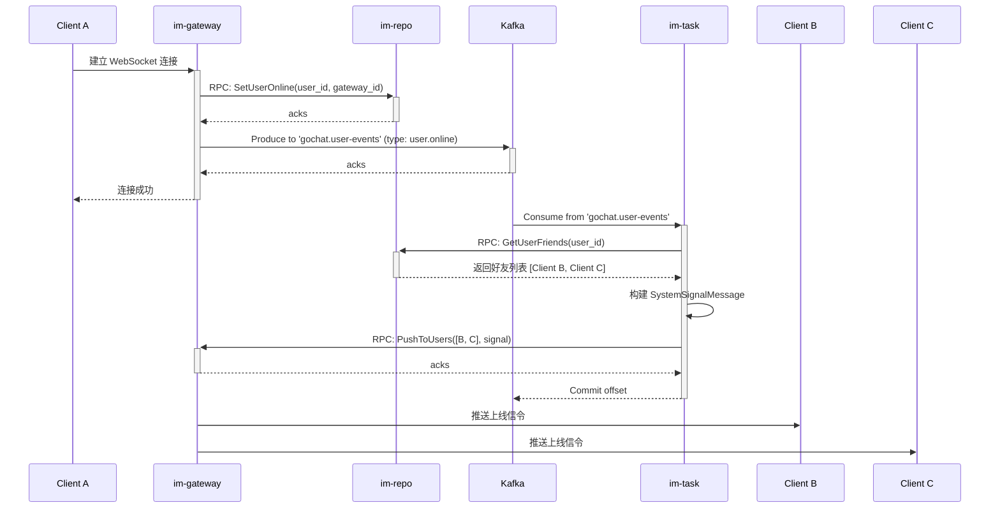
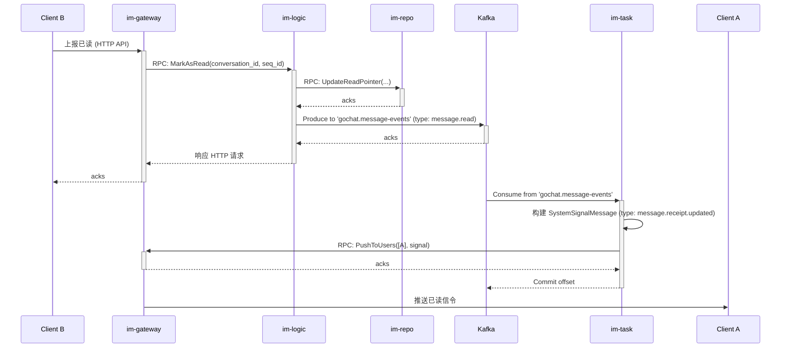
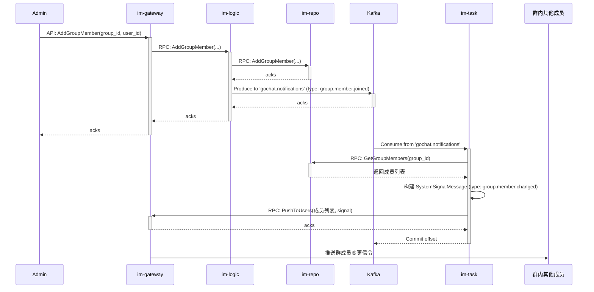

# GoChat 核心业务流程与数据流

本文档详细阐述了 GoChat 系统中各项核心 IM 功能的实现流程。它旨在将底层的 gRPC 服务、Kafka 消息和数据库模型串联起来，形成一个完整、清晰的业务闭环视图，并明确了各微服务的职责。

## 核心理念：事件驱动与职责分离

系统遵循事件驱动的设计模式。核心业务服务（如 `im-logic`）在完成本职工作后，会发布**领域事件**到 Kafka。这些事件是“已经发生的事实”，例如“用户已上线”或“消息已发送”。

**`im-task` 服务**作为系统的**异步任务处理中心**，会订阅这些领域事件，并负责处理所有后续的衍生任务，例如“通知好友此人已上线”或“通知发送者消息已被对方读取”。这种设计将核心业务与衍生业务解耦，使得系统更具弹性和可扩展性。

---

## 1. 用户在线状态与好友上线通知

**目标**: 用户 A 上线后，其所有好友能收到“A 已上线”的实时通知。

### 1.1 流程图

### 1.2 详细步骤

1.  **状态注册**:
    *   客户端 A 与 `im-gateway` 建立连接。
    *   `im-gateway` 调用 `im-repo` 的 `SetUserOnline` RPC，在 Redis 中记录 A 的在线状态及其所在的 `gateway` 实例 ID。

2.  **发布事件**:
    *   `im-gateway` 向 Kafka 的 `gochat.user-events` 主题发布一条 `user.online` 事件。此事件只包含 `user_id` 等基本信息，说明“A 上线了”这个事实。

3.  **事件处理与推送**:
    *   `im-task` 服务订阅 `gochat.user-events` 主题，消费到这条上线事件。
    *   `im-task` 调用 `im-repo` 的 `FriendService.GetUserFriends` RPC，获取 A 的所有好友列表。
    *   `im-task` 构建一个 `SystemSignalMessage` 消息，`SignalType` 为 `friend.status.changed`，`Payload` 包含 A 的 `user_id` 和在线状态。
    *   `im-task` 调用 `im-gateway` 内部的 `PusherService.PushToUsers` RPC，将这条信令推送给 A 的所有好友。
    *   `im-gateway` 收到 RPC 请求后，将信令通过 WebSocket 精准地推送给在线的好友客户端。

---

## 2. 消息收发与已读回执

**目标**: 用户 A 发送消息给用户 B，B 读取后，A 能收到“已读”回执。

### 2.1 消息发送流程 (已在之前文档中详述)

简要流程: `Client` -> `Gateway` -> Kafka(`upstream`) -> `Logic` -> Kafka(`persist` & `downstream`) -> `Task` & `Gateway` -> `Client`。

### 2.2 已读回执流程

### 2.3 详细步骤

1.  **上报已读**:
    *   客户端 B 在界面上看到新消息后，调用 `MarkAsRead` HTTP API，上报自己在该会话中已读的最新 `seq_id`。

2.  **更新状态与发布事件**:
    *   `im-logic` 接收到请求，调用 `im-repo` 的 `UpdateReadPointer` RPC，在数据库 `user_read_pointers` 表中更新 B 的已读进度。
    *   更新成功后，`im-logic` 向 Kafka 的 `gochat.message-events` 主题发布一条 `message.read` 事件。

3.  **处理事件与推送回执**:
    *   `im-task` 消费 `message.read` 事件。
    *   `im-task` 根据事件内容，确定需要通知消息发送方 A。
    *   `im-task` 构建一个 `SystemSignalMessage`，`SignalType` 为 `message.receipt.updated`，`Payload` 包含会话 ID 和最新的已读 `seq_id`。
    *   `im-task` 调用 `im-gateway` 的 `PushToUsers` RPC，将这条已读信令推送给客户端 A。

---

## 3. 群组成员变更通知

**目标**: 用户 A 被拉入群聊后，群内所有其他成员收到“A 已加入群聊”的通知。

### 3.1 流程图

### 3.2 详细步骤

1.  **执行操作**: 管理员通过客户端调用 `AddGroupMember` API。
2.  **数据持久化与发布事件**:
    *   请求通过 `im-gateway` 到达 `im-logic`。
    *   `im-logic` 调用 `im-repo` 的 `AddGroupMember` RPC，在 `group_members` 表中添加新成员记录。
    *   成功后，`im-logic` 向 Kafka 的 `gochat.notifications` 主题发布一条 `group.member.joined` 事件。

3.  **处理事件与群组通知**:
    *   `im-task` 消费 `group.member.joined` 事件。
    *   `im-task` 调用 `im-repo` 的 `GetGroupMembers` RPC，获取该群的完整成员列表，作为推送目标。
    *   `im-task` 构建 `SystemSignalMessage`，`SignalType` 为 `group.member.changed`。
    *   `im-task` 调用 `im-gateway` 的 `PushToUsers` RPC，将此信令广播给群内所有成员。客户端收到后可以刷新成员列表。