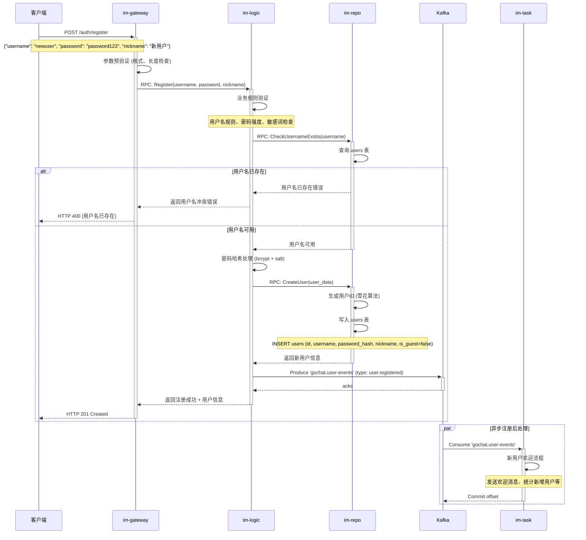
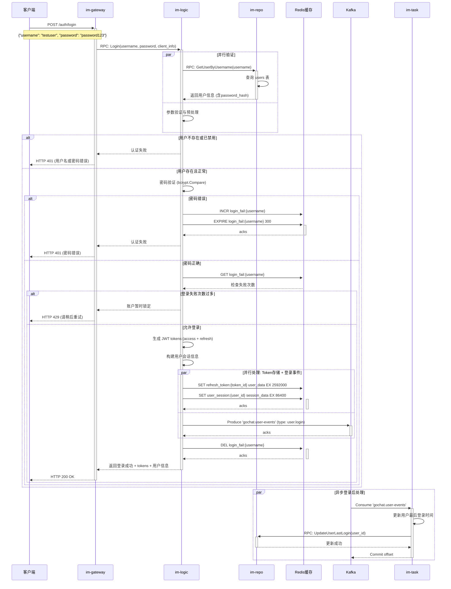
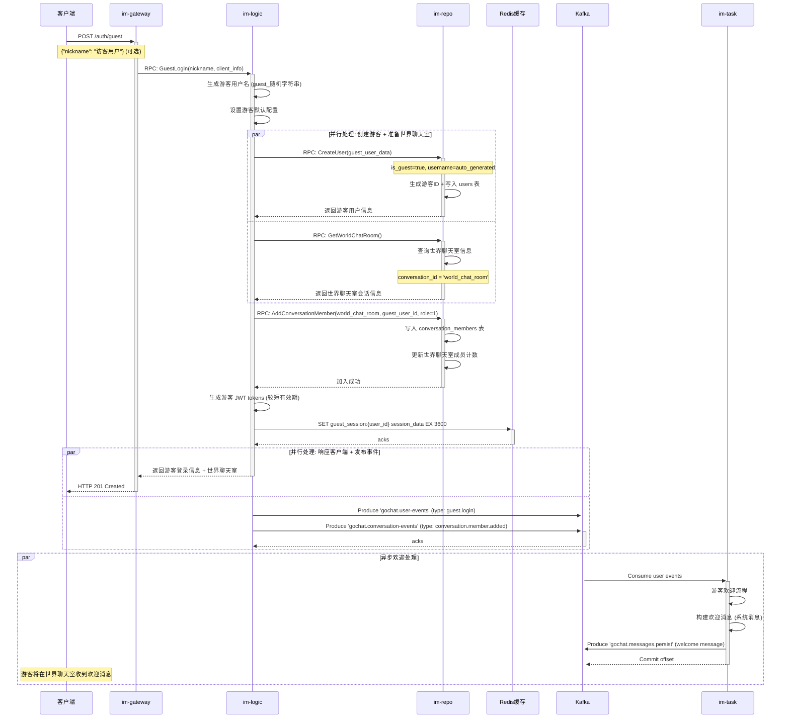
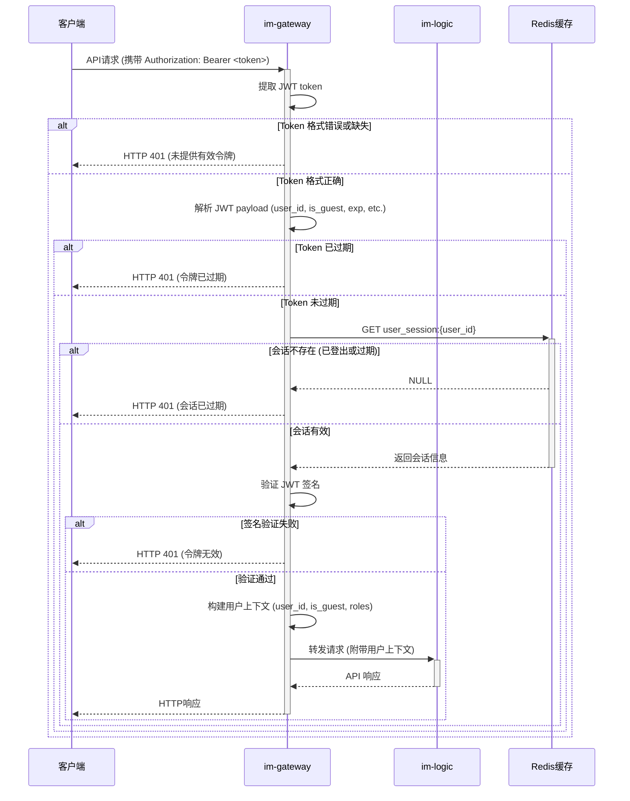
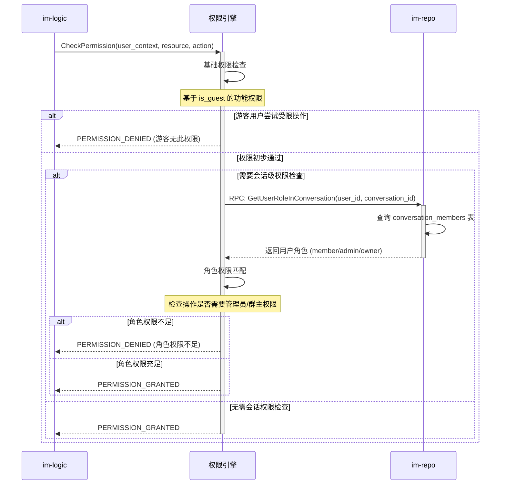
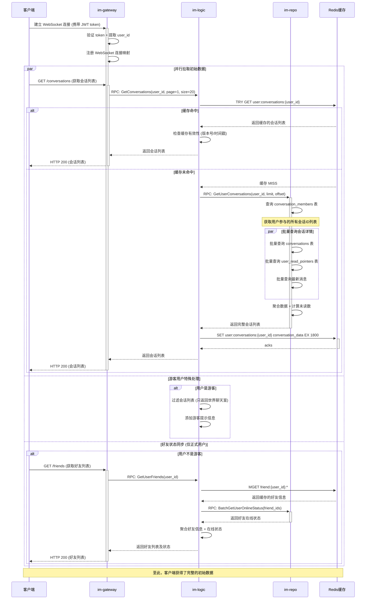
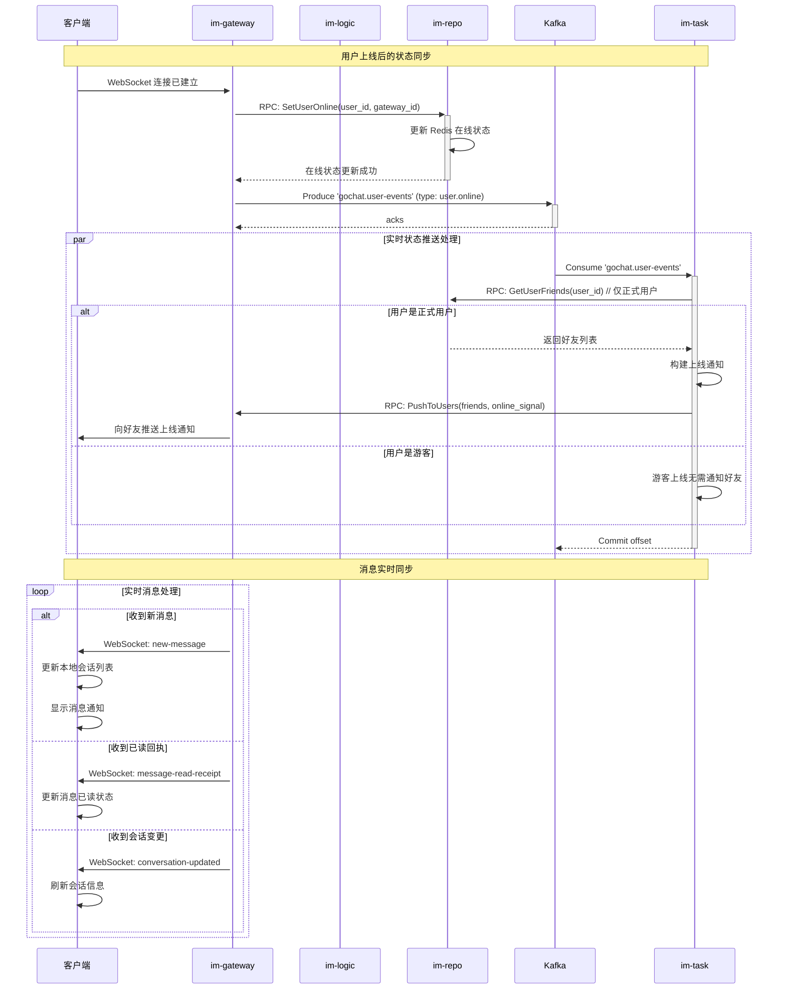
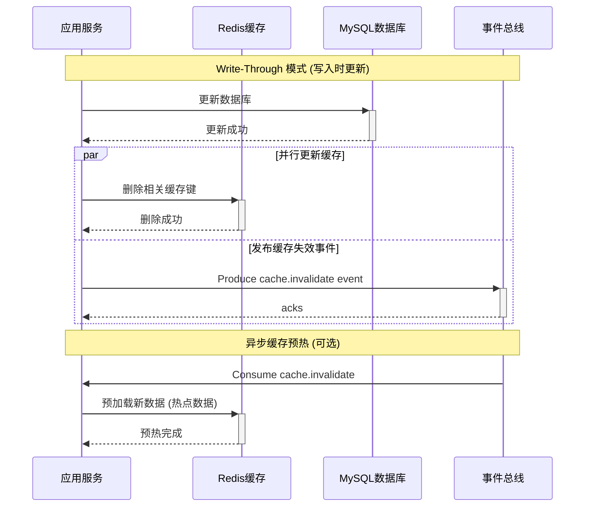
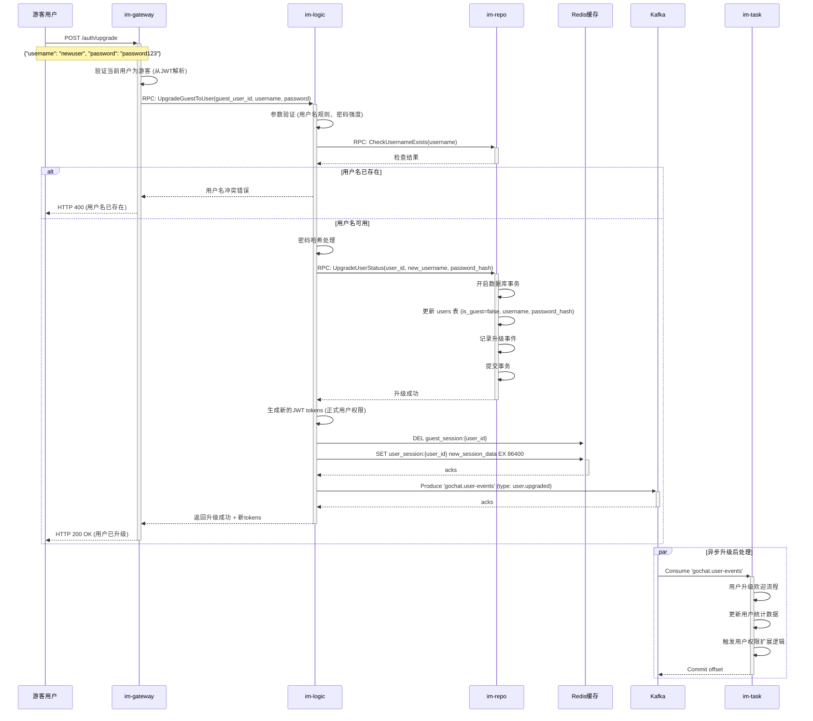
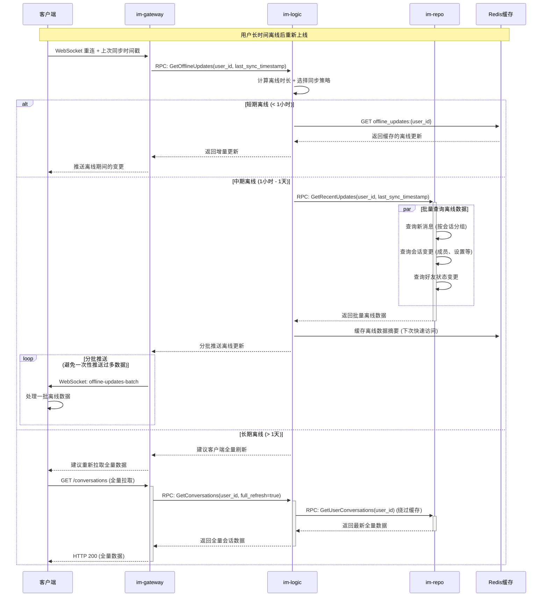

# GoChat 认证与同步流程

本文档详细描述了基于统一会话抽象设计的用户认证、授权、数据同步等核心流程。系统将单聊、群聊、世界聊天室统一为 conversation 概念，并针对正式用户和游客实现差异化的权限控制。

## 核心设计理念

### 统一身份模型
- **正式用户**: 注册用户，拥有完整功能权限
- **游客用户**: 临时用户，仅可访问世界聊天室，权限受限

### 统一权限体系
- 基于用户类型 (`is_guest`) 的功能权限控制
- 基于会话成员角色 (`role`) 的操作权限控制
- 渐进式权限升级：游客可升级为正式用户

---

## 1. 用户注册流程

**目标**: 创建新的正式用户账户，获得完整的系统功能权限。

### 1.1 注册请求处理



### 1.2 详细数据库操作

```sql
-- 1. 检查用户名唯一性
SELECT id FROM users WHERE username = 'newuser' LIMIT 1;

-- 2. 插入新用户记录
INSERT INTO users (
    id, username, password_hash, nickname, avatar_url, 
    is_guest, status, created_at, updated_at
) VALUES (
    1234567890123456789,  -- 雪花算法生成的ID
    'newuser',
    '$2a$12$encrypted_password_hash',
    '新用户',
    NULL,  -- 默认头像由前端处理
    false,  -- 正式用户
    0,      -- 正常状态
    NOW(),
    NOW()
);

-- 3. 记录注册事件 (可选，用于审计)
INSERT INTO user_events (
    user_id, event_type, event_data, created_at
) VALUES (
    1234567890123456789,
    'user.registered',
    JSON_OBJECT('registration_source', 'web', 'ip_address', '192.168.1.100'),
    NOW()
);
```

---

## 2. 用户登录与认证流程

**目标**: 验证用户身份，返回访问令牌，建立会话状态。

### 2.1 正式用户登录流程



### 2.2 游客登录流程



### 2.3 详细数据库操作

```sql
-- 游客用户创建
INSERT INTO users (
    id, username, password_hash, nickname, 
    is_guest, status, created_at, updated_at
) VALUES (
    9876543210987654321,  -- 游客ID
    'guest_a1b2c3d4',     -- 自动生成的用户名
    'N/A',                -- 游客无需密码
    COALESCE('访客用户', CONCAT('游客_', SUBSTRING(MD5(RAND()), 1, 6))),
    true,                 -- 标记为游客
    0,
    NOW(),
    NOW()
);

-- 自动加入世界聊天室
INSERT INTO conversation_members (
    conversation_id, user_id, role, nickname, 
    muted, joined_at, updated_at
) VALUES (
    'world_chat_room',    -- 固定的世界聊天室ID
    9876543210987654321,  -- 游客用户ID
    1,                    -- 普通成员角色
    '访客用户',           -- 在群内显示昵称
    false,                -- 未被禁言
    NOW(),
    NOW()
);

-- 更新世界聊天室成员计数
UPDATE conversations 
SET member_count = member_count + 1, updated_at = NOW()
WHERE id = 'world_chat_room';
```

---

## 3. 权限验证与授权流程

**目标**: 在每个API调用中验证用户身份和操作权限。

### 3.1 JWT Token 验证中间件



### 3.2 权限控制决策



### 3.3 权限矩阵

#### 基础功能权限 (基于 is_guest)

| 功能 | 正式用户 | 游客用户 | 备注 |
|------|----------|----------|------|
| 创建单聊 | ✅ | ❌ | 游客无法发起好友申请 |
| 创建群聊 | ✅ | ❌ | 游客无法创建群聊 |
| 发送消息 (世界聊天室) | ✅ | ✅ | 都可以在世界聊天室发言 |
| 发送消息 (其他会话) | ✅ | ❌ | 游客只能在世界聊天室发言 |
| 搜索用户 | ✅ | ❌ | 游客无法搜索和添加好友 |
| 上传文件 | ✅ | ❌ | 游客无法上传文件 |
| 更新个人信息 | ✅ | ❌ | 游客无法修改个人信息 |

#### 会话操作权限 (基于角色)

| 操作 | 普通成员 | 管理员 | 群主 | 备注 |
|------|----------|--------|------|------|
| 发送消息 | ✅ | ✅ | ✅ | 除非被禁言 |
| 查看成员列表 | ✅ | ✅ | ✅ | 所有成员可见 |
| 添加成员 | ❌ | ✅ | ✅ | 需要管理权限 |
| 移除成员 | ❌ | ✅ | ✅ | 不能移除更高角色用户 |
| 设置管理员 | ❌ | ❌ | ✅ | 只有群主可以 |
| 修改群信息 | ❌ | ✅ | ✅ | 群名、头像、描述等 |
| 解散群聊 | ❌ | ❌ | ✅ | 只有群主可以 |

---

## 4. 登录后数据同步流程

**目标**: 用户登录后快速获取个人数据，包括会话列表、好友状态、未读消息等。

### 4.1 初始数据拉取流程



### 4.2 实时状态同步



### 4.3 数据一致性保证

#### 缓存更新策略


#### 乐观锁并发控制
```go
// 会话列表更新的乐观锁示例
type ConversationListCache struct {
    UserID    string                `json:"user_id"`
    Version   int64                 `json:"version"`
    UpdatedAt int64                 `json:"updated_at"`
    Data      []ConversationSummary `json:"conversations"`
}

func (s *ConversationService) UpdateUserConversationCache(userID string, newData []ConversationSummary) error {
    cacheKey := fmt.Sprintf("user:conversations:%s", userID)
    
    // 获取当前缓存
    current, err := s.redis.Get(ctx, cacheKey).Result()
    if err == redis.Nil {
        // 缓存不存在，直接设置
        cache := ConversationListCache{
            UserID:    userID,
            Version:   1,
            UpdatedAt: time.Now().Unix(),
            Data:      newData,
        }
        return s.redis.Set(ctx, cacheKey, cache, time.Hour).Err()
    }
    
    // 解析当前缓存
    var currentCache ConversationListCache
    json.Unmarshal([]byte(current), &currentCache)
    
    // 乐观锁更新
    newCache := ConversationListCache{
        UserID:    userID,
        Version:   currentCache.Version + 1,
        UpdatedAt: time.Now().Unix(),
        Data:      newData,
    }
    
    // 使用 Lua 脚本进行原子性比较和设置
    luaScript := `
        local current = redis.call('get', KEYS[1])
        if current == false then
            return redis.call('set', KEYS[1], ARGV[1])
        end
        
        local currentData = cjson.decode(current)
        local newData = cjson.decode(ARGV[1])
        
        if currentData.version == tonumber(ARGV[2]) then
            return redis.call('setex', KEYS[1], ARGV[3], ARGV[1])
        else
            return nil
        end
    `
    
    result := s.redis.Eval(ctx, luaScript, []string{cacheKey}, 
        mustMarshal(newCache), currentCache.Version, 3600)
    
    if result.Err() != nil || result.Val() == nil {
        return errors.New("cache update conflict, please retry")
    }
    
    return nil
}
```

---

## 5. 游客升级为正式用户流程

**目标**: 游客用户可以升级为正式用户，获得完整功能权限。

### 5.1 游客升级流程



### 5.2 升级后数据迁移

```sql
-- 游客升级为正式用户
BEGIN TRANSACTION;

-- 更新用户基本信息
UPDATE users 
SET 
    username = 'newuser',
    password_hash = '$2a$12$new_password_hash',
    is_guest = false,
    status = 0,
    updated_at = NOW()
WHERE id = 9876543210987654321 AND is_guest = true;

-- 记录升级事件
INSERT INTO user_events (
    user_id, event_type, event_data, created_at
) VALUES (
    9876543210987654321,
    'user.upgraded',
    JSON_OBJECT(
        'old_username', 'guest_a1b2c3d4',
        'new_username', 'newuser',
        'upgrade_source', 'web',
        'world_chat_member', true
    ),
    NOW()
);

COMMIT;
```

---

## 6. 会话数据优化与同步策略

**目标**: 优化大规模用户场景下的会话列表查询性能和数据同步效率。

### 6.1 分层缓存架构

```markdown
## 三级缓存体系设计

### L1 缓存 - 内存缓存 (应用层)
- **位置**: im-logic 服务内存
- **数据**: 热点用户的会话摘要 (Top 1000 活跃用户)
- **TTL**: 5分钟
- **容量**: 100MB
- **用途**: 超高频访问的会话列表

### L2 缓存 - Redis 缓存
- **数据结构**: 
  ```
  user:conversations:{user_id} -> ConversationSummaryList
  conversation:info:{conv_id} -> ConversationDetail
  user:unread_count:{user_id} -> UnreadCountMap
  ```
- **TTL**: 30分钟 (会话列表) / 10分钟 (详情)
- **用途**: 一般用户的会话数据

### L3 缓存 - 数据库查询缓存
- **位置**: MySQL Query Cache + 慢查询优化
- **用途**: 复杂聚合查询的结果缓存
```

### 6.2 增量同步机制

```mermaid
sequenceDiagram
    participant Client as 客户端
    participant Gateway as im-gateway
    participant Logic as im-logic
    participant Redis as Redis缓存
    participant Kafka
    participant Task as im-task

    Note over Client, Task: 增量会话列表同步

    Client->>+Gateway: GET /conversations?since=1640000000 (增量拉取)
    Gateway->>+Logic: RPC: GetConversationsIncremental(user_id, since_timestamp)
    
    Logic->>+Redis: GET user:conversations:version:{user_id}
    Redis-->>Logic: 返回当前版本号
    
    alt 客户端版本较新 (无需更新)
        Logic-->>Gateway: 返回空更新 (304 Not Modified)
        Gateway-->>-Client: HTTP 304 (无变更)
    else 需要增量更新
        Logic->>+Redis: ZRANGEBYSCORE user:conversations:changes:{user_id} since_timestamp +inf
        Redis-->>-Logic: 返回变更的会话ID列表
        
        Logic->>+Redis: HMGET conversation:summary:* (批量获取变更会话详情)
        Redis-->>-Logic: 返回会话详情
        
        Logic-->>-Gateway: 返回增量变更数据
        Gateway-->>-Client: HTTP 200 (增量会话数据)
    end

    par 实时增量推送
        Kafka->>+Task: Consume conversation change events
        Task->>+Redis: ZADD user:conversations:changes:{user_id} timestamp conversation_id
        Task->>+Gateway: RPC: PushToUsers([user_id], incremental_update)
        Gateway->>Client: WebSocket: conversation-incremental-update
        Task-->>-Kafka: Commit offset
    end
```

### 6.3 智能预取策略

```go
// 会话数据智能预取
type ConversationPrefetcher struct {
    redis       redis.Client
    repo        ConversationRepository
    analytics   UserAnalytics
    
    // 预取规则配置
    rules       PrefetchRules
}

type PrefetchRules struct {
    // 基于用户行为的预取
    RecentActiveConversations int     // 最近活跃的会话数量
    FrequentContactThreshold  float64 // 频繁联系人阈值
    PredictiveWindow          int     // 预测时间窗口(天)
    
    // 基于时间的预取
    PeakHourPreload          bool     // 高峰时段预加载
    OfflineRecoveryPreload   bool     // 离线恢复预加载
}

func (p *ConversationPrefetcher) PrefetchUserConversations(ctx context.Context, userID string) error {
    // 1. 获取用户行为分析数据
    behavior, err := p.analytics.GetUserBehavior(userID)
    if err != nil {
        return err
    }
    
    // 2. 基于机器学习模型预测用户可能访问的会话
    predictedConversations := p.predictLikelyConversations(behavior)
    
    // 3. 批量预取会话数据
    conversationIDs := make([]string, 0, len(predictedConversations))
    for _, pred := range predictedConversations {
        if pred.Probability > 0.7 { // 只预取高概率会话
            conversationIDs = append(conversationIDs, pred.ConversationID)
        }
    }
    
    // 4. 批量加载到缓存
    if len(conversationIDs) > 0 {
        conversations, err := p.repo.BatchGetConversations(ctx, conversationIDs)
        if err != nil {
            return err
        }
        
        // 异步写入缓存
        go p.batchCacheConversations(ctx, conversations)
    }
    
    return nil
}

func (p *ConversationPrefetcher) predictLikelyConversations(behavior UserBehavior) []ConversationPrediction {
    predictions := make([]ConversationPrediction, 0)
    
    // 规则1: 最近7天活跃的会话
    for _, conv := range behavior.RecentActiveConversations {
        score := p.calculateActivityScore(conv)
        predictions = append(predictions, ConversationPrediction{
            ConversationID: conv.ID,
            Probability:    score,
            Reason:         "recent_activity",
        })
    }
    
    // 规则2: 固定时间的周期性会话 (如工作群在工作时间)
    currentHour := time.Now().Hour()
    for _, conv := range behavior.TimeBasedConversations {
        if p.isLikelyActiveHour(conv, currentHour) {
            predictions = append(predictions, ConversationPrediction{
                ConversationID: conv.ID,
                Probability:    0.8,
                Reason:         "time_pattern",
            })
        }
    }
    
    // 规则3: 社交图谱关联 (好友的活跃群聊)
    for _, friendConv := range behavior.FriendsActiveConversations {
        if p.isUserInConversation(behavior.UserID, friendConv.ID) {
            predictions = append(predictions, ConversationPrediction{
                ConversationID: friendConv.ID,
                Probability:    0.6,
                Reason:         "social_network",
            })
        }
    }
    
    // 按概率排序
    sort.Slice(predictions, func(i, j int) bool {
        return predictions[i].Probability > predictions[j].Probability
    })
    
    return predictions
}
```

### 6.4 离线消息同步优化



---

## 7. 安全性与防护机制

**目标**: 防止恶意攻击，保护用户数据安全。

### 7.1 认证安全防护

```go
// 登录安全防护机制
type AuthSecurityMiddleware struct {
    redis           redis.Client
    config          SecurityConfig
    geoIP          GeoIPService
    deviceTracker  DeviceTracker
}

type SecurityConfig struct {
    // 登录失败限制
    MaxFailAttempts     int           `json:"max_fail_attempts"`      // 最大失败次数
    FailLockoutDuration time.Duration `json:"fail_lockout_duration"`  // 锁定时长
    
    // IP 限制
    MaxIPAttempts       int           `json:"max_ip_attempts"`        // 单IP最大尝试次数
    IPLockoutDuration   time.Duration `json:"ip_lockout_duration"`    // IP锁定时长
    
    // 设备限制
    MaxDevicesPerUser   int           `json:"max_devices_per_user"`   // 单用户最大设备数
    
    // 地理位置检查
    EnableGeoCheck      bool          `json:"enable_geo_check"`       // 启用地理位置检查
    GeoDistanceThreshold int          `json:"geo_distance_threshold"` // 地理位置变化阈值(km)
}

func (m *AuthSecurityMiddleware) ValidateLoginAttempt(ctx context.Context, req LoginRequest) (*SecurityCheckResult, error) {
    result := &SecurityCheckResult{}
    
    // 1. 检查用户登录失败次数
    userFailKey := fmt.Sprintf("login_fail:user:%s", req.Username)
    userFailCount, _ := m.redis.Get(ctx, userFailKey).Int()
    if userFailCount >= m.config.MaxFailAttempts {
        result.Blocked = true
        result.Reason = "user_locked"
        result.RetryAfter = m.config.FailLockoutDuration
        return result, nil
    }
    
    // 2. 检查IP登录尝试次数
    ipFailKey := fmt.Sprintf("login_fail:ip:%s", req.ClientIP)
    ipFailCount, _ := m.redis.Get(ctx, ipFailKey).Int()
    if ipFailCount >= m.config.MaxIPAttempts {
        result.Blocked = true
        result.Reason = "ip_locked"
        result.RetryAfter = m.config.IPLockoutDuration
        return result, nil
    }
    
    // 3. 设备指纹检查
    deviceID := m.generateDeviceFingerprint(req)
    if m.config.MaxDevicesPerUser > 0 {
        deviceCount, err := m.deviceTracker.GetUserDeviceCount(ctx, req.Username)
        if err == nil && deviceCount >= m.config.MaxDevicesPerUser {
            isKnownDevice, _ := m.deviceTracker.IsKnownDevice(ctx, req.Username, deviceID)
            if !isKnownDevice {
                result.RequiresVerification = true
                result.VerificationType = "device_verification"
            }
        }
    }
    
    // 4. 地理位置异常检查
    if m.config.EnableGeoCheck {
        location, err := m.geoIP.GetLocation(req.ClientIP)
        if err == nil {
            lastLocation, _ := m.getLastLoginLocation(ctx, req.Username)
            if lastLocation != nil {
                distance := m.calculateDistance(location, lastLocation)
                if distance > float64(m.config.GeoDistanceThreshold) {
                    result.RequiresVerification = true
                    result.VerificationType = "location_verification"
                    result.SecurityAlert = &SecurityAlert{
                        Type: "unusual_location",
                        Data: map[string]interface{}{
                            "current_location": location,
                            "last_location":    lastLocation,
                            "distance_km":      distance,
                        },
                    }
                }
            }
        }
    }
    
    result.Allowed = !result.Blocked
    return result, nil
}

func (m *AuthSecurityMiddleware) HandleLoginFailure(ctx context.Context, username, clientIP string) error {
    // 记录用户失败次数
    userFailKey := fmt.Sprintf("login_fail:user:%s", username)
    pipe := m.redis.Pipeline()
    pipe.Incr(ctx, userFailKey)
    pipe.Expire(ctx, userFailKey, m.config.FailLockoutDuration)
    
    // 记录IP失败次数
    ipFailKey := fmt.Sprintf("login_fail:ip:%s", clientIP)
    pipe.Incr(ctx, ipFailKey)
    pipe.Expire(ctx, ipFailKey, m.config.IPLockoutDuration)
    
    _, err := pipe.Exec(ctx)
    return err
}
```

### 7.2 JWT Token 安全策略

```go
// JWT Token 管理与安全策略
type JWTManager struct {
    privateKey    *rsa.PrivateKey
    publicKey     *rsa.PublicKey
    redis         redis.Client
    config        JWTConfig
}

type JWTConfig struct {
    AccessTokenTTL   time.Duration `json:"access_token_ttl"`   // 访问令牌有效期
    RefreshTokenTTL  time.Duration `json:"refresh_token_ttl"`  // 刷新令牌有效期
    
    // 安全配置
    EnableTokenRotation bool `json:"enable_token_rotation"` // 启用令牌轮换
    MaxRefreshCount     int  `json:"max_refresh_count"`     // 最大刷新次数
    
    // 游客令牌配置
    GuestTokenTTL       time.Duration `json:"guest_token_ttl"`       // 游客令牌有效期
    GuestMaxSessions    int           `json:"guest_max_sessions"`    // 游客最大会话数
}

type TokenClaims struct {
    UserID    string `json:"user_id"`
    Username  string `json:"username"`
    IsGuest   bool   `json:"is_guest"`
    SessionID string `json:"session_id"`
    
    // 安全字段
    DeviceID  string   `json:"device_id"`
    IPAddress string   `json:"ip_address"`
    Scopes    []string `json:"scopes"`  // 权限范围
    
    jwt.RegisteredClaims
}

func (j *JWTManager) GenerateTokenPair(ctx context.Context, user *User, deviceID, ipAddress string) (*TokenPair, error) {
    sessionID := j.generateSessionID()
    now := time.Now()
    
    // 根据用户类型设置不同的令牌有效期和权限
    var accessTTL time.Duration
    var scopes []string
    
    if user.IsGuest {
        accessTTL = j.config.GuestTokenTTL
        scopes = []string{"conversation:world", "message:send:world"}
    } else {
        accessTTL = j.config.AccessTokenTTL
        scopes = []string{
            "conversation:*", "message:*", "friend:*", 
            "user:profile:read", "user:profile:write",
        }
    }
    
    // 生成访问令牌
    accessClaims := TokenClaims{
        UserID:    user.ID,
        Username:  user.Username,
        IsGuest:   user.IsGuest,
        SessionID: sessionID,
        DeviceID:  deviceID,
        IPAddress: ipAddress,
        Scopes:    scopes,
        RegisteredClaims: jwt.RegisteredClaims{
            ExpiresAt: jwt.NewNumericDate(now.Add(accessTTL)),
            IssuedAt:  jwt.NewNumericDate(now),
            NotBefore: jwt.NewNumericDate(now),
            Issuer:    "gochat-auth",
            Subject:   user.ID,
            ID:        j.generateTokenID(),
        },
    }
    
    accessToken, err := j.signToken(accessClaims)
    if err != nil {
        return nil, err
    }
    
    // 生成刷新令牌
    refreshClaims := TokenClaims{
        UserID:    user.ID,
        SessionID: sessionID,
        DeviceID:  deviceID,
        RegisteredClaims: jwt.RegisteredClaims{
            ExpiresAt: jwt.NewNumericDate(now.Add(j.config.RefreshTokenTTL)),
            IssuedAt:  jwt.NewNumericDate(now),
            NotBefore: jwt.NewNumericDate(now),
            Issuer:    "gochat-auth",
            Subject:   user.ID,
            ID:        j.generateTokenID(),
        },
    }
    
    refreshToken, err := j.signToken(refreshClaims)
    if err != nil {
        return nil, err
    }
    
    // 存储会话信息到Redis
    sessionData := SessionData{
        UserID:       user.ID,
        SessionID:    sessionID,
        DeviceID:     deviceID,
        IPAddress:    ipAddress,
        RefreshCount: 0,
        CreatedAt:    now,
        LastUsedAt:   now,
    }
    
    sessionKey := fmt.Sprintf("session:%s", sessionID)
    err = j.redis.Set(ctx, sessionKey, sessionData, j.config.RefreshTokenTTL).Err()
    if err != nil {
        return nil, err
    }
    
    return &TokenPair{
        AccessToken:  accessToken,
        RefreshToken: refreshToken,
        ExpiresIn:    int64(accessTTL.Seconds()),
    }, nil
}

func (j *JWTManager) RefreshToken(ctx context.Context, refreshToken string) (*TokenPair, error) {
    // 解析刷新令牌
    claims, err := j.parseToken(refreshToken)
    if err != nil {
        return nil, errors.New("invalid refresh token")
    }
    
    // 检查会话是否存在
    sessionKey := fmt.Sprintf("session:%s", claims.SessionID)
    sessionData, err := j.getSessionData(ctx, sessionKey)
    if err != nil {
        return nil, errors.New("session not found")
    }
    
    // 检查刷新次数限制
    if j.config.MaxRefreshCount > 0 && sessionData.RefreshCount >= j.config.MaxRefreshCount {
        // 超过刷新次数限制，需要重新登录
        j.redis.Del(ctx, sessionKey)
        return nil, errors.New("refresh limit exceeded, please login again")
    }
    
    // 获取用户信息
    user, err := j.getUserByID(ctx, claims.UserID)
    if err != nil {
        return nil, err
    }
    
    // 生成新的令牌对
    newTokenPair, err := j.GenerateTokenPair(ctx, user, sessionData.DeviceID, sessionData.IPAddress)
    if err != nil {
        return nil, err
    }
    
    // 更新会话数据
    sessionData.RefreshCount++
    sessionData.LastUsedAt = time.Now()
    j.redis.Set(ctx, sessionKey, sessionData, j.config.RefreshTokenTTL)
    
    // 如果启用了令牌轮换，则将旧的刷新令牌加入黑名单
    if j.config.EnableTokenRotation {
        blacklistKey := fmt.Sprintf("token_blacklist:%s", claims.ID)
        j.redis.Set(ctx, blacklistKey, true, time.Until(claims.ExpiresAt.Time))
    }
    
    return newTokenPair, nil
}
```

### 7.3 API 限流与防护

```go
// API 限流器
type RateLimiter struct {
    redis  redis.Client
    rules  []RateLimit
}

type RateLimit struct {
    Key      string        `json:"key"`       // 限流键模式
    Limit    int           `json:"limit"`     // 限制次数
    Window   time.Duration `json:"window"`    // 时间窗口
    UserType string        `json:"user_type"` // 用户类型 (guest/user)
}

var defaultRateLimits = []RateLimit{
    // 消息发送限流
    {Key: "send_message:user:%s", Limit: 100, Window: time.Minute, UserType: "user"},
    {Key: "send_message:user:%s", Limit: 20, Window: time.Minute, UserType: "guest"},
    
    // 好友申请限流
    {Key: "friend_request:user:%s", Limit: 10, Window: time.Hour, UserType: "user"},
    {Key: "friend_request:user:%s", Limit: 0, Window: time.Hour, UserType: "guest"}, // 游客禁止
    
    // 创建群聊限流
    {Key: "create_group:user:%s", Limit: 5, Window: time.Hour, UserType: "user"},
    {Key: "create_group:user:%s", Limit: 0, Window: time.Hour, UserType: "guest"}, // 游客禁止
    
    // 搜索限流
    {Key: "search:user:%s", Limit: 30, Window: time.Minute, UserType: "user"},
    {Key: "search:user:%s", Limit: 0, Window: time.Minute, UserType: "guest"}, // 游客禁止
    
    // IP级别限流
    {Key: "api_call:ip:%s", Limit: 1000, Window: time.Minute, UserType: ""},
}

func (r *RateLimiter) CheckLimit(ctx context.Context, userID, userType, clientIP, operation string) (*RateLimitResult, error) {
    result := &RateLimitResult{}
    
    // 查找匹配的限流规则
    for _, rule := range r.rules {
        if rule.UserType != "" && rule.UserType != userType {
            continue
        }
        
        var key string
        if strings.Contains(rule.Key, "user:%s") {
            key = fmt.Sprintf(rule.Key, userID)
        } else if strings.Contains(rule.Key, "ip:%s") {
            key = fmt.Sprintf(rule.Key, clientIP)
        } else {
            continue
        }
        
        // 如果限制为0，表示完全禁止
        if rule.Limit == 0 {
            result.Allowed = false
            result.Reason = "operation_forbidden"
            return result, nil
        }
        
        // 使用滑动窗口算法进行限流检查
        allowed, remaining, resetTime, err := r.slidingWindowCheck(ctx, key, rule.Limit, rule.Window)
        if err != nil {
            return nil, err
        }
        
        result.Allowed = allowed
        result.Remaining = remaining
        result.ResetTime = resetTime
        
        if !allowed {
            result.Reason = "rate_limit_exceeded"
            return result, nil
        }
    }
    
    result.Allowed = true
    return result, nil
}

func (r *RateLimiter) slidingWindowCheck(ctx context.Context, key string, limit int, window time.Duration) (bool, int, time.Time, error) {
    now := time.Now()
    windowStart := now.Add(-window)
    
    // 使用 Lua 脚本保证原子性
    luaScript := `
        local key = KEYS[1]
        local window_start = tonumber(ARGV[1])
        local now = tonumber(ARGV[2])
        local limit = tonumber(ARGV[3])
        local window_seconds = tonumber(ARGV[4])
        
        -- 清理过期的记录
        redis.call('ZREMRANGEBYSCORE', key, '-inf', window_start)
        
        -- 获取当前窗口内的请求数
        local current_count = redis.call('ZCARD', key)
        
        if current_count < limit then
            -- 添加当前请求
            redis.call('ZADD', key, now, now)
            redis.call('EXPIRE', key, window_seconds)
            return {1, limit - current_count - 1, now + window_seconds}
        else
            -- 获取窗口重置时间 (最早的请求时间 + 窗口时长)
            local oldest_requests = redis.call('ZRANGE', key, 0, 0, 'WITHSCORES')
            local reset_time = now + window_seconds
            if #oldest_requests > 0 then
                reset_time = oldest_requests[2] + window_seconds
            end
            return {0, 0, reset_time}
        end
    `
    
    result, err := r.redis.Eval(ctx, luaScript, []string{key}, 
        windowStart.Unix(), now.Unix(), limit, int(window.Seconds())).Result()
    if err != nil {
        return false, 0, time.Time{}, err
    }
    
    resultSlice := result.([]interface{})
    allowed := resultSlice[0].(int64) == 1
    remaining := int(resultSlice[1].(int64))
    resetTime := time.Unix(int64(resultSlice[2].(float64)), 0)
    
    return allowed, remaining, resetTime, nil
}
```

通过这套完整的认证与同步流程设计，GoChat 系统实现了：

1. **统一身份管理**: 正式用户和游客用户的统一认证流程
2. **渐进式权限**: 游客可以升级为正式用户，平滑获得完整权限
3. **高效数据同步**: 多级缓存和增量同步优化用户体验
4. **智能预取**: 基于用户行为预测和预加载数据
5. **全面安全防护**: 多重安全机制保护系统和用户数据

整个设计体现了"安全第一、体验至上"的原则，既保证了系统的安全性，又提供了流畅的用户体验。