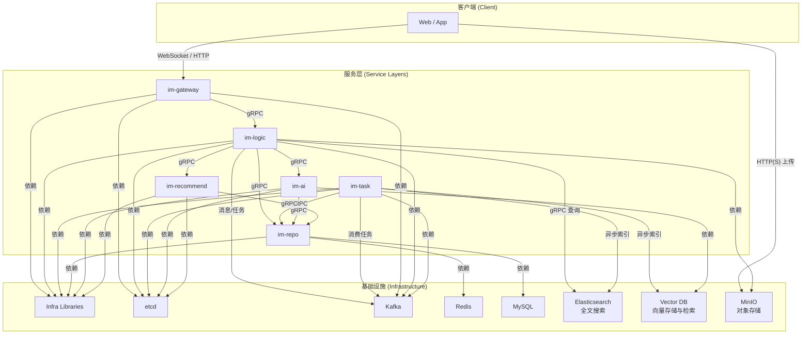

# GoChat 分布式即时通讯系统 - 系统架构设计文档 (V3.0)

**版本**: 3.0
**日期**: 2025-07-05
**作者**: AI System Architect

### 1. 系统概述

#### 1.1 项目背景
GoChat 是一个基于 Go 语言构建的现代化、分布式的即时通讯（IM）系统。本项目旨在通过微服务架构，实现一个功能完整、性能卓越且易于扩展的后端服务，为前端应用（Web/App）提供稳定可靠的实时通信能力。

#### 1.2 核心功能
本文档设计的后端架构，旨在支持以下核心功能：
*   **用户体系**: 用户注册、登录、认证与会话管理。
*   **实时通讯**: 实现一对一单聊、多对多群聊、世界聊天室。
*   **核心体验**: 会话列表管理、历史消息拉取、在线状态同步、消息已读回执。
*   **智能服务**:
    *   **AI 助手**: 提供会话式 AI Agent 和群聊智能摘要服务。
    *   **全局搜索**: 支持聊天记录、用户、文件等内容的全文检索。
    *   **内容推荐**: 实现“可能认识的人”和“可能感兴趣的群”等推荐功能。
*   **多媒体支持**: 支持图片、文件等对象的上传、下载与存储。

#### 1.3 设计范围
本文档聚焦于 GoChat 的**后端系统架构设计**，涵盖服务模块划分、核心流程、接口协议、数据存储、性能、可用性及安全等方面的设计，不涉及前端 UI/UX 或具体的客户端实现细节。

### 2. 架构目标

本架构设计旨在实现以下关键目标：

*   **高可用性 (High Availability)**: 系统应具备容错能力，任何单一服务节点的故障不应导致整体服务中断。基础设施与服务本身均需支持集群化部署。
*   **高性能与低延迟 (High Performance & Low Latency)**: 消息传递的核心链路必须经过优化，确保用户在正常网络环境下获得毫秒级的实时通信体验。
*   **可扩展性 (Scalability)**: 所有服务均设计为可水平扩展，能够通过简单地增加服务实例来应对用户量和消息量的增长，支持未来向千万级用户规模演进。
*   **可维护性 (Maintainability)**: 通过清晰的模块划分、统一的开发规范和完善的可观测性设计，降低系统复杂性，提高开发和运维效率。
*   **数据一致性与可靠性 (Consistency & Reliability)**: 消息数据是系统的核心资产，必须确保其不丢失、不重复，并为用户提供一致的数据视图。
*   **安全性 (Security)**: 系统需具备基础的安全防护能力，保障用户数据和通信内容的安全。

### 3. 整体架构

#### 3.1 架构模型
GoChat 采用业界成熟的**分布式微服务架构**。系统被拆分为一组高内聚、低耦合的服务，每个服务职责单一，可独立开发、部署和扩展。

#### 3.2 核心架构图
下图展示了 GoChat V3.0 系统的核心服务组件及其依赖关系，引入了AI、搜索和推荐能力。



#### 3.3 组件职责

| 组件 | 主要职责 |
| :--- | :--- |
| **im-gateway** | **协议转换与流量入口**。负责维护客户端 WebSocket 长连接，处理 HTTP API 请求，验证用户身份，并将内部协议与外部协议进行转换。 |
| **im-logic** | **核心业务大脑**。负责处理所有核心、实时的业务逻辑，如会话管理、消息处理与分发、好友关系、群组管理等。 |
| **im-task** | **异步任务处理中心**。负责处理所有高延迟、重负载、非实时的后台任务，如超大群消息扩散、离线推送、内容审核、数据归档、**异步索引**等。 |
| **im-repo** | **统一数据仓储层**。负责封装所有对底层数据存储（MySQL, Redis）的访问，向上层服务提供清晰、原子化的数据操作 gRPC 接口。 |
| **im-ai** | **AI 智能服务**。提供会话式 AI Agent 和群聊辅助（如摘要）功能。负责管理 RAG 流程、与大型语言模型（LLM）交互、维护向量索引。 |
| **im-recommend** | **推荐引擎服务**。通过分析用户关系图谱和行为数据，异步地生成“可能认识的人”、“可能感兴趣的群”等推荐内容。 |

#### 3.4 基础设施

| 组件 | 作用 | 部署模式 | 高可用策略 |
| :--- | :--- | :--- | :--- |
| **Infra Libraries** | 统一的 Go 基础库，提供 RPC、日志、配置、消息队列、缓存等公共能力封装。 | 作为Go Module被各服务依赖 | 版本管理和向后兼容 |
| **etcd** | 提供服务注册、服务发现和分布式配置管理能力。支持服务健康检查和自动故障转移。 | 3节点集群 | Raft一致性算法，自动Leader选举 |
| **Kafka** | 高性能消息队列，用于服务间的异步解耦、流量削峰和数据缓冲。支持分区和副本机制。 | 3节点集群，每个Topic 3副本 | 分区副本机制，ISR保证数据不丢失 |
| **Redis** | 高性能内存数据库，用于缓存热点数据和存储易变状态。支持主从复制和哨兵模式。 | 主从+哨兵模式 | 哨兵自动故障转移，读写分离 |
| **MySQL** | 可靠的关系型数据库，用于持久化存储所有核心业务数据。支持主从复制和读写分离。 | 主从复制 | 主从切换，binlog同步保证数据一致性 |
| **Elasticsearch** | **全文搜索引擎**。用于提供聊天记录、用户、文件等内容的快速、模糊、高亮搜索。 | 3+节点集群 | 分片与副本机制，保证数据不丢失和高可用。 |
| **Vector DB** | **向量数据库** (如 Milvus, Weaviate)。用于存储消息内容的向量表示，为 AI 服务的 RAG (检索增强生成) 提供高效的相似性搜索。 | 集群模式 | 分布式架构，保证高可用和可扩展性。 |
| **MinIO** | **对象存储服务**。用于存储用户上传的图片、文件、头像等非结构化数据。 | 分布式集群 | EC 纠删码技术，保证数据高可靠。 |
| **ID Generator** | 分布式ID生成服务，采用 Snowflake 算法，为消息、用户等实体提供全局唯一的ID。集成在im-infra中。 | 嵌入各服务进程 | 基于机器ID和时间戳，无单点故障 |

### 4. 模块设计

#### 4.1 `im-gateway` (网关层)
*   **职责**: 维护海量客户端长连接；协议转换（HTTP/WS <-> gRPC/Kafka）；用户身份认证；消息的代理与路由。
*   **核心技术**: `Gin` (HTTP框架), `Gorilla/WebSocket` (WebSocket库)。
*   **高可用**: `im-gateway` 本身无状态。通过将会话状态（`user_id` -> `gateway_id`）注册到外部 Redis 中，实现节点的动态增减和故障转移。

#### 4.2 `im-logic` (逻辑层)
*   **职责**: 实现所有核心业务 gRPC 服务；消费上行消息，执行**持久化优先**策略；执行消息分发决策。
*   **核心设计 (消息分发)**:
    *   **单聊**: 直接将消息路由到目标用户所在的 `gateway`。
    *   **群聊 (混合模型)**:
        *   **中小群 (<=500人)**: 直接进行实时消息扩散（Fan-out），保证低延迟。
        *   **超大群 (>500人)**: 将扩散任务投递给 `im-task`，避免自身阻塞，保证核心服务稳定。

#### 4.3 `im-task` (任务层)
*   **职责**: 消费 Kafka 中的任务消息，处理所有非实时、重负载的业务。
*   **任务示例**: 超大群消息扩散、调用第三方服务进行离线推送（APNs/FCM）、内容安全审核、音视频转码、数据分析与归档等。

#### 4.4 `im-repo` (仓储层)
*   **职责**: 封装所有数据访问逻辑，提供 gRPC 接口；实现缓存策略；保证数据一致性。
*   **核心设计 (缓存策略)**:
    *   **读策略**: 严格遵循 **Cache-Aside** 模式。先查缓存，未命中则查数据库并写回缓存。
    *   **写策略**: 采用 **Write-Through** 模式。先更新数据库，成功后删除对应缓存，确保数据一致性。
    *   **一致性保证**: 通过缓存失效而非更新来避免并发问题，配合适当的缓存过期时间。
    *   **容错机制**: 缓存操作失败不影响数据库操作，但会记录告警日志。

#### 4.5 `im-infra` (基础库)
*   **定位**: 一个共享的 Go Module，被所有业务服务依赖，统一技术栈，提高开发效率。
*   **内容**: 包含对 gRPC、Zap(日志)、Viper(配置)、Kafka、Redis、GORM(MySQL) 等库的标准化封装。

### 5. 接口与协议设计

#### 5.1 外部接口
*   **HTTP API**: 遵循 `api_documentation.md` 中定义的 RESTful 规范，用于处理登录、注册、获取会话列表等请求-响应式操作。
*   **WebSocket**: 用于实时消息通信，是系统的核心交互方式。

#### 5.2 内部通信
*   **同步调用**: 服务间需要实时返回结果的请求，统一使用 **gRPC**。
*   **异步消息**: 服务间的解耦、缓冲和任务派发，统一使用 **Kafka**。

#### 5.3 WebSocket 核心协议
客户端与 `im-gateway` 之间通过 JSON 格式的信令进行交互。
*   **`send-message`**: 客户端发送消息。
*   **`new-message`**: 服务器推送新消息。
*   **`message-ack`**: 服务器确认收到客户端消息，用于优化客户端UI体验。
*   **`ping/pong`**: 心跳包，用于维持连接和活性检测。

#### 5.4 Kafka 消息协议
为保证可追溯性和扩展性，所有在 Kafka 中流转的消息都封装在一个标准结构中。
```protobuf
message KafkaMessage {
  string trace_id = 1;     // 用于全链路追踪的唯一ID
  map<string, string> header = 2; // 头部，可存放元数据如任务类型
  bytes body = 3;          // 序列化后的具体业务消息体
}
```

### 6. 数据存储设计

#### 6.1 核心实体与ID
*   **ID生成**: 所有核心实体（用户、群组、消息）的ID均由独立的分布式ID服务（Snowflake）生成，不依赖数据库自增，为分库分表奠定基础。
*   **`conversation_id`**: 通过对参与者ID进行计算生成，保证唯一且无需存储。
*   **`seq_id`**: 会话内单调递增序列，由 Redis 的 `INCR` 命令原子生成，用于保证消息的顺序性。

#### 6.2 数据库设计 (MySQL)
数据库表结构以支持业务功能为基础，并为性能和扩展性进行了优化。
*   **核心表**: `users`, `groups`, `group_members`, `messages`。
*   **设计要点**:
    *   所有主键均为 `BIGINT UNSIGNED`。
    *   在 `messages` 表上建立 `(conversation_id, seq_id)` 唯一索引，以保证消息顺序和唯一性，并建立 `(conversation_id, created_at)` 复合索引，优化历史消息拉取性能。

#### 6.3 缓存设计 (Redis)
Redis 用于存储高频访问的热点数据和易变的临时状态。
*   **核心缓存**:
    *   `user_info:{user_id}`: 用户信息 (HASH)。
    *   `user_session:{user_id}`: 用户在线状态及所在网关 (HASH)，**高可用性的基石**。
    *   `conv_seq:{conversation_id}`: 会话序列号 (STRING)。
    *   `group_members:{group_id}`: 群成员列表 (SET)。
    *   `msg_dedup:{client_msg_id}`: 客户端消息ID去重 (STRING with EX)。

### 7. 性能与可扩展性设计

#### 7.1 性能优化策略
*   **高并发连接优化**: 在 `im-gateway` 层，通过优化 Linux 内核参数（如 `net.core.somaxconn`）、采用 `epoll` I/O 多路复用模型、以及使用 `sync.Pool` 复用内存对象（如消息体结构），最大限度地提升单机连接承载能力和吞吐量。
*   **消息处理**: 通过混合模型处理群聊消息，小群（≤500人）实时扩散，大群异步处理，在实时性与系统负载间取得平衡。
*   **缓存优化**: 多层缓存策略，热点数据缓存命中率目标95%以上，平均响应时间<10ms。
*   **连接池管理**: 数据库连接池、Redis连接池、gRPC连接池的合理配置，避免连接泄漏。

#### 7.2 水平扩展设计
*   **无状态服务**: 所有服务层（`gateway`, `logic`, `task`, `repo`, `ai`, `recommend`）均为无状态或状态外置设计，支持K8s水平扩展。
*   **负载均衡**: 通过etcd服务发现+客户端负载均衡，支持多种负载均衡算法（轮询、加权轮询、最少连接）。
*   **弹性伸缩**: 基于CPU、内存、消息队列长度等指标的自动扩缩容策略。

#### 7.3 数据扩展性
*   **分库分表**: `im-repo` 封装底层数据源，为未来按 `conversation_id` 或 `user_id` 进行数据分片预留扩展点。
*   **读写分离**: MySQL主从架构，读操作分散到从库，写操作集中到主库。
*   **冷热分层**: 对于历史消息等访问频率低的数据，设计归档机制，定期从主业务库（如 MySQL）迁移到成本更低的存储系统（如对象存储或大数据平台），实现冷热数据分层。
*   **异步处理**: 大量使用 Kafka 进行异步解耦，削峰填谷，提高系统整体吞吐量。

### 8. 可用性与安全设计

*   **高可用性**: 所有基础设施组件（Kafka, Redis, etcd, MySQL, Elasticsearch, MinIO等）均需以集群模式部署。服务通过 K8s 实现故障自愈和负载均衡。
*   **数据一致性与可靠性**:
    *   **消息有序性**: 在会话（`conversation`）级别，通过 `seq_id` 保证消息的严格有序。`seq_id` 由 Redis 原子递增生成。消息ID（`message_id`）采用雪花算法生成，其时间戳部分可保证全局大致有序。
    *   **消息唯一性**: 通过 `im-infra/once` 幂等性组件，在 `im-logic` 层对带有客户端唯一ID（`client_msg_id`）的请求进行检查，确保因网络重试等原因导致的重复请求只被处理一次。
    *   **一致性模型**: 系统在不同场景下采用不同的一致性模型。核心数据（如用户、消息）的写入遵循强一致性（写入DB成功才算成功）。缓存与DB之间通过“更新DB，删除Cache”策略保证最终一致性。
*   **熔断与降级**:
    *   **熔断**: 服务间调用集成熔断器（如 Sentinel），当对下游服务的调用失败率超过阈值时，快速失败，防止故障扩散。
    *   **降级与限流**: 在 `im-gateway` 入口层实现灵活的限流策略。可针对不同接口、用户、IP设置频次限制。在系统高负载时，可对非核心业务（如大群消息、推荐服务）进行降级处理，或将其路由到低优先级的 Kafka Topic，优先保障单聊等核心功能的稳定性。
*   **安全设计**:
    *   **传输安全**: 全链路强制启用 TLS/SSL 加密通信。
    *   **认证安全**: 使用 JWT 进行无状态认证。
    *   **数据安全**: 密码使用 `bcrypt` 加盐哈希存储。敏感信息在存储和传输前进行加密处理。
*   **系统可观测性**:
    *   **日志 (Logging)**: 所有日志均为结构化（JSON）格式，并包含 `TraceID`，便于聚合与查询。
    *   **指标 (Metrics)**: 通过 Prometheus 监控各服务的黄金指标（延迟、流量、错误、饱和度），并建立核心业务指标（如在线用户数、消息发送量）的监控大盘。
    *   **追踪 (Tracing)**: 通过 OpenTelemetry 和 Jaeger 实现分布式全链路追踪，快速定位性能瓶颈和错误根源。

### 9. 总结

本架构设计方案为 GoChat 系统构建了一个健壮、可扩展且易于维护的后端平台。通过采用微服务、状态外置、全链路异步等业界领先的设计思想，并对核心业务流程进行了深度优化，本方案能够在满足当前功能需求的同时，为系统未来的发展和演进提供坚实的基础。
