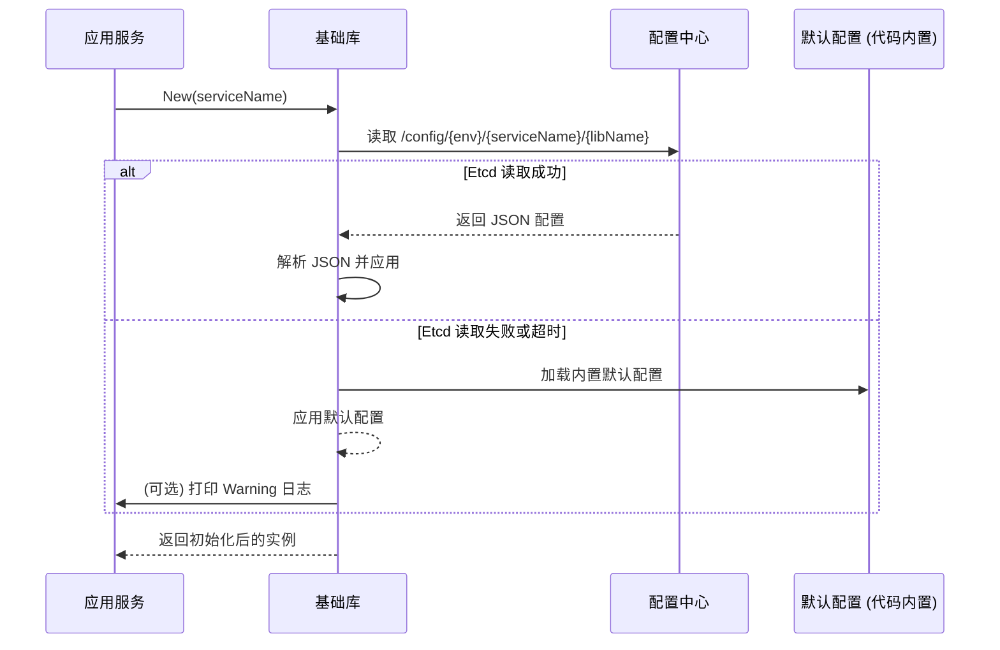

# im-infra 基础库开发风格指南 (v2.0)

## 1. 核心理念

`im-infra` 中的所有基础库都应遵循以下核心理念，以确保整个基础设施层的一致性、可维护性和易用性：

- **高内聚，低耦合**: 将复杂性封装在内部，对外提供简洁、稳定的接口。
- **动态配置优先，默认配置保底**: 优先从配置中心加载，失败则优雅降级。
- **面向接口编程**: 业务代码应依赖于抽象接口，而不是具体实现。
- **生产就绪**: 所有库都应内置优雅关闭、错误处理和性能监控等生产环境所需的功能。

---

## 2. 统一的配置管理

所有需要配置的基础库**必须**遵循从 `etcd` 动态加载、失败后降级到默认值的模式。

### 2.1 配置加载流程



### 2.2 实现要点

- **配置路径**: 统一使用 `fmt.Sprintf("/config/%s/%s/%s", env, serviceName, libName)` 格式。
    - `env`: 通过环境变量 `APP_ENV` 获取，若为空则默认为 `dev`。
    - `serviceName`: 由 `New` 函数的调用者传入，例如 "im-logic"。
    - `libName`: 库的名称，例如 "ratelimit", "cache"。
- **动态刷新**: 对于适合动态调整的配置（如限流规则），库内部应启动一个 `goroutine` 来 `Watch` `etcd` 中的配置变更并自动热加载。
- **降级机制**: 如果从 `etcd` 读取配置失败（网络问题、超时、权限等），**绝不能 panic**。必须记录一条 `Warn` 日志，并加载在代码中硬编码的 `DefaultConfig()`，以保证服务的可用性。

---

## 3. 基础库的三种原型 (Archetypes)

`im-infra` 的基础库根据其职责和使用方式，可以分为三种原型。新的基础库应根据其特性，选择最符合的原型进行设计。

### 原型一：有状态服务型 (Stateful Service)

- **定义**: 提供一个长期运行、有内部状态、有生命周期的后台服务。
- **示例**: `metrics`, `ratelimit`
- **核心特征**:
    - **生命周期管理**: 必须提供 `New()` 和 `Shutdown()`/`Close()` 方法。
    - **返回接口**: `New()` 函数返回一个**接口** (e.g., `Limiter`, `Provider`)，隐藏具体实现。
    - **后台任务**: 内部通常包含一个或多个 `goroutine` (如 `metrics` 的 Prometheus 服务器，`ratelimit` 的规则刷新器)。
    - **文件名**: 公共 API 定义在与包名同名的文件中，如 `ratelimit/ratelimit.go`。

```go
// file: ratelimit/ratelimit.go
package ratelimit

type Limiter interface {
    Allow(ruleName string) bool
    Close() error
}

func New(serviceName string, opts ...Option) (Limiter, error) {
    // 1. 从 etcd 加载配置，失败则降级
    // 2. 初始化内部 limiter 实现
    // 3. 启动后台刷新 goroutine
    // 4. 返回接口
}
```

### 原型二：客户端包装型 (Client Wrapper)

- **定义**: 封装一个外部客户端（如 Redis, GORM），为其增加日志、指标、错误处理等通用能力。
- **示例**: `cache`, `db`
- **核心特征**:
    - **便捷的全局实例**: 通常会提供一个开箱即用的全局默认实例 (`cache.Default()`) 和对应的包级别函数 (`cache.Get()`)，方便简单场景下使用。
    - **实例创建**: 同时提供 `New()` 函数，用于创建需要自定义配置的实例。
    - **接口可选**: `New()` 可以返回具体类型（如 `*redis.Client` 的包装），也可以返回接口，取决于抽象的必要性。
    - **文件名**: 公共 API 和全局函数定义在与包名同名的文件中，如 `cache/cache.go`。

```go
// file: cache/cache.go
package cache

// 全局函数，使用内部的 default a
func Get(ctx context.Context, key string) (string, error) {
    return Default().Get(ctx, key)
}

// 返回一个便捷的默认实例
func Default() Cache {
    // ... singleton logic ...
}

// 创建一个自定义实例
func New(cfg Config) (Cache, error) {
    // ...
}
```

### 原型三：无状态工具型 (Stateless Utility)

- **定义**: 提供一组功能函数，这些函数没有或几乎没有内部状态。
- **示例**: `clog`, `id-gen`
- **核心特征**:
    - **包级别函数**: 主要通过包级别函数对外提供服务 (`clog.Info()`, `idgen.GetSnowflakeID()`)。
    - **无实例概念**: 用户通常不需要 `New()` 一个实例来使用它。
    - **内部单例**: 内部可能有一个单例（如 `clog` 的 `defaultLogger`），但用户对此无感。
    - **配置简单**: 通常不需要复杂的外部配置。`clog.Module()` 是一个很好的例子，它提供了轻量级的“定制”，而不是完整的实例创建。

```go
// file: clog/clog.go
package clog

// 主要通过包级别函数提供功能
func Info(msg string, fields ...Field) {
    getDefaultLogger().Info(msg, fields...)
}

// 提供轻量级的定制化，而不是一个全新的实例
func Module(name string) Logger {
    // ... cache and return a logger with module name ...
}
```

---

## 4. 通用规范

以下规范适用于所有原型。

### 4.1 代码组织

- **根目录**: 存放公共 API (`ratelimit.go`, `config.go`) 和文档 (`README.md`, `API.md`)。
- **`internal/`**: 存放所有内部实现。
- **`examples/`**: 至少包含 `basic` 和 `advanced` 两个示例。

### 4.2 文档与注释

- **`README.md`**: 解释“为什么”和设计理念。
- **`API.md`**: 解释“如何使用”，并根据库的原型提供对应的示例。
- **Go Doc**: 所有公共 API 必须有完整的 Go Doc 注释。

### 4.3 日志风格

- **强制使用** `im-infra/clog`。
- **强制使用**结构化日志 (`clog.String(...)`)。
- **强制使用**模块化日志器 (`clog.Module("cache.redis")`)。
- 错误日志**必须**使用 `clog.Err(err)`。