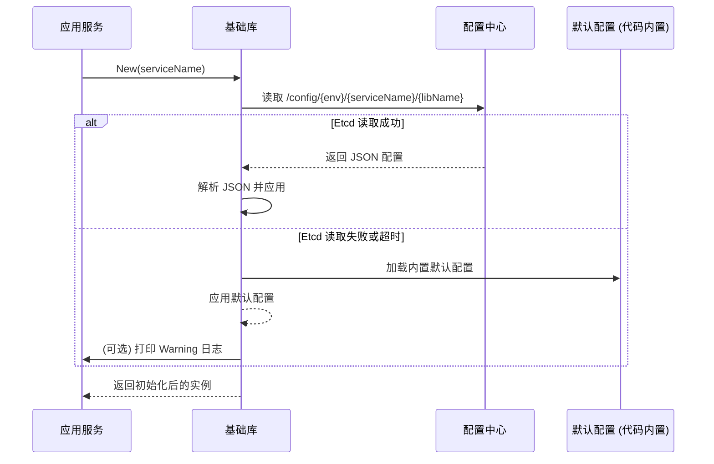
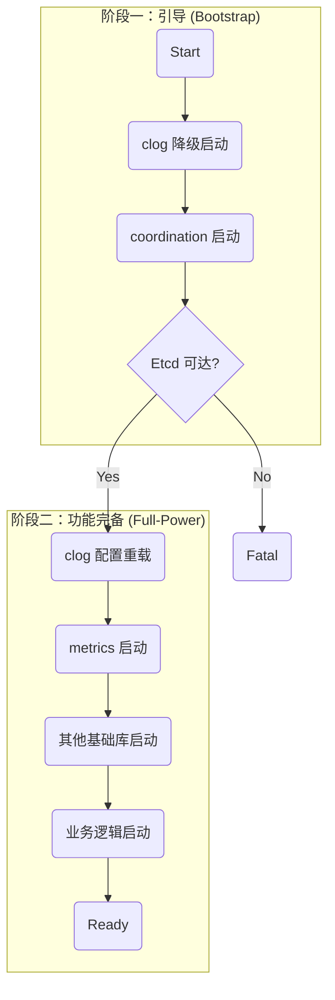

# im-infra 基础库开发风格指南 (v2.0)

## 1. 核心理念

`im-infra` 中的所有基础库都应遵循以下核心理念，以确保整个基础设施层的一致性、可维护性和易用性：

- **高内聚，低耦合**: 将复杂性封装在内部，对外提供简洁、稳定的接口。
- **动态配置优先，默认配置保底**: 优先从配置中心加载，失败则优雅降级。
- **面向接口编程**: 业务代码应依赖于抽象接口，而不是具体实现。
- **生产就绪**: 所有库都应内置优雅关闭、错误处理和性能监控等生产环境所需的功能。

---

## 2. 统一的配置管理

所有需要配置的基础库**必须**遵循从 `etcd` 动态加载、失败后降级到默认值的模式。

### 2.1 配置加载流程



### 2.2 实现要点

- **配置路径**: 统一使用 `fmt.Sprintf("/config/%s/%s/%s", env, serviceName, libName)` 格式。
    - `env`: 通过环境变量 `APP_ENV` 获取，若为空则默认为 `dev`。
    - `serviceName`: 由 `New` 函数的调用者传入，例如 "im-logic"。
    - `libName`: 库的名称，例如 "ratelimit", "cache"。
- **动态刷新**: 对于适合动态调整的配置（如限流规则），库内部应启动一个 `goroutine` 来 `Watch` `etcd` 中的配置变更并自动热加载。
- **降级机制**: 如果从 `etcd` 读取配置失败（网络问题、超时、权限等），**绝不能 panic**。必须记录一条 `Warn` 日志，并加载在代码中硬编码的 `DefaultConfig()`，以保证服务的可用性。

---

## 3. 基础库的三种原型 (Archetypes)

`im-infra` 的基础库根据其职责和使用方式，可以分为三种原型。新的基础库应根据其特性，选择最符合的原型进行设计。

### 原型一：有状态服务型 (Stateful Service)

- **定义**: 提供一个长期运行、有内部状态、有生命周期的后台服务。
- **示例**: `metrics`, `ratelimit`, `coordination`, `mq` (消费者)
- **核心特征**:
    - **生命周期管理**: 必须提供 `New()` 和 `Close()`/`Shutdown()` 方法。`New` 方法应接收 `context.Context` 以支持优雅关闭。
    - **依赖注入**: 应通过 `Option` 函数模式接收可选依赖，如 `metrics.Provider` 或 `clog.Logger`。
    - **返回接口**: `New()` 函数返回一个**接口** (e.g., `Limiter`, `Provider`)，隐藏具体实现。
    - **后台任务**: 内部通常包含一个或多个 `goroutine` (如 `metrics` 的 Prometheus 服务器，`ratelimit` 的规则刷新器)。

```go
// file: coordination/coordination.go
package coordination

// New 函数接收 context 和可选的 logger
func New(ctx context.Context, serviceName string, opts ...Option) (Provider, error) {
    // 1. 应用 Options, 注入依赖
    // 2. 从 etcd 加载配置，失败则降级
    // 3. 启动后台 goroutine (e.g., watch)
    // 4. 返回接口
}
```

### 原型二：客户端包装型 (Client Wrapper)

- **定义**: 封装一个外部客户端（如 Redis, GORM），为其增加日志、指标、错误处理等通用能力。
- **示例**: `cache`, `db`
- **核心特征**:
    - **通过钩子集成**: 优先使用客户端自身的钩子 (Hooks) 或插件 (Plugins) 机制来无侵入地集成 `clog` 和 `metrics`。
    - **依赖注入**: `New()` 函数应通过 `Option` 模式接收 `clog.Logger` 和 `metrics.Provider`。
    - **便捷的全局实例**: 可以提供一个开箱即用的全局默认实例 (`cache.Default()`)，但其内部也应遵循依赖注入和优雅降级的原则。
    - **接口可选**: `New()` 可以返回具体类型（如 `*redis.Client` 的包装），也可以返回接口，取决于抽象的必要性。

```go
// file: cache/cache.go
package cache

// New 函数通过 Option 注入依赖
func New(cfg Config, opts ...Option) (Cache, error) {
    // 1. 应用 Options, 获取 logger 和 metrics provider
    // 2. 初始化 redis.Client
    // 3. 使用 redis.Client.AddHook() 注入自定义的 logging 和 metrics hook
    // 4. 返回实例
}
```

### 原型三：全局单例工具型 (Singleton Utility)

- **定义**: 提供一组全局可用的功能函数，内部维护一个对用户透明的单例。
- **示例**: `clog`, `id-gen`
- **核心特征**:
    - **包级别函数**: 主要通过包级别函数对外提供服务 (`clog.Info()`, `idgen.GenerateInt64()`)。
    - **优雅降级与升级**: 核心能力。启动时使用安全的默认配置（如 `clog` 输出到控制台），在配置就绪后，通过 `Init` 或类似函数重新加载配置，实现能力“升级”。
    - **无实例概念**: 用户通常不需要 `New()` 一个实例来使用它。
    - **轻量级定制**: 可提供 `Module()` 或 `With()` 等函数，返回一个携带了部分上下文的新接口，方便使用。

```go
// file: clog/clog.go
package clog

// 默认的 logger，在 Init 之前可能是一个输出到 stdout 的 logger
var defaultLogger Logger = newDefaultLogger()

// Init 函数用于从最终配置中加载并替换 defaultLogger
func Init(cfg Config) {
    // ... 根据配置创建生产环境 logger
    // defaultLogger = newProdLogger(cfg)
}

func Info(msg string, fields ...Field) {
    defaultLogger.Info(msg, fields...)
}
```

---

## 4. 依赖注入与初始化顺序

为了保证服务的健壮性和可观测性，所有基础库的初始化应遵循统一的依赖关系和顺序。

### 4.1 依赖注入最佳实践

- **目标**: 解耦 `clog` 和 `metrics` 的具体实现，使任何库都可以独立、可测试地运行。
- **原则**:
    1.  **禁止硬编码依赖**: 任何库（如 `cache`）**禁止**直接调用 `metrics.Inc()` 或 `clog.Info()`。
    2.  **使用 Option 模式注入**: 所有需要日志和指标的库，其 `New` 函数都必须接受 `Option` 函数作为参数，用于注入依赖。
    3.  **依赖接口，而非实现**: 注入的依赖必须是接口，如 `clog.Logger` 和 `metrics.Provider`。
    4.  **默认关闭**: 如果调用者没有注入 `Logger` 或 `Provider`，库内部应优雅地处理 `nil` 依赖，不执行任何相关操作（或使用一个空实现的 `noop` 实例），**绝不能 panic**。

### 4.2 推荐初始化顺序：两阶段初始化

为了解决 `clog` 和 `coordination` 之间的“鸡生蛋”式循环依赖问题，服务启动时必须遵循 **两阶段初始化 (Two-Phase Initialization)** 模式。



1.  **阶段一：引导 (Bootstrap Phase)** - 目标是让服务“点火”并具备最基础的日志和配置能力。
    - **`clog` 降级启动**: 在 `main` 函数的入口处，立即初始化一个 **引导 Logger**。此 Logger 不依赖任何外部配置，直接向 `os.Stdout` 输出文本日志。它的唯一使命是记录启动过程。
    - **`coordination` 启动**: `NewCoordination` 函数接收上一步创建的引导 Logger 作为依赖，然后去连接 `etcd`。

2.  **阶段二：功能完备 (Full-Power Phase)** - 目标是让所有基础库和业务服务“引擎全开”。
    - **`clog` 配置重载**: `coordination` 从 `etcd` 读取到完整的日志配置后，调用 `clog.Init()` 创建一个 **生产 Logger**（具备完整的格式化、级别控制、输出到文件或远端的能力），并原子替换掉全局的引导 Logger。此后，所有日志都将通过生产 Logger 输出。
    - **`metrics` 启动**: 使用从 `etcd` 获取的配置初始化 `metrics` 服务。
    - **其他基础库启动**: 依次初始化 `cache`, `db`, `mq` 等。此时，它们可以通过依赖注入，获取到功能完备的 `clog.Logger` 和 `metrics.Provider` 实例。
    - **业务逻辑启动**: 启动所有 gRPC/HTTP 服务，开始处理业务请求。

这个流程确保了启动过程无死锁、全程可观测、职责清晰。

---

## 5. 通用规范

以下规范适用于所有原型。

### 5.1 代码组织

- **根目录**: 存放公共 API (`ratelimit.go`, `config.go`) 和文档 (`README.md`, `API.md`)。
- **`internal/`**: 存放所有内部实现。
- **`examples/`**: 至少包含 `basic` 和 `advanced` 两个示例。

### 5.2 文档与注释

- **`README.md`**: 解释“为什么”和设计理念。
- **`API.md`**: 解释“如何使用”，并根据库的原型提供对应的示例。
- **Go Doc**: 所有公共 API 必须有完整的 Go Doc 注释。

### 5.3 日志使用规范

- **强制使用** `im-infra/clog`。
- **强制使用**结构化日志 (`clog.String(...)`)。
- **错误日志必须**使用 `clog.Err(err)`。
- **`module` 功能仅用于 `clog`**: `clog.Module("cache.redis")` 是日志库为了增加上下文提供的能力，其他库不应关心此概念。

#### 5.3.1 调用方式规范

为了兼顾基础库的解耦和业务代码的便利性，日志调用方式规定如下：

- **库代码 (`im-infra/**`)**: **严禁** 使用全局的 `clog.Info()`。所有需要日志的库，其 `New` 函数 **必须** 通过 `Option` 模式接收一个 `clog.Logger` 接口的实例，并使用该实例 (`logger.Info()`) 进行日志记录。这强制了依赖注入，是实现解耦和可测试性的关键。

- **业务代码 (`im-logic`, `im-gateway` 等)**: 在最终服务的业务逻辑代码中（如 HTTP Handler, gRPC Service），为了方便，**可以** 使用全局的 `clog.Info()` 等包级别函数。

#### 5.3.2 对 `clog` 库自身的要求

`clog` 库的实现者 **必须** 确保无论通过 `logger.Info()` 还是 `clog.Info()` 调用，都能正确输出日志的原始调用位置（文件名和行号）。这通常通过 `runtime.Caller` 和 `zap.AddCallerSkip` 等技术实现，是 `clog` 库必须履行的职责。

### 5.4 命名规范

命名是代码的门面，清晰、一致、地道的命名是 `im-infra` 项目可维护性的基石。

#### 5.4.1 核心哲学：面向服务，而非实现

包名应描述其提供的 **抽象服务**，而不是其内部使用的具体技术。这强制我们思考库的边界和抽象层，是构建高内聚、低耦合系统的关键。

-   **正确**: `package db` - 提供数据库服务。
-   **错误**: `package mysql` - 将实现细节暴露给了包名，限制了未来的技术选型。

-   **正确**: `package cache` - 提供缓存服务。
-   **错误**: `package redis` - 耦合了具体技术。

#### 5.4.2 官方包名列表

所有 `im-infra` 基础库应采用以下官方命名。这些名称经过精心选择，旨在实现简洁、清晰和风格统一。

| 包名        | 原名 (如有)     | 职责说明                                     |
| :---------- | :-------------- | :------------------------------------------- |
| `cache`     | -               | 通用缓存服务，封装 Redis 等。                |
| `clog`      | -               | 上下文日志服务。                             |
| `coord`     | `coordination`  | 分布式协调服务，封装 Etcd 等。               |
| `db`        | -               | 数据库访问层，封装 GORM 等。                 |
| `metrics`   | -               | 指标采集与暴露服务。                         |
| `mq`        | -               | 消息队列服务，封装 Kafka 等。                |
| `once`      | `idempotent`    | 分布式幂等性/只执行一次服务。关联 `sync.Once`。 |
| `ratelimit` | -               | 分布式限流服务。                             |
| `uid`       | `id-gen`        | 唯一 ID 生成服务。                           |

**命名决策示例**:
- **`coord`**: `coordination` 的标准缩写，简洁且行业通用。
- **`once`**: 关联 Go 标准库 `sync.Once` 的心智模型，比 `idempotent` 更地道、API 更优雅。
- **`uid`**: `Unique Identifier` 的标准缩写，比 `idgen` 更简短、风格更统一。

#### 5.4.3 其他命名约定

-   **文件名**:
    -   `{packagename}.go`: 存放核心的公共 API，如 `New` 函数和主要接口定义。
    -   `options.go`: 存放所有 `Option` 函数类型和实现。
    -   `config.go`: 存放与配置相关的结构体和默认配置函数。
    -   `interfaces.go`: (可选) 如果接口定义复杂，可单独存放于此文件。

-   **接口名**:
    -   **简洁**: 避免在包名后重复，如 `ratelimit.RateLimiter` 应为 `ratelimit.Limiter`。
    -   **模式**:
        -   代表一种能力或服务，使用名词或 `Provider` 后缀，如 `cache.Cache`, `metrics.Provider`。
        -   核心是一个动作，使用动词 + `er` 后缀，如 `ratelimit.Limiter`。
        -   避免使用 `Interface` 后缀。

-   **构造函数**:
    -   主构造函数应命名为 `New`。
    -   `New` 函数应返回接口类型，而非具体的结构体指针，以强制实现细节的封装。
