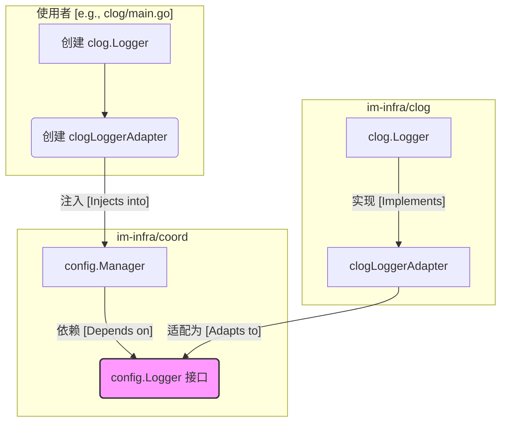

# `im-infra/coord` 配置中心 `logger_adapter` 必要性分析报告

## 1. 背景

在对 `im-infra` 基础库进行优化时，我们注意到 `coord` 配置管理模块使用了一个 `logger_adapter` 来处理日志记录，而不是直接使用项目统一的 `clog` 日志库。本文档旨在分析 `logger_adapter` 存在的必要性，并评估使用 `clog` 直接替代的可行性。

## 2. 核心设计原则分析

`coord` 作为一个通用的基础设施协调服务库，其核心设计目标之一是**模块化和解耦**。`coord/config` 中的 `Manager[T]` 被设计为一个泛型配置管理器，能够管理任何类型的配置数据，并与项目的其他部分保持低耦合。

为了实现这一目标，`Manager` 采用了**依赖倒置原则**，定义了一系列接口（`config.Logger`, `config.Validator`, `config.ConfigUpdater`），并通过依赖注入的方式来使用具体实现。

## 3. `logger_adapter` 的核心作用

`logger_adapter.go` 中定义的 `LoggerAdapter` 和 `ClogLoggerAdapter` 扮演了“适配器”和“桥梁”的关键角色。其主要作用如下：

*   **避免循环依赖**：这是 `logger_adapter` 存在的**最根本原因**。
    *   `coord/config` 模块需要记录其内部状态和操作（如加载配置、监听更新），因此需要日志功能。
    *   `clog` 模块自身也需要使用 `coord/config` 来实现配置的热更新。
    *   如果 `coord/config` 直接导入 `clog`，将会导致 `coord/config` -> `clog` -> `coord/config` 的循环依赖，这在 Go 语言中是不被允许的，会导致编译失败。

*   **实现依赖解耦**：
    *   通过定义 `config.Logger` 接口，`coord` 声明了“我需要一个能打日志的东西”，但它并**不关心**这个东西具体是什么日志库（是 `clog`、`zap` 还是 `logrus`）。
    *   `LoggerAdapter` 则负责将一个具体的日志库实例“翻译”成 `coord` 能理解的 `config.Logger` 接口。这使得 `coord` 库可以被任何项目独立使用，无论该项目使用何种日志框架。

## 4. 流程图解

下图清晰地展示了通过适配器模式解耦依赖关系的过程：

从图中可以看出，`config.Manager` 只与 `config.Logger` 接口交互，完全不知道 `clog.Logger` 的存在，从而避免了直接依赖。

## 5. 结论与建议

`logger_adapter` 的设计是经过深思熟虑的，是解决循环依赖、保持模块独立性的关键所在，因此**具有高度的必要性**。直接在 `coord` 模块中使用 `clog` 是不可行的，会导致项目无法编译。

**建议**：

**维持当前的设计**。当前基于接口和适配器的设计是清晰、健壮且可扩展的，符合优秀基础设施库的设计原则。它不仅解决了循环依赖问题，还为未来替换或升级日志库提供了灵活性。`clog` 模块自身在使用 `coord` 时也遵循了这一模式，是项目中的最佳实践。