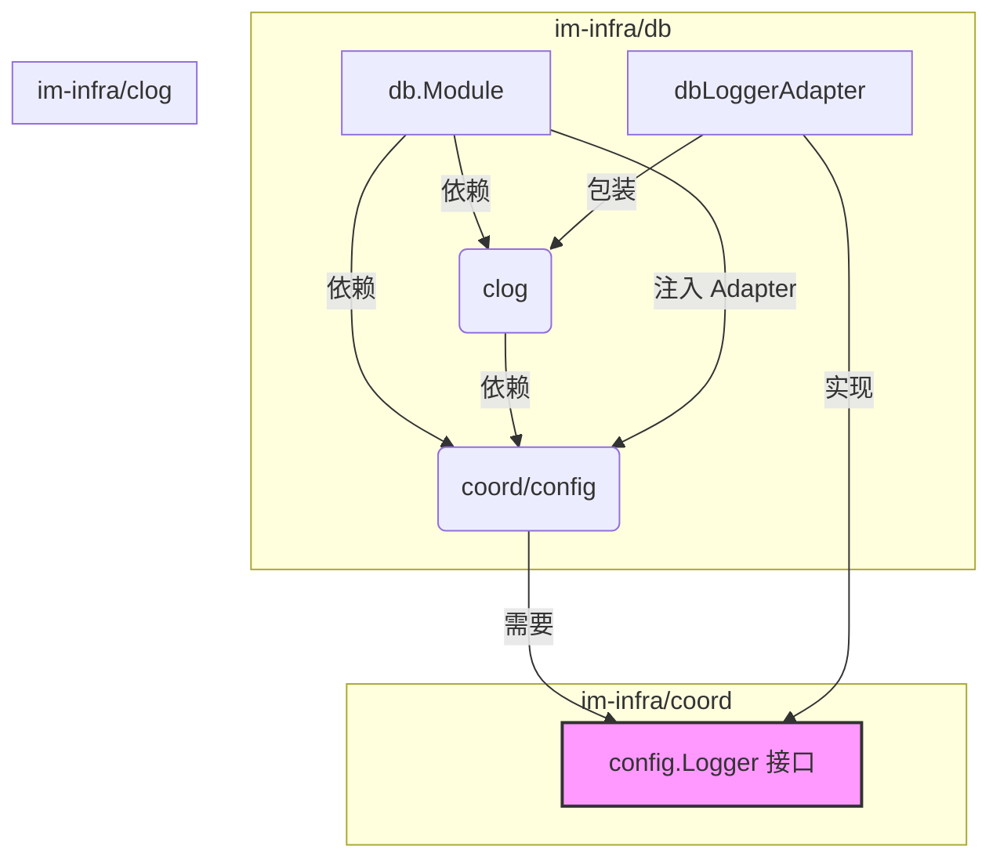

# `im-infra` 统一依赖模式分析：为何 `db` 等模块都需要 `LoggerAdapter`

## 1. 背景

在分析了 `clog` 模块的 `logger_adapter` 后，我们进一步探讨 `db` 及其他基础设施模块是否也需要遵循同样的设计模式。答案是肯定的。这并非单个模块的特殊需求，而是整个 `im-infra` 库为了实现高度解耦和避免循环依赖所采用的核心架构模式。

## 2. 核心依赖关系解析

任何一个需要使用动态配置（`coord/config`）和标准日志（`clog`）的模块（我们称之为 `Module-X`，例如 `db`, `cache`, `mq` 等），其依赖关系天然如下：

1.  **`Module-X` 依赖 `coord/config`**：用于获取自身的业务配置。
2.  **`Module-X` 依赖 `clog`**：用于记录自身的业务日志。
3.  **`clog` 依赖 `coord/config`**：用于获取日志库自身的配置（如日志级别）。

当 `Module-X` 初始化其配置管理器 `config.Manager`（该管理器来自 `coord/config`）时，`config.Manager` 本身也需要一个日志记录器来报告其内部状态。这就产生了一个关键问题：`config.Manager` 不能直接依赖 `clog`，否则会形成 `coord/config` -> `clog` -> `coord/config` 的循环依赖。

## 3. 统一解决方案：依赖倒置与适配器模式

为了解决这个普遍存在的循环依赖问题，我们采用了统一的架构模式：

*   **依赖倒置**：`coord/config` 不依赖任何具体的日志实现，而是定义了一个抽象的 `config.Logger` 接口。
*   **适配器模式**：每个 `Module-X` 在创建 `config.Manager` 时，都有责任提供一个满足 `config.Logger` 接口的实例。模块内部会创建一个 `Adapter`，该 `Adapter` 包装一个 `clog.Logger` 实例，并将其“适配”成 `config.Logger` 接口。

### `db` 模块的依赖关系图

下图清晰地展示了 `db` 模块如何应用此模式来解耦依赖：

**流程解读**：
1. `db` 模块需要 `coord/config` 和 `clog`。
2. `clog` 也需要 `coord/config`。
3. `db` 模块在创建 `coord/config` 的 `Manager` 实例时，不能直接把 `clog` 传进去。
4. 因此，`db` 模块创建了 `dbLoggerAdapter` 来包装 `clog`。
5. 这个 `Adapter` 实现了 `coord/config` 所需的 `config.Logger` 接口。
6. `db` 模块将这个 `Adapter` 注入到 `config.Manager` 中，成功打破了循环依赖。

## 4. 结论

**`LoggerAdapter` 是 `im-infra` 中所有需要动态配置和日志记录的模块必须遵循的通用设计模式。**

`db` 模块和 `clog` 模块一样，都需要通过 `LoggerAdapter` 来为其配置管理器注入日志功能。这确保了 `coord` 核心模块的独立性和可重用性，是整个基础库保持架构清晰、健壮的关键。