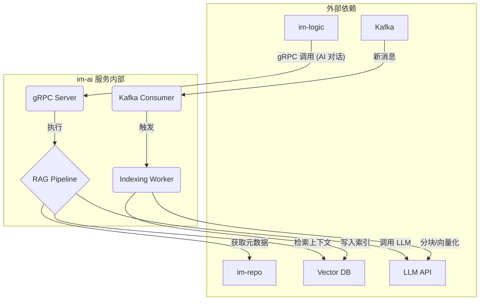

# im-ai 智能服务设计

`im-ai` 是 GoChat 系统引入的“智能大脑”，它通过集成大型语言模型（LLM）和检索增强生成（RAG）技术，为用户提供丰富的、上下文感知的智能交互体验。

## 1. 核心职责

1.  **会话式 AI 代理 (Conversational AI Agent)**:
    *   作为一种特殊的“联系人”，用户可以与其进行一对一的智能对话。
    *   能够利用 RAG 技术，检索用户**过往的所有聊天记录**作为上下文，提供更具个性化和延续性的回答。
    *   具备**工具使用（Tools）**能力，可以通过函数调用（Function Calling）与其他系统交互，例如创建待办事项、查询天气、发送消息等。

2.  **群聊智能助手 (Group Chat Helper)**:
    *   作为群聊中的一个“静默成员”或通过 `@` 唤醒。
    *   能够根据用户的请求，**智能摘要**群聊的未读消息或指定时间段内的聊天内容。
    *   能够**回答关于群聊历史内容的问题**（“我们上次讨论那个项目是在什么时候？”）。

3.  **向量索引管理者 (Vector Index Manager)**:
    *   负责消费 Kafka 中由 `im-logic` 推送过来的消息数据。
    *   通过异步的 Worker，将消息**分块（Chunking）**、**向量化（Embedding）**，并存入向量数据库。
    *   维护向量索引的更新与一致性。

## 2. 架构与设计

`im-ai` 服务本身是一个 gRPC 服务，同时也是一个 Kafka 消费者。

### 2.1 RAG 核心流程 (Retrieval-Augmented Generation)

当用户向 AI Agent 发送消息时，`im-ai` 的 gRPC 服务会触发 RAG 流程：

1.  **查询向量化**: 将用户的当前问题通过 Embedding 模型转换为向量。
2.  **相似性搜索**: 使用该向量在向量数据库中进行相似性搜索，检索出最相关的历史聊天记录“块”（Chunks）。
3.  **上下文增强**: 将检索到的聊天记录块与用户的原始问题一起，构建成一个丰富的 Prompt。
4.  **LLM 调用**: 将增强后的 Prompt 发送给大型语言模型（如 GPT、Claude）。
5.  **结果生成与返回**: 将 LLM 返回的结果解析后，通过 gRPC 返回给 `im-logic`，最终推送给用户。

### 2.2 异步索引流程

为了让 RAG 能够检索到最新的聊天记录，`im-ai` 需要一个异步的索引流程：

1.  **消费消息**: `im-logic` 在将消息持久化到 `im-repo` 的同时，会将一份副本（或一个通知）发送到专门的 Kafka Topic (`ai-indexing-topic`)。
2.  **消费与缓冲**: `im-ai` 的 `Indexing Worker` 消费这些消息，并可能在内存中进行缓冲。
3.  **智能分块 (Smart Chunking)**: 这是关键一步。Worker **不会**直接索引单条消息。而是采用**基于时间窗口的会话分块策略**。
    *   它会将一个时间段内（例如15分钟）的连续对话合并成一个“块”。
    *   块与块之间可以有重叠（例如，每个块包含前5分钟的对话内容），以保证上下文的连续性。
    *   为每个块附加丰富的元数据（`Metadata`），如参与者、时间范围、会话ID等。
4.  **向量化与存储**: 将处理好的文本块通过 Embedding 模型转换为向量，并连同其元数据一起存入向量数据库。

这种分块策略远优于索引单条消息，因为它保留了对话的上下文，是处理聊天记录 RAG 的正确方法。

## 3. 技术栈

| 用途 | 库/工具 | 说明 |
| :--- | :--- | :--- |
| **基础库** | `im-infra` | 提供统一的基础能力。 |
| **gRPC 框架** | `google.golang.org/grpc` | 实现对 `im-logic` 暴露的 gRPC 服务。 |
| **向量数据库客户端** | e.g., `milvus-sdk-go` | 用于与 Milvus, Weaviate 等向量数据库交互。 |
| **LLM 客户端** | `net/http` | 用于调用 OpenAI, Anthropic 等提供的 LLM API。 |
| **Kafka 客户端** | `im-infra/mq` | 用于消费需要被索引的消息。 |
