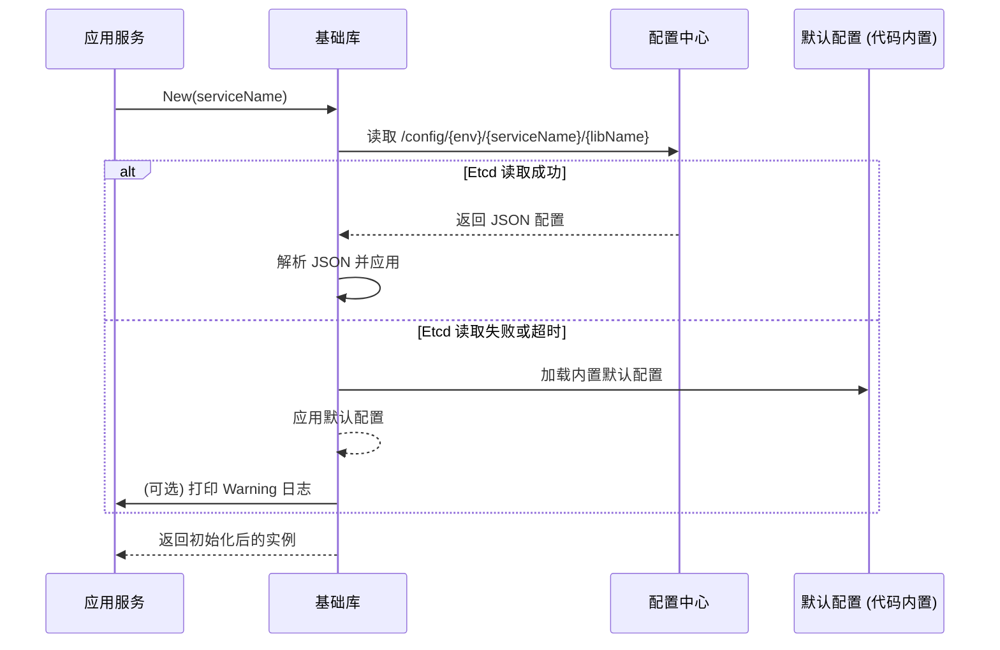
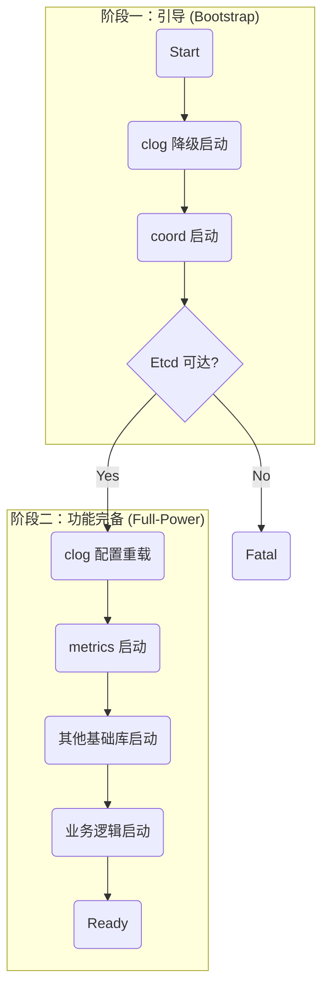

# im-infra 基础库设计与开发指南

`im-infra` 是 GoChat 项目的基石，它提供了一套统一、标准化的基础库，被所有上层微服务（`im-gateway`, `im-logic`, `im-task`, `im-repo`）所依赖。其核心目标是统一技术栈、封装复杂性、提高开发效率和系统的可维护性。

## 1. 核心理念

`im-infra` 中的所有基础库都应遵循以下核心理念，以确保整个基础设施层的一致性、可维护性和易用性：

- **高内聚，低耦合**: 将复杂性封装在内部，对外提供简洁、稳定的接口。
- **动态配置优先，默认配置保底**: 优先从配置中心加载，失败则优雅降级。
- **面向接口编程**: 业务代码应依赖于抽象接口，而不是具体实现。
- **生产就绪**: 所有库都应内置优雅关闭、错误处理和性能监控等生产环境所需的功能。

---

## 2. 统一的配置管理

所有需要配置的基础库**必须**遵循从 `etcd` 动态加载、失败后降级到默认值的模式。

### 2.1 配置加载流程



### 2.2 实现要点

- **配置路径**: 统一使用 `fmt.Sprintf("/config/%s/%s/%s", env, serviceName, libName)` 格式。
    - `env`: 通过环境变量 `APP_ENV` 获取，若为空则默认为 `dev`。
    - `serviceName`: 由 `New` 函数的调用者传入，例如 "im-logic"。
    - `libName`: 库的名称，例如 "ratelimit", "cache"。
- **动态刷新**: 对于适合动态调整的配置（如限流规则），库内部应启动一个 `goroutine` 来 `Watch` `etcd` 中的配置变更并自动热加载。
- **降级机制**: 如果从 `etcd` 读取配置失败（网络问题、超时、权限等），**绝不能 panic**。必须记录一条 `Warn` 日志，并加载在代码中硬编码的 `DefaultConfig()`，以保证服务的可用性。

---

## 3. 基础库的三种原型 (Archetypes)

`im-infra` 的基础库根据其职责和使用方式，可以分为三种原型。新的基础库应根据其特性，选择最符合的原型进行设计。

### 原型一：有状态服务型 (Stateful Service)

- **定义**: 提供一个长期运行、有内部状态、有生命周期的后台服务。
- **示例**: `metrics`, `ratelimit`, `coord`, `mq` (消费者)
- **核心特征**:
    - **生命周期管理**: 必须提供 `New()` 和 `Close()`/`Shutdown()` 方法。`New` 方法应接收 `context.Context` 以支持优雅关闭。
    - **依赖注入**: 应通过 `Option` 函数模式接收可选依赖，如 `metrics.Provider` 或 `clog.Logger`。
    - **返回接口**: `New()` 函数返回一个**接口** (e.g., `Limiter`, `Provider`)，隐藏具体实现。
    - **后台任务**: 内部通常包含一个或多个 `goroutine` (如 `metrics` 的 Prometheus 服务器，`ratelimit` 的规则刷新器)。

```go
// file: coordination/coordination.go
package coordination

// New 函数接收 context 和可选的 logger
func New(ctx context.Context, serviceName string, opts ...Option) (Provider, error) {
    // 1. 应用 Options, 注入依赖
    // 2. 从 etcd 加载配置，失败则降级
    // 3. 启动后台 goroutine (e.g., watch)
    // 4. 返回接口
}
```

### 原型二：客户端包装型 (Client Wrapper)

- **定义**: 封装一个外部客户端（如 Redis, GORM），为其增加日志、指标、错误处理等通用能力。
- **示例**: `cache`, `db`
- **核心特征**:
    - **通过钩子集成**: 优先使用客户端自身的钩子 (Hooks) 或插件 (Plugins) 机制来无侵入地集成 `clog` 和 `metrics`。
    - **依赖注入**: `New()` 函数应通过 `Option` 模式接收 `clog.Logger` 和 `metrics.Provider`。
    - **便捷的全局实例**: 可以提供一个开箱即用的全局默认实例 (`cache.Default()`)，但其内部也应遵循依赖注入和优雅降级的原则。
    - **接口可选**: `New()` 可以返回具体类型（如 `*redis.Client` 的包装），也可以返回接口，取决于抽象的必要性。

```go
// file: cache/cache.go
package cache

// New 函数通过 Option 注入依赖
func New(cfg Config, opts ...Option) (Cache, error) {
    // 1. 应用 Options, 获取 logger 和 metrics provider
    // 2. 初始化 redis.Client
    // 3. 使用 redis.Client.AddHook() 注入自定义的 logging 和 metrics hook
    // 4. 返回实例
}
```

### 原型三：全局单例工具型 (Singleton Utility)

- **定义**: 提供一组全局可用的功能函数，内部维护一个对用户透明的单例。
- **示例**: `clog`, `uid`
- **核心特征**:
    - **包级别函数**: 主要通过包级别函数对外提供服务 (`clog.Info()`, `uid.GenerateInt64()`)。
    - **优雅降级与升级**: 核心能力。启动时使用安全的默认配置（如 `clog` 输出到控制台），在配置就绪后，通过 `Init` 或类似函数重新加载配置，实现能力"升级"。
    - **无实例概念**: 用户通常不需要 `New()` 一个实例来使用它。
    - **轻量级定制**: 可提供 `Module()` 或 `With()` 等函数，返回一个携带了部分上下文的新接口，方便使用。

```go
// file: clog/clog.go
package clog

// 默认的 logger，在 Init 之前可能是一个输出到 stdout 的 logger
var defaultLogger Logger = newDefaultLogger()

// Init 函数用于从最终配置中加载并替换 defaultLogger
func Init(cfg Config) {
    // ... 根据配置创建生产环境 logger
    // defaultLogger = newProdLogger(cfg)
}

func Info(msg string, fields ...Field) {
    defaultLogger.Info(msg, fields...)
}
```

---

## 4. 依赖注入与初始化顺序

为了保证服务的健壮性和可观测性，所有基础库的初始化应遵循统一的依赖关系和顺序。

### 4.1 依赖注入最佳实践

- **目标**: 解耦 `clog` 和 `metrics` 的具体实现，使任何库都可以独立、可测试地运行。
- **原则**:
    1.  **禁止硬编码依赖**: 任何库（如 `cache`）**禁止**直接调用 `metrics.Inc()` 或 `clog.Info()`。
    2.  **使用 Option 模式注入**: 所有需要日志和指标的库，其 `New` 函数都必须接受 `Option` 函数作为参数，用于注入依赖。
    3.  **依赖接口，而非实现**: 注入的依赖必须是接口，如 `clog.Logger` 和 `metrics.Provider`。
    4.  **默认关闭**: 如果调用者没有注入 `Logger` 或 `Provider`，库内部应优雅地处理 `nil` 依赖，不执行任何相关操作（或使用一个空实现的 `noop` 实例），**绝不能 panic**。

### 4.2 推荐初始化顺序：两阶段初始化

为了解决 `clog` 和 `coord` 之间的"鸡生蛋"式循环依赖问题，服务启动时必须遵循 **两阶段初始化 (Two-Phase Initialization)** 模式。



1.  **阶段一：引导 (Bootstrap Phase)** - 目标是让服务"点火"并具备最基础的日志和配置能力。
    - **`clog` 降级启动**: 在 `main` 函数的入口处，立即初始化一个 **引导 Logger**。此 Logger 不依赖任何外部配置，直接向 `os.Stdout` 输出文本日志。它的唯一使命是记录启动过程。
    - **`coord` 启动**: `NewCoord` 函数接收上一步创建的引导 Logger 作为依赖，然后去连接 `etcd`。

2.  **阶段二：功能完备 (Full-Power Phase)** - 目标是让所有基础库和业务服务"引擎全开"。
    - **`clog` 配置重载**: `coord` 从 `etcd` 读取到完整的日志配置后，调用 `clog.Init()` 创建一个 **生产 Logger**（具备完整的格式化、级别控制、输出到文件或远端的能力），并原子替换掉全局的引导 Logger。此后，所有日志都将通过生产 Logger 输出。
    - **`metrics` 启动**: 使用从 `etcd` 获取的配置初始化 `metrics` 服务。
    - **其他基础库启动**: 依次初始化 `cache`, `db`, `mq` 等。此时，它们可以通过依赖注入，获取到功能完备的 `clog.Logger` 和 `metrics.Provider` 实例。
    - **业务逻辑启动**: 启动所有 gRPC/HTTP 服务，开始处理业务请求。

这个流程确保了启动过程无死锁、全程可观测、职责清晰。

---

## 5. 通用规范

以下规范适用于所有原型。

### 5.1 代码组织

- **根目录**: 存放公共 API (`ratelimit.go`, `config.go`) 和文档 (`README.md`, `API.md`)。
- **`internal/`**: 存放所有内部实现。
- **`examples/`**: 至少包含 `basic` 和 `advanced` 两个示例。

### 5.2 文档与注释

- **`README.md`**: 解释"为什么"和设计理念。
- **`API.md`**: 解释"如何使用"，并根据库的原型提供对应的示例。
- **Go Doc**: 所有公共 API 必须有完整的 Go Doc 注释。

### 5.3 日志使用规范

- **强制使用** `im-infra/clog`。
- **强制使用**结构化日志 (`clog.String(...)`)。
- **错误日志必须**使用 `clog.Err(err)`。
- **`module` 功能仅用于 `clog`**: `clog.Module("cache.redis")` 是日志库为了增加上下文提供的能力，其他库不应关心此概念。

#### 5.3.1 调用方式规范

为了兼顾基础库的解耦和业务代码的便利性，日志调用方式规定如下：

- **库代码 (`im-infra/**`)**: **严禁** 使用全局的 `clog.Info()`。所有需要日志的库，其 `New` 函数 **必须** 通过 `Option` 模式接收一个 `clog.Logger` 接口的实例，并使用该实例 (`logger.Info()`) 进行日志记录。这强制了依赖注入，是实现解耦和可测试性的关键。

- **业务代码 (`im-logic`, `im-gateway` 等)**: 在最终服务的业务逻辑代码中（如 HTTP Handler, gRPC Service），为了方便，**可以** 使用全局的 `clog.Info()` 等包级别函数。

#### 5.3.2 对 `clog` 库自身的要求

`clog` 库的实现者 **必须** 确保无论通过 `logger.Info()` 还是 `clog.Info()` 调用，都能正确输出日志的原始调用位置（文件名和行号）。这通常通过 `runtime.Caller` 和 `zap.AddCallerSkip` 等技术实现，是 `clog` 库必须履行的职责。

### 5.4 命名规范

命名是代码的门面，清晰、一致、地道的命名是 `im-infra` 项目可维护性的基石。

#### 5.4.1 核心哲学：面向服务，而非实现

包名应描述其提供的 **抽象服务**，而不是其内部使用的具体技术。这强制我们思考库的边界和抽象层，是构建高内聚、低耦合系统的关键。

-   **正确**: `package db` - 提供数据库服务。
-   **错误**: `package mysql` - 将实现细节暴露给了包名，限制了未来的技术选型。

-   **正确**: `package cache` - 提供缓存服务。
-   **错误**: `package redis` - 耦合了具体技术。

#### 5.4.2 官方包名列表

所有 `im-infra` 基础库应采用以下官方命名。这些名称经过精心选择，旨在实现简洁、清晰和风格统一。

| 包名        | 原名 (如有)     | 职责说明                                     |
| :---------- | :-------------- | :------------------------------------------- |
| `cache`     | -               | 通用缓存服务，封装 Redis 等。                |
| `clog`      | -               | 上下文日志服务。                             |
| `coord`     | `coordination`  | 分布式协调服务，封装 Etcd 等。               |
| `db`        | -               | 数据库访问层，封装 GORM 等。                 |
| `metrics`   | -               | 指标采集与暴露服务。                         |
| `mq`        | -               | 消息队列服务，封装 Kafka 等。                |
| `once`      | `idempotent`    | 分布式幂等性/只执行一次服务。关联 `sync.Once`。 |
| `ratelimit` | -               | 分布式限流服务。                             |
| `uid`       | `id-gen`        | 唯一 ID 生成服务。                           |

**命名决策示例**:
- **`coord`**: `coordination` 的标准缩写，简洁且行业通用。
- **`once`**: 关联 Go 标准库 `sync.Once` 的心智模型，比 `idempotent` 更地道、API 更优雅。
- **`uid`**: `Unique Identifier` 的标准缩写，比 `idgen` 更简短、风格更统一。

#### 5.4.3 其他命名约定

-   **文件名**:
    -   `{packagename}.go`: 存放核心的公共 API，如 `New` 函数和主要接口定义。
    -   `options.go`: 存放所有 `Option` 函数类型和实现。
    -   `config.go`: 存放与配置相关的结构体和默认配置函数。
    -   `interfaces.go`: (可选) 如果接口定义复杂，可单独存放于此文件。

-   **接口名**:
    -   **简洁**: 避免在包名后重复，如 `ratelimit.RateLimiter` 应为 `ratelimit.Limiter`。
    -   **模式**:
        -   代表一种能力或服务，使用名词或 `Provider` 后缀，如 `cache.Cache`, `metrics.Provider`。
        -   核心是一个动作，使用动词 + `er` 后缀，如 `ratelimit.Limiter`。
        -   避免使用 `Interface` 后缀。

-   **构造函数**:
    -   主构造函数应命名为 `New`。
    -   `New` 函数应返回接口类型，而非具体的结构体指针，以强制实现细节的封装。

---

## 6. 组件 API 参考

本章节提供了 `im-infra` 中各个核心基础库的简要 API 参考，旨在帮助开发者快速了解每个库提供的核心功能。

### 6.1 `cache` - 缓存服务

-   `New(cfg Config, opts ...Option) (Cache, error)`: 创建一个新的缓存客户端实例。
-   `Get(ctx context.Context, key string) (string, error)`: 获取一个键的值。
-   `Set(ctx context.Context, key string, value interface{}, expiration time.Duration) error`: 设置一个键值对，并指定过期时间。
-   `Del(ctx context.Context, keys ...string) error`: 删除一个或多个键。

### 6.2 `clog` - 上下文日志服务

-   `Init(cfg Config)`: 根据配置初始化全局 Logger。
-   `Debug(msg string, fields ...Field)`: 记录 Debug 级别的日志。
-   `Info(msg string, fields ...Field)`: 记录 Info 级别的日志。
-   `Warn(msg string, fields ...Field)`: 记录 Warn 级别的日志。
-   `Error(msg string, fields ...Field)`: 记录 Error 级别的日志。
-   `With(fields ...Field) Logger`: 返回一个携带了额外上下文信息的新 Logger 实例。
-   `Err(err error) Field`: 创建一个包含错误信息的日志字段。

### 6.3 `coord` - 分布式协调服务

`coord` 模块是基于 etcd 的分布式协调库，为 gochat 项目提供分布式锁、服务注册发现、配置中心等核心功能。

#### 6.3.1 核心特性

- ⚡ **gRPC 动态服务发现**：标准 resolver 插件，实时感知服务变化，自动负载均衡
- 🔒 **分布式锁**：基于 etcd 的高可靠互斥锁，支持 TTL 和自动续约
- ⚙️ **配置中心**：强类型配置管理，支持实时监听和 CAS 操作
- 📈 **高性能**：连接复用，毫秒级故障转移，5000+ calls/sec
- 🛡️ **通用配置管理器**：为所有模块提供统一的配置管理能力

#### 6.3.2 主要接口

**主协调器接口**:
```go
// Provider 定义协调器的核心接口
type Provider interface {
    // Lock 获取分布式锁服务
    Lock() lock.DistributedLock
    // Registry 获取服务注册发现服务  
    Registry() registry.ServiceRegistry
    // Config 获取配置中心服务
    Config() config.ConfigCenter
    // Close 关闭协调器并释放资源
    Close() error
}
```

**分布式锁接口**:
```go
type DistributedLock interface {
    // Acquire 获取互斥锁，如果锁已被占用，会阻塞直到获取成功或 context 取消
    Acquire(ctx context.Context, key string, ttl time.Duration) (Lock, error)
    // TryAcquire 尝试获取锁（非阻塞），如果锁已被占用，会立即返回错误
    TryAcquire(ctx context.Context, key string, ttl time.Duration) (Lock, error)
}

type Lock interface {
    // Unlock 释放锁
    Unlock(ctx context.Context) error
    // TTL 获取锁的剩余有效时间
    TTL(ctx context.Context) (time.Duration, error)
    // Key 获取锁的键
    Key() string
}
```

**服务注册发现接口**:
```go
type ServiceRegistry interface {
    // Register 注册服务，ttl 是租约的有效期
    Register(ctx context.Context, service ServiceInfo, ttl time.Duration) error
    // Unregister 注销服务
    Unregister(ctx context.Context, serviceID string) error
    // Discover 发现服务
    Discover(ctx context.Context, serviceName string) ([]ServiceInfo, error)
    // Watch 监听服务变化
    Watch(ctx context.Context, serviceName string) (<-chan ServiceEvent, error)
    // GetConnection 获取到指定服务的 gRPC 连接，支持负载均衡
    GetConnection(ctx context.Context, serviceName string) (*grpc.ClientConn, error)
}
```

**配置中心接口**:
```go
type ConfigCenter interface {
    // Get 获取配置值并反序列化到提供的类型中
    Get(ctx context.Context, key string, v interface{}) error
    // Set 序列化并存储配置值
    Set(ctx context.Context, key string, value interface{}) error
    // Delete 删除配置键
    Delete(ctx context.Context, key string) error
    // List 列出给定前缀下的所有键
    List(ctx context.Context, prefix string) ([]string, error)
    // Watch 监听单个键的变化
    Watch(ctx context.Context, key string, v interface{}) (Watcher[any], error)
    // WatchPrefix 监听给定前缀下的所有键的变化
    WatchPrefix(ctx context.Context, prefix string, v interface{}) (Watcher[any], error)
    // GetWithVersion 获取配置值和版本信息（CAS支持）
    GetWithVersion(ctx context.Context, key string, v interface{}) (version int64, err error)
    // CompareAndSet 原子地比较并设置配置值
    CompareAndSet(ctx context.Context, key string, value interface{}, expectedVersion int64) error
}
```

#### 6.3.3 通用配置管理器

coord 提供了基于泛型的通用配置管理器，为所有基础设施模块提供统一的配置管理能力：

```go
// 创建配置管理器
manager := config.NewManager(
    configCenter,
    "dev", "gochat", "component",
    defaultConfig,
    config.WithValidator[T](validator),
    config.WithUpdater[T](updater),
    config.WithLogger[T](logger),
)

// 显式启动配置管理器
manager.Start()
defer manager.Stop()

// 获取当前配置
currentConfig := manager.GetCurrentConfig()
```

**特性**:
- 🔧 **类型安全**: 使用 Go 泛型确保配置类型安全
- 🛡️ **降级策略**: 配置中心不可用时自动使用默认配置
- 🔄 **热更新**: 支持配置热更新和实时监听
- ✅ **配置验证**: 支持自定义配置验证器
- 🔄 **更新回调**: 支持配置更新时的自定义逻辑

#### 6.3.4 构造函数签名

```go
// 创建新的协调器实例
func New(ctx context.Context, cfg CoordinatorConfig, opts ...Option) (Provider, error)

// 配置选项
type CoordinatorConfig struct {
    Endpoints   []string     `json:"endpoints"`      // etcd 服务器地址列表
    Username    string       `json:"username,omitempty"`  // etcd 用户名（可选）
    Password    string       `json:"password,omitempty"`  // etcd 密码（可选）
    Timeout     time.Duration `json:"timeout"`       // 连接超时时间
    RetryConfig *RetryConfig `json:"retry_config,omitempty"`  // 重试配置
}
```

#### 6.3.5 使用示例

**基本用法**:
```go
// 创建协调器（使用默认配置连接 localhost:2379）
coordinator, err := coord.New(context.Background(), coord.DefaultConfig())
if err != nil {
    log.Fatal(err)
}
defer coordinator.Close()

// 使用分布式锁
lock, err := coordinator.Lock().Acquire(ctx, "my-resource", 30*time.Second)
if err != nil {
    return err
}
defer lock.Unlock(ctx)

// 注册服务
service := registry.ServiceInfo{
    ID:      "chat-service-001",
    Name:    "chat-service",
    Address: "127.0.0.1",
    Port:    8080,
}
err = coordinator.Registry().Register(ctx, service, 30*time.Second)
```

**gRPC 动态服务发现**:
```go
// 注册服务
coordinator.Registry().Register(ctx, serviceInfo, 30*time.Second)

// 获取 gRPC 连接（自动负载均衡）
conn, err := coordinator.Registry().GetConnection(ctx, "user-service")
if err != nil {
    return err
}
defer conn.Close()

// 创建 gRPC 客户端
client := yourpb.NewYourServiceClient(conn)
resp, err := client.YourMethod(ctx, &yourpb.YourRequest{})
```

### 6.4 `db` - 数据库访问层

-   `New(cfg Config, opts ...Option) (*gorm.DB, error)`: 创建一个新的 GORM 数据库连接实例。
-   `DB()`: 获取全局默认的 `*gorm.DB` 实例。
-   (注: `db` 库主要封装 GORM，其 API 直接复用 GORM 的标准 API，如 `db.Model(&User{}).First(&user)`)

### 6.5 `metrics` - 指标服务

-   `New(cfg Config) (Provider, error)`: 创建一个新的指标服务提供者。
-   `Inc(name string, labels ...string)`: 增加一个计数器指标。
-   `Gauge(name string, value float64, labels ...string)`: 设置一个仪表盘指标。
-   `Histogram(name string, value float64, labels ...string)`: 记录一个直方图指标的观测值。
-   `Summary(name string, value float64, labels ...string)`: 记录一个摘要指标的观测值。

### 6.6 `mq` - 消息队列服务

-   `NewProducer(cfg ProducerConfig) (Producer, error)`: 创建一个消息生产者。
-   `NewConsumerGroup(cfg ConsumerConfig) (ConsumerGroup, error)`: 创建一个消费者组。
-   `Producer.Produce(ctx context.Context, msg Message) error`: 生产一条消息。
-   `ConsumerGroup.Consume(ctx context.Context, handler func(Message) error)`: 消费消息并使用指定的处理器进行处理。

### 6.7 `once` - 幂等性服务

-   `New(cfg Config) (Idempotent, error)`: 创建一个幂等性检查器实例。
-   `Do(ctx context.Context, key string, f func() error) error`: 检查 `key` 是否已经执行过，如果没有，则执行函数 `f` 并标记为已执行。

### 6.8 `ratelimit` - 限流服务

-   `New(ctx context.Context, serviceName string, opts ...Option) (Limiter, error)`: 创建一个新的限流器实例。
-   `Allow(key string) bool`: 判断一个请求是否被允许。

### 6.9 `uid` - 唯一 ID 服务

-   `Init(cfg Config)`: 根据配置初始化全局 ID 生成器。
-   `GenerateInt64() int64`: 生成一个全局唯一的 `int64` 类型的 ID (基于 Snowflake 算法)。
-   `GenerateString() string`: 生成一个全局唯一的字符串类型的 ID。

---

## 7. 已知问题和改进计划

### 7.1 coord 模块当前问题

基于审计结果，coord 模块存在以下需要改进的问题：

1. **缺少 HotReloadable 接口实现**: 根据实现计划，coord 应该实现 `HotReloadable` 接口以支持配置热更新
2. **文档与代码不一致**: API.md 文档缺少 CAS 操作（GetWithVersion 和 CompareAndSet）的说明
3. **配置管理器生命周期**: 需要明确 Start/Stop 方法的使用，当前文档和示例存在不一致
4. **错误类型未暴露**: 自定义错误类型在内部包中，用户无法正确处理特定错误条件

### 7.2 改进优先级

**高优先级（立即修复）**:
- 实现 coord 模块的 HotReloadable 接口
- 更新 API.md 文档，添加缺失的 CAS 操作说明
- 统一配置管理器的生命周期管理文档

**中优先级（后续版本）**:
- 暴露错误类型，提供更好的错误处理能力
- 增加连接池和健康检查功能
- 添加 TLS 支持

**低优先级（长期规划）**:
- 实现 RBAC 集成
- 添加性能优化和监控指标
- 完善测试覆盖率

### 7.3 使用建议

在 coord 模块完成上述改进之前，建议：

1. **使用默认配置**: 依赖 coord 的默认配置功能，确保在 etcd 不可用时服务仍可正常运行
2. **监控 etcd 连接**: 在生产环境中监控 etcd 连接状态，及时发现连接问题
3. **配置备份**: 为关键配置维护代码中的默认备份，避免单点故障
4. **逐步迁移**: 对于现有系统，可以逐步迁移到新的配置管理模式，先在测试环境验证