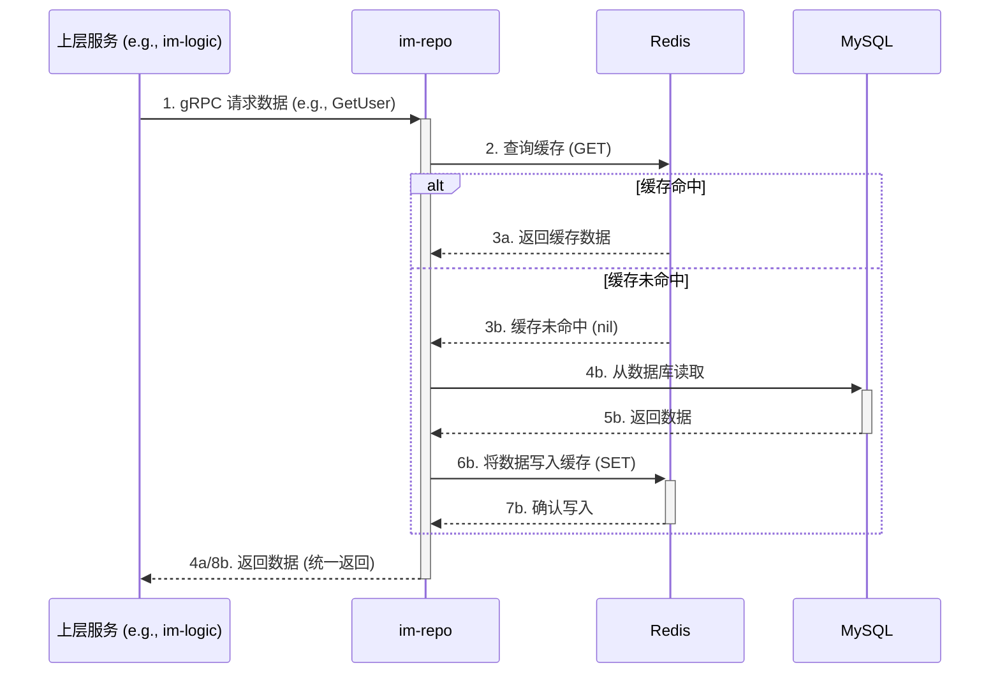

# im-repo 数据仓储服务设计

`im-repo` 是 GoChat 系统的“数据管家”，是所有持久化数据（MySQL）和缓存数据（Redis）的唯一看门人。它通过提供 gRPC 接口，为上层服务屏蔽了所有底层数据存储的复杂性。

## 1. 核心职责

1.  **数据访问的唯一入口**: 系统中任何其他模块都**不允许**直接连接 MySQL 或 Redis。所有数据操作都必须通过调用 `im-repo` 提供的 gRPC 接口来完成。
2.  **封装底层复杂性**: `im-repo` 对上层服务（`im-logic`, `im-task`）**屏蔽**了所有底层存储的细节。这包括：
    *   数据库表结构。
    *   缓存的读写策略（如 Cache-Aside）。
    *   未来可能引入的数据库读写分离、分库分表。
3.  **提供原子化的数据操作**: 提供的 gRPC 接口应该是业务层面的、原子化的操作。例如，`SaveMessage` 接口应该同时完成写入数据库和更新缓存两个动作。

**设计目标**: 开发一个**高可靠、高性能、易维护**的数据仓储服务。

## 2. 数据模型

`im-repo` 管理着系统的核心数据资产，包括数据库表和 Redis 缓存。

### 2.1 数据库表设计 (MySQL)

| 表名 | 字段名 | 类型 | 约束/索引 | 描述 |
| :--- | :--- | :--- | :--- | :--- |
| **users** | `id` | `BIGINT UNSIGNED` | **PK**, NOT NULL | 用户ID (分布式ID生成) |
| | `username` | `VARCHAR(50)` | **UNIQUE**, NOT NULL | 用户名 |
| | `password_hash` | `VARCHAR(255)` | NOT NULL | bcrypt 哈希后的密码 |
| | `nickname` | `VARCHAR(50)` | DEFAULT '' | 昵称 |
| | `avatar_url` | `VARCHAR(255)` | DEFAULT '' | 头像URL |
| | `created_at` | `TIMESTAMP` | NOT NULL | 创建时间 |
| **groups** | `id` | `BIGINT UNSIGNED` | **PK**, NOT NULL | 群组ID (分布式ID生成) |
| | `name` | `VARCHAR(50)` | NOT NULL | 群名称 |
| | `owner_id` | `BIGINT UNSIGNED` | **KEY**, NOT NULL | 群主用户ID |
| | `member_count`| `INT UNSIGNED` | NOT NULL, DEFAULT 0 | 成员数量 (冗余字段) |
| | `created_at` | `TIMESTAMP` | NOT NULL | 创建时间 |
| **group_members** | `id` | `BIGINT UNSIGNED` | **PK**, NOT NULL | 记录ID |
| | `group_id` | `BIGINT UNSIGNED` | **UNIQUE(group_id, user_id)** | 群组ID |
| | `user_id` | `BIGINT UNSIGNED` | **KEY(user_id)** | 用户ID |
| | `role` | `TINYINT` | NOT NULL, DEFAULT 1 | 角色 (1:成员, 2:管理员) |
| | `joined_at` | `TIMESTAMP` | NOT NULL | 加入时间 |
| **messages** | `id` | `BIGINT UNSIGNED` | **PK**, NOT NULL | 消息ID (分布式ID生成) |
| | `conversation_id` | `VARCHAR(64)` | **UNIQUE(conv_id, seq_id)**, **KEY(conv_id, created_at)** | 会话ID |
| | `sender_id` | `BIGINT UNSIGNED` | NOT NULL | 发送者ID |
| | `message_type`| `TINYINT` | NOT NULL, DEFAULT 1 | 消息类型 (1:文本, 2:图片) |
| | `content` | `TEXT` | NOT NULL | 消息内容 |
| | `seq_id` | `BIGINT UNSIGNED` | NOT NULL | 会话内单调递增序列号 |
| | `created_at` | `TIMESTAMP(3)`| NOT NULL | 创建时间 (精确到毫秒) |
| **user_read_pointers** | `id` | `BIGINT UNSIGNED` | **PK** | 记录ID |
| | `user_id` | `BIGINT UNSIGNED` | **UNIQUE(user_id, conv_id)** | 用户ID |
| | `conversation_id` | `VARCHAR(64)` | NOT NULL | 会话ID |
| | `last_read_seq_id` | `BIGINT UNSIGNED` | NOT NULL | 该用户在该会话中最后已读消息的seq_id |
| | `updated_at` | `TIMESTAMP` | NOT NULL | 更新时间 |

### 2.2 缓存设计 (Redis)

缓存的设计目标是减少对 MySQL 的直接访问，提升核心场景的性能。

| 用途 | Key 格式 | Value 类型 | 描述与作用 |
| :--- | :--- | :--- | :--- |
| **用户信息** | `user_info:{user_id}` | **HASH** | 缓存 `users` 表的行数据。采用 Cache-Aside 策略。 |
| **用户在线状态** | `user_session:{user_id}` | **HASH** | 由 `im-gateway` 写入，`im-logic` 读取。字段: `gateway_id`。 |
| **会话序列号** | `conv_seq:{conversation_id}` | **STRING** | 使用 `INCR` 命令为 `im-logic` 原子地生成 `seq_id`。 |
| **群组成员列表** | `group_members:{group_id}` | **SET** | 缓存一个群的所有 `user_id`。用于快速获取成员列表。 |
| **消息去重** | `msg_dedup:{client_msg_id}`| **STRING** | 由 `im-logic` 写入，`SETEX` 60秒。用于实现消息发送的幂等性。 |
| **热点消息缓存** | `hot_messages:{conv_id}` | **ZSET** | 缓存每个会话最近的N条(如300条)消息。`Score` 是 `seq_id`，`Member` 是消息体的 JSON 字符串。 |
| **会话未读数** | `unread:{conv_id}:{user_id}` | **STRING** | 使用 `INCR` 命令记录用户的未读消息数。 |
| **用户推荐结果** | `recommend:user:{user_id}` | **ZSET** | 缓存为用户生成的“可能认识的人”列表。`Score` 是推荐分数，`Member` 是被推荐用户的 ID。 |
| **群组推荐结果** | `recommend:group:{user_id}` | **ZSET** | 缓存为用户生成的“可能感兴趣的群”列表。`Score` 是推荐分数，`Member` 是被推荐群组的 ID。 |

## 3. 核心缓存策略

### Cache-Aside (旁路缓存) 模式

这是 `im-repo` 读取数据时遵循的核心策略，主要用于用户信息、群组成员等不频繁变更的数据。

### 写策略：更新数据库 + 失效缓存

当数据发生变更时（如用户修改昵称），`im-repo` 采用以下策略保证数据一致性：

1.  **更新数据库**: 首先，将变更写入主存储 MySQL。
2.  **删除缓存**: 数据库操作成功后，**直接删除** Redis 中对应的缓存键（如 `DEL user_info:{user_id}`），而不是更新它。

这种“更新DB，删除Cache”的策略可以有效地避免因并发写操作导致的缓存与数据库不一致的问题。缓存的重建将交由下一次读请求（触发 Cache-Aside）来完成。

## 4. 数据扩展性设计

随着业务量的增长，单一数据库实例最终会成为瓶颈。`im-repo` 的设计需要为未来的数据扩展性做好准备。

### 4.1 分库分表 (Sharding)
`im-repo` 作为唯一的数据访问入口，是实现分库分表的最佳位置。上层服务不需要关心底层数据到底存储在哪张表、哪个库。
- **分片键 (Shard Key)**: `messages` 表是最大的表，可以优先考虑以 `conversation_id` 作为分片键。这样可以保证同一个会话的消息落在同一个分片上，便于查询。用户相关的表可以按 `user_id` 分片。
- **实现方案**: 未来可以在 `im-repo` 内部引入数据库中间件（如 `Sharding-Sphere`），或者在代码层面根据分片键计算出目标库和表，然后执行 SQL。

### 4.2 数据冷热分层
IM 系统的消息数据具有明显的时效性，大部分用户只会查询近期的数据。
- **冷数据**: 对于超过一定时间（如6个月）的历史消息，可以认为是“冷数据”。
- **归档机制**: 可以通过 `im-task` 的定时任务，定期将 MySQL 中的冷数据迁移到成本更低、更适合海量存储的系统中，例如对象存储（MinIO）或大数据存储（如 Hive, ClickHouse）。
- **查询访问**: `im-repo` 在收到历史消息查询请求时，可以根据时间范围决定是从主库 MySQL 查询，还是从冷存储系统中查询。这对于实现“消息时光机”等功能至关重要。
