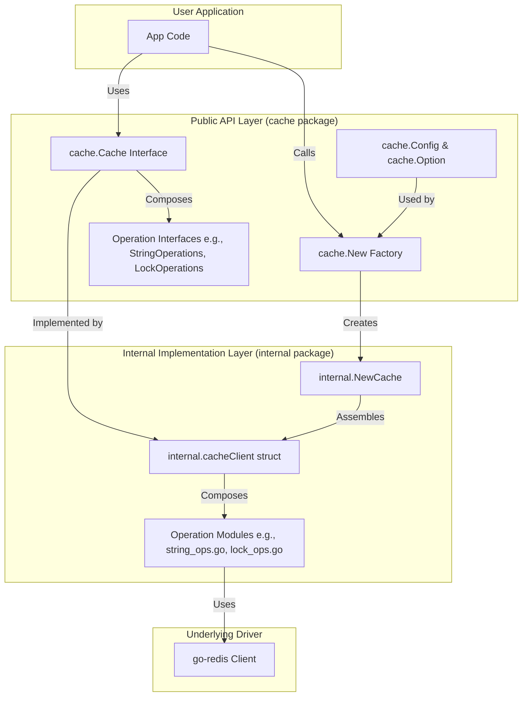

# cache 设计文档

## 🎯 设计目标

`cache` 是为 GoChat 项目设计的统一分布式缓存服务，基于 [go-redis](https://github.com/redis/go-redis) 构建。其核心设计目标是提供一个**高性能、功能完备、类型安全且易于使用**的 Redis 操作层。

### 核心设计原则

1.  **简洁易用**：提供清晰、直观的 API，隐藏底层 `go-redis` 的复杂性。
2.  **功能完备**：封装常用的 Redis 操作，包括字符串、哈希、集合、分布式锁和布隆过滤器。
3.  **类型安全**：所有与时间相关的参数（如过期时间）均使用 `time.Duration`，避免魔术数字和单位混淆。
4.  **面向接口**：所有功能通过 `cache.Provider` 接口暴露，遵循依赖倒置原则，便于测试和模拟 (mocking)。
5.  **配置灵活**：提供环境相关的默认配置 (`GetDefaultConfig`) 和函数式选项 (`Option`)，易于定制和扩展。
6.  **清晰分层**：严格区分公共 API (`cache/`) 和内部实现 (`cache/internal/`)，实现关注点分离。
7.  **错误处理**：提供标准的 `ErrCacheMiss` 错误类型，统一缓存未命中的处理方式。
8.  **子接口设计**：通过 `Provider` 接口暴露子操作接口，避免接口膨胀，提高可组合性。

## 🏗️ 架构设计

`cache` 模块遵循 **客户端包装器 (Client Wrapper)** 的设计模式，将 `go-redis` 的功能封装在一个更高级、更符合业务需求的 API 之后。

### 整体架构



### 关键组件设计

#### 1. 工厂函数 (`cache.New`)

**设计要点**:
*   **唯一入口**: `New` 是创建 `Cache` 实例的唯一入口，封装了所有初始化逻辑。
*   **配置转换**: 将用户友好的 `cache.Config` 转换为内部使用的 `internal.Config`，实现内外隔离。
*   **依赖注入**: 通过 `Option` 函数（如 `WithLogger`）注入日志记录器等外部依赖，实现控制反转 (IoC)。
*   **日志集成**: 与 `im-infra/clog` 无缝集成，在实例创建时记录关键配置信息。

**代码示例** (`cache.go`):
```go
func New(ctx context.Context, cfg Config, opts ...Option) (Cache, error) {
    // 应用函数式选项
	options := &Options{}
	for _, opt := range opts {
		opt(options)
	}

    // ... Logger 初始化 ...

    // 将顶层 Config 转换为内部使用的 internal.Config
	internalCfg := internal.Config{
		Addr:            cfg.Addr,
		// ...
	}

	// 创建 cache 实例
	return internal.NewCache(ctx, internalCfg, componentLogger)
}
```

#### 2. 核心接口 (`cache.Provider`)

**设计要点**:
*   **子接口模式**: `Provider` 接口不直接组合操作接口，而是提供获取子操作接口的方法。这避免了接口膨胀，提高了可组合性。
*   **明确职责**: 每个子操作接口（`StringOperations`, `HashOperations` 等）都有明确的职责范围，遵循单一职责原则。
*   **易于测试**: 调用方可以轻松地为 `Provider` 接口创建模拟实现，用于单元测试。
*   **渐进式使用**: 用户可以根据需要选择使用哪些操作接口，避免被迫实现所有方法。

**代码示例** (`interfaces.go`):
```go
type Provider interface {
	String() StringOperations
	Hash() HashOperations
	Set() SetOperations
	Lock() LockOperations
	Bloom() BloomFilterOperations
	Script() ScriptingOperations
	Ping(ctx context.Context) error
	Close() error
}
```

**使用示例**:
```go
// 只需要字符串操作
stringOps := cacheClient.String()
value, err := stringOps.Get(ctx, "key")

// 只需要哈希操作
hashOps := cacheClient.Hash()
fields, err := hashOps.HGetAll(ctx, "user:123")
```

#### 3. 公共/内部隔离

**设计要点**:
*   **封装实现**: 所有具体的实现逻辑都位于 `internal` 包中，对外部调用者不可见。这防止了用户错误地依赖具体实现。
*   **职责分离**:
    *   `cache/` (公共层): 负责定义接口、配置结构和工厂函数。它是模块的稳定门面。
    *   `cache/internal/` (内部层): 负责与 `go-redis` 交互，实现所有接口定义的业务逻辑。
*   **键名管理**: 内部实现统一处理 `KeyPrefix`，对上层透明，简化了业务代码。

**目录结构**:
```
cache/
├── cache.go              # 主入口，New 工厂函数
├── interfaces.go         # 所有公共接口定义
├── config.go             # 公共配置结构体
├── options.go            # Option 函数
└── internal/             # 内部实现
    ├── client.go         # 核心客户端实现 (cacheClient)
    ├── *_ops.go          # 按功能划分的操作模块
    └── ...
```

#### 4. 分布式锁 (`LockOperations`)

**设计要点**:
*   **原子操作**: 锁的获取基于 Redis 的 `SET NX` 原子操作，保证互斥性。
*   **Acquire 方法**: 使用 `Acquire()` 而非 `Lock()` 作为获取锁的方法名，避免与关键字冲突。
*   **所有权验证**: 锁的释放采用 Lua 脚本，确保只有锁的持有者才能释放它，防止误删。
*   **接口封装**: `Locker` 接口 (`Unlock`, `Refresh`) 封装了锁的生命周期管理，使用简单。

**代码示例** (`interfaces.go`):
```go
type LockOperations interface {
	Acquire(ctx context.Context, key string, expiration time.Duration) (Locker, error)
}

type Locker interface {
    Unlock(ctx context.Context) error
    Refresh(ctx context.Context, expiration time.Duration) error
}
```

#### 5. 错误处理机制

**设计要点**:
*   **标准错误**: 定义 `ErrCacheMiss` 常量，统一表示缓存未命中的情况。
*   **明确语义**: 键不存在和操作失败是两种不同的错误类型，便于调用方进行差异化处理。
*   **错误传播**: 内部实现统一处理 Redis 错误，确保错误类型的一致性。

**代码示例**:
```go
// 检查键不存在
value, err := cacheClient.String().Get(ctx, "nonexistent")
if err == cache.ErrCacheMiss {
    // 处理缓存未命中
    log.Println("Cache miss")
} else if err != nil {
    // 处理其他错误
    log.Printf("Error: %v", err)
}
```

#### 6. 环境相关配置

**设计要点**:
*   **环境感知**: `GetDefaultConfig()` 根据环境参数返回不同的默认配置。
*   **生产优化**: 生产环境使用更高的连接池大小和更长的超时时间。
*   **开发友好**: 开发环境使用更简单的配置，便于本地开发和调试。

**代码示例**:
```go
// 开发环境 - 适合本地开发
devConfig := cache.GetDefaultConfig("development")

// 生产环境 - 适合容器化部署
prodConfig := cache.GetDefaultConfig("production")
```

## 🎨 设计模式应用

*   **工厂模式 (Factory Pattern)**: `cache.New` 函数封装了 `Provider` 实例的复杂创建过程。
*   **外观模式 (Facade Pattern)**: `cache` 包为底层的 `go-redis` 客户端提供了一个简化的、统一的接口。
*   **选项模式 (Functional Options Pattern)**: `WithLogger` 等 `Option` 函数提供了灵活、可扩展的配置方式。
*   **接口隔离原则 (Interface Segregation Principle)**: 通过 `Provider` 接口暴露子操作接口，避免接口膨胀，使得客户端只需依赖它们需要的功能。
*   **依赖注入 (Dependency Injection)**: 通过 `WithLogger` 将日志记录器注入到 `cache` 实例中，实现了解耦。
*   **包装器模式 (Wrapper Pattern)**: 通过 `providerWrapper` 和各种 `*Wrapper` 类型桥接内部实现和公共接口，解决循环依赖问题。

## 🔧 关键技术决策

### 1. 为什么选择 `go-redis`？

*   **事实标准**: `go-redis` 是 Go 社区最流行、最活跃的 Redis 客户端。
*   **性能优越**: 具有高性能的连接池和协议解析。
*   **功能全面**: 支持 Redis 的所有核心功能以及集群、哨兵、管道和 Lua 脚本等高级特性。
*   **社区支持**: 拥有庞大的用户基础和活跃的社区，问题可以快速得到解决。

### 2. 为什么进行公共/内部包隔离？

*   **强制解耦**: 阻止上层业务代码依赖任何具体的实现细节，只允许通过公共接口进行交互。
*   **API 稳定性**: 内部实现的重构（例如，从 `go-redis` 迁移到其他库）不会影响公共 API 的稳定性。
*   **明确契约**: 公共 API 层定义了清晰的、稳定的使用契约，降低了维护成本。
*   **循环依赖解决**: 通过包装器模式解决了公共接口和内部实现之间的循环依赖问题。

### 3. 为什么所有时间参数都使用 `time.Duration`？

*   **类型安全**: 避免了使用 `int64` 或 `float64` 时可能出现的单位混淆（秒、毫秒、纳秒）。
*   **可读性强**: `5 * time.Minute` 远比 `300` 更具可读性和可维护性。
*   **防止错误**: 编译器可以捕获类型不匹配的错误，减少了运行时 bug。

### 4. 为什么使用子接口模式而非组合接口？

*   **避免接口膨胀**: `Provider` 接口保持简洁，只包含获取子接口的方法，而不是组合所有操作方法。
*   **提高可组合性**: 用户可以根据需要选择使用哪些操作接口，避免被迫实现不需要的方法。
*   **明确职责边界**: 每个子操作接口都有明确的职责范围，符合单一职责原则。
*   **渐进式使用**: 用户可以逐步了解和使用不同的功能模块，降低学习曲线。

### 5. 为什么需要 `ErrCacheMiss` 错误类型？

*   **统一错误处理**: 提供标准的错误类型，便于调用方统一处理缓存未命中情况。
*   **语义明确**: 区分键不存在和操作失败两种不同的错误类型，提高代码的可读性。
*   **测试友好**: 便于编写单元测试，模拟缓存未命中的场景。

## 🔮 未来扩展方向

*   **指标监控集成**: 与 `im-infra/metrics` 集成，暴露 Redis 命令延迟、命中率、连接池状态等关键指标。
*   **分布式追踪集成**: 集成 OpenTelemetry，实现对 Redis 命令的端到端追踪。
*   **更丰富的 Redis 模块支持**: 增加对 RediSearch、RedisJSON 等高级模块的封装。
*   **客户端缓存 (Client-Side Caching)**: 支持 Redis 6 的客户端缓存（Tracking 功能），进一步降低延迟。
*   **批量操作优化**: 增加对管道 (Pipeline)、事务 (Transaction) 等批量操作的支持。
*   **连接池健康检查**: 实现更智能的连接池管理，包括健康检查和自动重连机制。
*   **缓存击穿保护**: 集成互斥锁机制，防止缓存击穿问题。
*   **缓存雪崩保护**: 支持随机过期时间，避免大量缓存同时过期导致的雪崩效应。

## 📊 性能特性

### 设计优化点

1. **连接池管理**: 基于 `go-redis` 的高性能连接池，支持动态调整连接数。
2. **键名前缀处理**: 在内部实现层统一处理键名前缀，避免上层代码的重复逻辑。
3. **错误处理优化**: 使用 `errors.Is()` 进行错误比较，避免字符串匹配带来的性能开销。
4. **内存友好**: 通过包装器模式避免不必要的对象复制，减少内存分配。

### 最佳实践建议

1. **连接池配置**: 根据应用负载调整 `PoolSize`、`MinIdleConns` 等参数。
2. **超时设置**: 合理设置 `DialTimeout`、`ReadTimeout`、`WriteTimeout`，避免网络问题导致的阻塞。
3. **键名设计**: 使用有意义的键名前缀，便于管理和监控。
4. **错误处理**: 始终检查 `ErrCacheMiss` 错误，实现优雅的降级策略。
