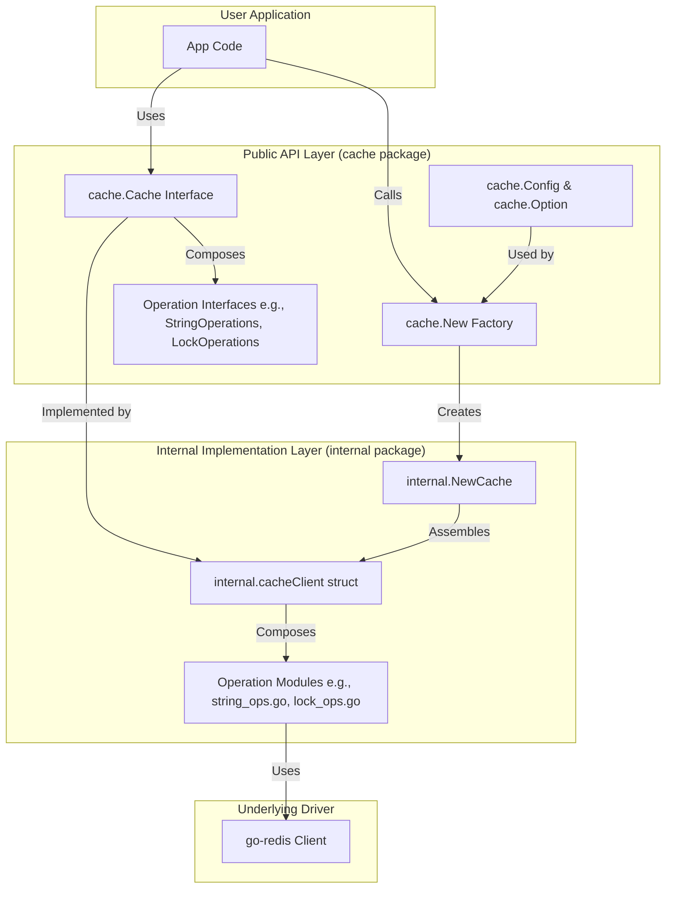

# cache 设计文档

## 🎯 设计目标

`cache` 是为 GoChat 项目设计的统一分布式缓存服务，基于 [go-redis](https://github.com/redis/go-redis) 构建。其核心设计目标是提供一个**高性能、功能完备、类型安全且易于使用**的 Redis 操作层。

### 核心设计原则

1.  **简洁易用**：提供清晰、直观的 API，隐藏底层 `go-redis` 的复杂性。
2.  **功能完备**：封装常用的 Redis 操作，包括字符串、哈希、集合、分布式锁和布隆过滤器。
3.  **类型安全**：所有与时间相关的参数（如过期时间）均使用 `time.Duration`，避免魔术数字和单位混淆。
4.  **面向接口**：所有功能通过 `cache.Cache` 接口暴露，遵循依赖倒置原则，便于测试和模拟 (mocking)。
5.  **配置灵活**：提供合理的默认配置 (`DefaultConfig`) 和函数式选项 (`Option`)，易于定制和扩展。
6.  **清晰分层**：严格区分公共 API (`cache/`) 和内部实现 (`cache/internal/`)，实现关注点分离。

## 🏗️ 架构设计

`cache` 模块遵循 **客户端包装器 (Client Wrapper)** 的设计模式，将 `go-redis` 的功能封装在一个更高级、更符合业务需求的 API 之后。

### 整体架构



### 关键组件设计

#### 1. 工厂函数 (`cache.New`)

**设计要点**:
*   **唯一入口**: `New` 是创建 `Cache` 实例的唯一入口，封装了所有初始化逻辑。
*   **配置转换**: 将用户友好的 `cache.Config` 转换为内部使用的 `internal.Config`，实现内外隔离。
*   **依赖注入**: 通过 `Option` 函数（如 `WithLogger`）注入日志记录器等外部依赖，实现控制反转 (IoC)。
*   **日志集成**: 与 `im-infra/clog` 无缝集成，在实例创建时记录关键配置信息。

**代码示例** (`cache.go`):
```go
func New(ctx context.Context, cfg Config, opts ...Option) (Cache, error) {
    // 应用函数式选项
	options := &Options{}
	for _, opt := range opts {
		opt(options)
	}

    // ... Logger 初始化 ...

    // 将顶层 Config 转换为内部使用的 internal.Config
	internalCfg := internal.Config{
		Addr:            cfg.Addr,
		// ...
	}

	// 创建 cache 实例
	return internal.NewCache(ctx, internalCfg, componentLogger)
}
```

#### 2. 核心接口 (`cache.Cache`)

**设计要点**:
*   **接口组合**: `Cache` 接口通过组合多个更小的、按功能划分的接口（如 `StringOperations`, `HashOperations`）来定义其能力。这遵循了接口隔离原则 (ISP)。
*   **抽象定义**: 定义了所有缓存操作的契约，实现与具体实现 `internal.cacheClient` 的解耦。
*   **易于测试**: 调用方可以轻松地为 `Cache` 接口创建模拟实现，用于单元测试。

**代码示例** (`interfaces.go`):
```go
type Cache interface {
	StringOperations
	HashOperations
	SetOperations
	LockOperations
	BloomFilterOperations
	ScriptingOperations

	Ping(ctx context.Context) error
	Close() error
}
```

#### 3. 公共/内部隔离

**设计要点**:
*   **封装实现**: 所有具体的实现逻辑都位于 `internal` 包中，对外部调用者不可见。这防止了用户错误地依赖具体实现。
*   **职责分离**:
    *   `cache/` (公共层): 负责定义接口、配置结构和工厂函数。它是模块的稳定门面。
    *   `cache/internal/` (内部层): 负责与 `go-redis` 交互，实现所有接口定义的业务逻辑。
*   **键名管理**: 内部实现统一处理 `KeyPrefix`，对上层透明，简化了业务代码。

**目录结构**:
```
cache/
├── cache.go              # 主入口，New 工厂函数
├── interfaces.go         # 所有公共接口定义
├── config.go             # 公共配置结构体
├── options.go            # Option 函数
└── internal/             # 内部实现
    ├── client.go         # 核心客户端实现 (cacheClient)
    ├── *_ops.go          # 按功能划分的操作模块
    └── ...
```

#### 4. 分布式锁 (`LockOperations`)

**设计要点**:
*   **原子操作**: 锁的获取基于 Redis 的 `SET NX` 原子操作，保证互斥性。
*   **自动续期**: 返回的 `Lock` 对象可以包含一个后台 goroutine 来自动续期（如果设计需要），防止锁因业务执行时间过长而过期。
*   **所有权验证**: 锁的释放采用 Lua 脚本，确保只有锁的持有者才能释放它，防止误删。
*   **接口封装**: `Lock` 接口 (`Unlock`, `Refresh`) 封装了锁的生命周期管理，使用简单。

**代码示例** (`interfaces.go`):
```go
type LockOperations interface {
	Lock(ctx context.Context, key string, expiration time.Duration) (Lock, error)
}

type Lock interface {
    Unlock(ctx context.Context) error
    Refresh(ctx context.Context, expiration time.Duration) error
}
```

## 🎨 设计模式应用

*   **工厂模式 (Factory Pattern)**: `cache.New` 函数封装了 `Cache` 实例的复杂创建过程。
*   **外观模式 (Facade Pattern)**: `cache` 包为底层的 `go-redis` 客户端提供了一个简化的、统一的接口。
*   **选项模式 (Functional Options Pattern)**: `WithLogger` 等 `Option` 函数提供了灵活、可扩展的配置方式。
*   **接口隔离原则 (Interface Segregation Principle)**: 将 `Cache` 接口分解为 `StringOperations`、`HashOperations` 等多个小接口，使得客户端只需依赖它们需要的方法。
*   **依赖注入 (Dependency Injection)**: 通过 `WithLogger` 将日志记录器注入到 `cache` 实例中，实现了解耦。

## 🔧 关键技术决策

### 1. 为什么选择 `go-redis`？

*   **事实标准**: `go-redis` 是 Go 社区最流行、最活跃的 Redis 客户端。
*   **性能优越**: 具有高性能的连接池和协议解析。
*   **功能全面**: 支持 Redis 的所有核心功能以及集群、哨兵、管道和 Lua 脚本等高级特性。
*   **社区支持**: 拥有庞大的用户基础和活跃的社区，问题可以快速得到解决。

### 2. 为什么进行公共/内部包隔离？

*   **强制解耦**: 阻止上层业务代码依赖任何具体的实现细节，只允许通过公共接口进行交互。
*   **API 稳定性**: 内部实现的重构（例如，从 `go-redis` 迁移到其他库）不会影响公共 API 的稳定性。
*   **明确契约**: 公共 API 层定义了清晰的、稳定的使用契约，降低了维护成本。

### 3. 为什么所有时间参数都使用 `time.Duration`？

*   **类型安全**: 避免了使用 `int64` 或 `float64` 时可能出现的单位混淆（秒、毫秒、纳秒）。
*   **可读性强**: `5 * time.Minute` 远比 `300` 更具可读性和可维护性。
*   **防止错误**: 编译器可以捕获类型不匹配的错误，减少了运行时 bug。

## 🔮 未来扩展方向

*   **指标监控集成**: 与 `im-infra/metrics` 集成，暴露 Redis 命令延迟、命中率、连接池状态等关键指标。
*   **分布式追踪集成**: 集成 OpenTelemetry，实现对 Redis 命令的端到端追踪。
*   **更丰富的 Redis 模块支持**: 增加对 RediSearch、RedisJSON 等高级模块的封装。
*   **客户端缓存 (Client-Side Caching)**: 支持 Redis 6 的客户端缓存（Tracking 功能），进一步降低延迟。
