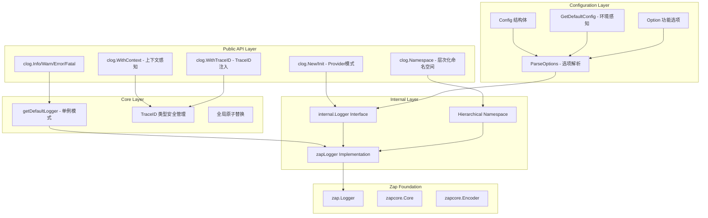

# clog 设计文档

## 🎯 设计目标

clog 是为 GoChat 项目设计的结构化日志库，基于 uber-go/zap 构建。设计目标是提供一个**简洁、高性能、上下文感知**的日志解决方案，完全遵循 GoChat 项目的开发规范。

### 核心设计原则

1. **规范优先**：严格遵循 im-infra 组件设计规范
2. **上下文感知**：自动从 context 中提取 trace_id，支持分布式追踪
3. **层次化命名空间**：统一的命名空间系统，支持链式调用
4. **类型安全**：封装 context 键，避免键名冲突
5. **环境感知**：提供环境相关的默认配置

## 🏗️ 新架构设计

### 整体架构



### 关键组件设计

#### 1. Provider 模式实现

**设计要点**：
- 严格遵循 `New(ctx context.Context, config *Config, opts ...Option)` 签名
- 支持环境相关的默认配置 `GetDefaultConfig(env string)`
- 功能选项模式注入依赖
- 完整的错误处理和降级机制

**核心实现**：
```go
// 标准 Provider 签名
func New(ctx context.Context, config *Config, opts ...Option) (Logger, error) {
    // 解析选项
    options := ParseOptions(opts...)
    
    // 创建 logger 实例
    logger, err := internal.NewLogger(config, options.namespace)
    if err != nil {
        // 降级处理：返回 fallback logger
        return internal.NewFallbackLogger(), err
    }
    return logger, nil
}

// 环境感知的默认配置
func GetDefaultConfig(env string) *Config {
    switch env {
    case "development":
        return &Config{
            Level:       "debug",
            Format:      "console", 
            EnableColor: true,
        }
    case "production":
        return &Config{
            Level:       "info",
            Format:      "json",
            EnableColor: false,
        }
    }
}
```

**技术亮点**：
- **规范遵循**：完全符合 im-infra 组件契约
- **环境优化**：开发/生产环境的差异化配置
- **降级保证**：初始化失败时系统仍可用
- **类型安全**：配置验证和错误处理

#### 2. 层次化命名空间系统

**设计要点**：
- 统一的命名空间概念，替代之前的 service/module 分离
- 支持链式调用构建深层命名空间
- 每个层次自动组合形成完整路径
- 与 trace_id 无缝集成

**核心实现**：
```go
// 链式命名空间创建
func (s *PaymentService) ProcessPayment(ctx context.Context) error {
    // 支持深层嵌套的命名空间
    paymentLogger := clog.Namespace("payment")
                        .Namespace("processor") 
                        .Namespace("stripe")
    
    paymentLogger.Info("开始处理支付请求", 
        clog.String("order_id", req.OrderID))
    return nil
}

// 输出示例
{
  "namespace": "im-gateway.payment.processor.stripe",
  "trace_id": "abc123-def456", 
  "msg": "开始处理支付请求",
  "order_id": "order_123"
}
```

**设计优势**：
- **概念统一**：所有标识都是"命名空间"，消除 service/module 混淆
- **组合灵活**：支持任意层次的嵌套和组合
- **可观测性强**：完整的命名空间路径便于精确过滤和分析
- **API一致**：所有层次都使用相同的 `Namespace()` 方法

#### 3. 类型安全的 TraceID 管理

**设计要点**：
- 使用私有 struct 类型作为 context 键，避免冲突
- 分离注入（WithTraceID）和提取（WithContext）操作
- 完全封装 trace_id 管理细节
- 遵循 Go 社区最佳实践

**核心实现**：
```go
// 类型安全的 context 键
var traceIDKey struct{}

// TraceID 注入 - 通常在中间件/拦截器中调用
func WithTraceID(ctx context.Context, traceID string) context.Context {
    return context.WithValue(ctx, traceIDKey, traceID)
}

// TraceID 提取 - 业务代码中自动获取
func WithContext(ctx context.Context) Logger {
    logger := getDefaultLogger()
    
    if ctx != nil {
        if traceID := ctx.Value(traceIDKey); traceID != nil {
            if id, ok := traceID.(string); ok && id != "" {
                return logger.With(zap.String("trace_id", id))
            }
        }
    }
    return logger
}
```

**技术亮点**：
- **类型安全**：私有 struct 键避免键名冲突
- **封装完整**：用户无需关心 trace_id 存储细节
- **API对称**：WithTraceID(注入) + WithContext(提取)形成完整闭环
- **性能优化**：直接类型断言，避免反射开销

#### 4. 配置系统重构

**设计要点**：
- 所有配置相关代码集中在 config.go
- 功能选项模式支持依赖注入
- 环境相关的默认配置
- 统一的配置验证机制

**核心实现**：
```go
// config.go - 配置管理中心
type Config struct {
    Level       string `json:"level" yaml:"level"`
    Format      string `json:"format" yaml:"format"`
    // ... 其他配置字段
}

// 功能选项
type Option func(*options)

type options struct {
    namespace string
}

// WithNamespace 设置根命名空间
func WithNamespace(name string) Option {
    return func(o *options) {
        o.namespace = name
    }
}

// 选项解析器
func ParseOptions(opts ...Option) *options {
    var result options
    for _, opt := range opts {
        opt(&result)
    }
    return &result
}
```

**组织优势**：
- **职责清晰**：配置相关代码统一管理
- **扩展便利**：新增选项无需修改多处代码
- **类型安全**：编译时检查选项类型
- **维护简单**：配置逻辑集中，便于调试和修改

## 🔧 关键技术决策

### 1. 为什么使用层次化命名空间而不是模块系统？

**决策理由**：
- **概念统一**：消除 service/module 的概念混淆
- **组合灵活**：支持任意层次的嵌套，而不仅仅是两层
- **可观测性强**：完整路径便于日志分析和过滤
- **API一致**：统一的 `Namespace()` 方法，降低学习成本

**对比分析**：
| 维度 | 旧模块系统 | 新命名空间系统 |
|------|-----------|--------------|
| API数量 | 2套API (WithService + Module) | 1套API (WithNamespace + Namespace) |
| 概念复杂度 | 高 (service vs module 边界模糊) | 低 (统一的命名空间概念) |
| 扩展性 | 差 (固定的两层结构) | 强 (任意层次的嵌套) |
| 一致性 | 差 (Option vs 直接方法) | 高 (一致的调用方式) |
| 可读性 | 中 (需要理解两套概念) | 高 (自然的层次结构) |

### 2. 为什么使用类型安全的 context 键？

**决策理由**：
- **避免冲突**：私有 struct 键不会与其他包冲突
- **类型安全**：编译时检查，避免运行时错误
- **封装完整**：用户无需关心键的具体实现
- **符合惯例**：Go 社区处理 context 传递的最佳实践

### 3. 为什么将配置代码集中到 config.go？

**决策理由**：
- **职责分离**：配置逻辑与业务逻辑分离
- **维护便利**：配置相关修改只需在一个文件中进行
- **扩展性强**：新增配置选项不影响其他模块
- **代码整洁**：避免配置代码散落在多个文件中

## 🎨 设计模式应用

### 1. Provider 模式
- **应用场景**：组件初始化和依赖注入
- **实现方式**：标准 `New(ctx, config, opts...)` 签名
- **优势**：符合 im-infra 规范、支持依赖注入、便于测试

### 2. 功能选项模式 (Functional Options)
- **应用场景**：配置 Logger 实例
- **实现方式**：`Option func(*options)` 类型
- **优势**：API 扩展性强、参数可选、向后兼容

### 3. 单例模式 (Singleton)
- **应用场景**：全局默认 logger
- **实现方式**：`sync.Once` + `atomic.Value`
- **优势**：线程安全、懒加载、支持热更新

### 4. 装饰器模式 (Decorator)
- **应用场景**：`Namespace()` 方法
- **实现方式**：在现有 logger 基础上添加命名空间字段
- **优势**：功能扩展、保持接口一致、支持链式调用

## 🚀 性能优化策略

### 1. 零分配日志记录
- 基于 zap 的零分配架构
- 直接导出 zap 字段构造函数
- 避免额外的包装和转换开销

### 2. 类型安全的 context 操作
- 使用私有 struct 键避免 map 查找
- 直接类型断言，避免反射
- 预分配常量避免运行时分配

### 3. 高效的命名空间管理
- 命名空间字段在创建时一次性添加
- 避免每次日志记录时的字符串拼接
- 支持命名空间复用和缓存

## 📊 向后兼容性

### 破坏性变更说明

| 旧 API | 新 API | 变更原因 |
|--------|--------|----------|
| `clog.Module("user")` | `clog.Namespace("user")` | 统一命名空间概念 |
| `clog.Init(config)` | `clog.Init(ctx, &config, opts...)` | Provider 模式规范 |
| `clog.New(config)` | `clog.New(ctx, &config, opts...)` | 上下文感知和选项支持 |
| `context.WithValue(ctx, "traceID", id)` | `clog.WithTraceID(ctx, id)` | 类型安全管理 |
| `clog.SetTraceIDHook()` | **移除** | 简化 API 设计 |

### 迁移指南

1. **模块化 → 命名空间**：
   ```go
   // 旧代码
   logger := clog.Module("user")
   
   // 新代码  
   logger := clog.Namespace("user")
   ```

2. **初始化方式**：
   ```go
   // 旧代码
   clog.Init(config)
   
   // 新代码
   clog.Init(context.Background(), &config, clog.WithNamespace("my-service"))
   ```

3. **TraceID 管理**：
   ```go
   // 旧代码
   ctx := context.WithValue(ctx, "traceID", "abc123")
   
   // 新代码
   ctx := clog.WithTraceID(ctx, "abc123")
   ```

## 🔮 未来扩展方向

### 1. 配置中心集成
- 支持从 etcd 动态读取配置
- 配置热更新机制
- 配置版本管理

### 2. 高级选项支持
- `WithEncoder()` - 自定义编码器
- `WithOutput()` - 自定义输出目标
- `WithHook()` - 自定义处理钩子

### 3. 性能监控集成
- 日志性能指标收集
- 异常日志自动告警
- 日志流量控制

### 4. 分布式追踪增强
- OpenTelemetry 集成
- 自动 Span 关联
- 追踪上下文传播

## 📝 使用示例

### 基础使用
```go
// 服务初始化
func main() {
    config := clog.GetDefaultConfig("production")
    if err := clog.Init(context.Background(), config, clog.WithNamespace("im-gateway")); err != nil {
        log.Fatal(err)
    }
    
    clog.Info("服务启动成功")
}
```

### 中间件集成
```go
func TraceMiddleware() gin.HandlerFunc {
    return func(c *gin.Context) {
        traceID := c.GetHeader("X-Trace-ID")
        if traceID == "" {
            traceID = uuid.NewString()
        }
        
        // 注入 traceID
        ctx := clog.WithTraceID(c.Request.Context(), traceID)
        c.Request = c.Request.WithContext(ctx)
        
        c.Next()
    }
}
```

### 业务代码使用
```go
func (s *UserService) CreateUser(ctx context.Context, req *CreateUserRequest) error {
    // 自动获取带 trace_id 的 logger
    logger := clog.WithContext(ctx)
    
    logger.Info("开始创建用户", clog.String("email", req.Email))
    
    // 层次化命名空间
    validationLogger := logger.Namespace("validation")
    validationLogger.Info("验证用户数据")
    
    return nil
}
```

这个重构后的设计完全符合 GoChat 项目的开发规范，提供了更好的类型安全性、可观测性和开发体验。