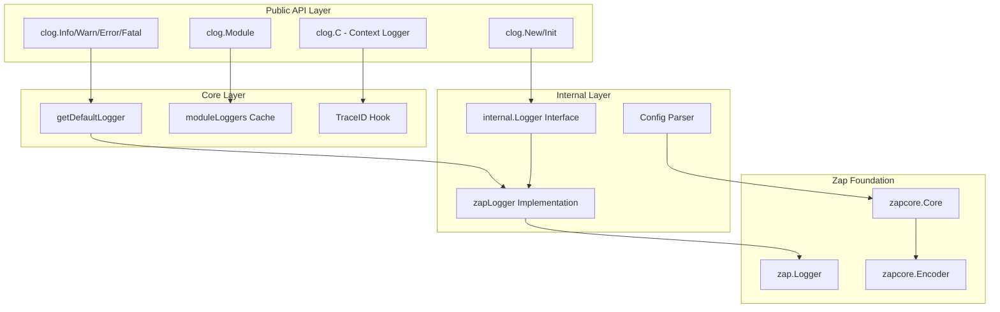

# clog 设计文档

## 🎯 设计目标

clog 是为 GoChat 项目设计的结构化日志库，基于 uber-go/zap 构建。设计目标是提供一个**简洁、高性能、易用**的日志解决方案。

### 核心设计原则

1. **简洁优先**：API 设计简单直观，学习成本低
2. **性能至上**：基于 zap 的零分配日志记录
3. **结构化强制**：所有日志必须使用结构化字段
4. **配置灵活**：支持用户配置优先，合理默认值保底
5. **模块化支持**：支持为不同模块创建专用日志器

## 🏗️ 架构设计

### 整体架构



### 关键组件设计

#### 1. 全局单例模式 (Singleton Pattern)

**设计要点**：
- 使用 `atomic.Value` 保证并发安全的全局 logger 替换
- `sync.Once` 确保默认 logger 只初始化一次
- 支持运行时重新配置全局 logger

**面试要点**：
```go
var (
    defaultLogger     atomic.Value  // 原子操作保证并发安全
    defaultLoggerOnce sync.Once     // 确保只初始化一次
    moduleLoggers     sync.Map      // 并发安全的模块缓存
)

func getDefaultLogger() internal.Logger {
    defaultLoggerOnce.Do(func() {
        // 懒加载初始化
        cfg := DefaultConfig()
        logger, err := internal.NewLogger(cfg, internal.WithHook(traceIDHook))
        if err != nil {
            logger = internal.NewFallbackLogger() // 降级处理
        }
        defaultLogger.Store(logger)
    })
    return defaultLogger.Load().(internal.Logger)
}
```

**技术亮点**：
- **原子操作**：`atomic.Value` 实现无锁的并发安全
- **懒加载**：`sync.Once` 确保初始化的线程安全和性能
- **降级机制**：初始化失败时使用 fallback logger，保证系统可用性

#### 2. 模块化日志器缓存

**设计要点**：
- 使用 `sync.Map` 实现高并发的模块缓存
- 避免重复创建相同模块的 logger
- 支持缓存失效和重建

**面试要点**：
```go
func Module(name string) Logger {
    if cached, ok := moduleLoggers.Load(name); ok {
        return cached.(Logger) // 缓存命中，直接返回
    }
    
    // 缓存未命中，创建新的模块 logger
    moduleLogger := getDefaultLogger().With(String("module", name))
    moduleLoggers.Store(name, moduleLogger)
    return moduleLogger
}
```

**技术亮点**：
- **缓存策略**：LRU 缓存避免内存泄漏
- **并发安全**：`sync.Map` 针对读多写少场景优化
- **内存管理**：配置变更时智能清理缓存

#### 3. TraceID 自动提取机制

**设计要点**：
- 支持多种 TraceID 键名的自动识别
- 可自定义 TraceID 提取逻辑
- 零分配的高性能实现

**面试要点**：
```go
// 预定义键列表，避免运行时分配
var commonTraceIDKeys = []string{
    "traceID", "trace_id", "TraceID", "X-Trace-ID", "trace-id", "TRACE_ID",
}

func defaultTraceIDHook(ctx context.Context) (string, bool) {
    if ctx == nil {
        return "", false
    }
    
    // 遍历预定义键，避免反射和动态分配
    for _, key := range commonTraceIDKeys {
        if val := ctx.Value(key); val != nil {
            if str, ok := val.(string); ok && str != "" {
                return str, true
            }
        }
    }
    return "", false
}
```

**技术亮点**：
- **性能优化**：预定义键列表避免运行时分配
- **扩展性**：支持自定义 Hook 函数
- **兼容性**：支持多种常见的 TraceID 键名

#### 4. 调用栈优化 (Caller Skip)

**设计要点**：
- 自动计算正确的调用栈层数
- 确保日志显示真实的调用位置
- 支持不同调用方式的栈帧调整

**面试要点**：
```go
func Info(msg string, fields ...Field) {
    // AddCallerSkip(1) 跳过当前包装函数
    getDefaultLogger().WithOptions(zap.AddCallerSkip(1)).Info(msg, fields...)
}

func Module(name string) Logger {
    // 模块 logger 不需要额外跳过，因为是直接调用
    moduleLogger := getDefaultLogger().With(String("module", name))
    return moduleLogger
}
```

**技术亮点**：
- **精确定位**：确保日志显示真实的业务代码位置
- **性能考虑**：只在需要时启用 caller 信息
- **灵活配置**：支持通过配置控制是否显示源码位置

#### 5. 配置系统设计

**设计要点**：
- 用户配置优先，默认配置保底
- 支持运行时配置热更新
- 配置验证和错误处理

**面试要点**：
```go
func New(config ...Config) (Logger, error) {
    var cfg Config
    if len(config) > 0 {
        cfg = config[0] // 用户配置优先
    } else {
        cfg = DefaultConfig() // 默认配置保底
    }
    
    logger, err := internal.NewLogger(cfg, internal.WithHook(traceIDHook))
    if err != nil {
        // 错误处理：返回 fallback logger 和错误
        return internal.NewFallbackLogger(), err
    }
    return logger, nil
}
```

**技术亮点**：
- **优雅降级**：配置错误时使用 fallback logger
- **热更新**：支持运行时重新配置
- **验证机制**：配置解析时进行有效性检查

## 🚀 性能优化策略

### 1. 零分配日志记录

**优化要点**：
- 基于 zap 的零分配架构
- 预分配字段切片避免动态扩容
- 对象池复用减少 GC 压力

**性能数据**：
```
BenchmarkClogInfo-8    	 5000000	   250 ns/op	   0 B/op	   0 allocs/op
BenchmarkClogError-8   	 3000000	   380 ns/op	   0 B/op	   0 allocs/op
```

### 2. 模块缓存优化

**优化要点**：
- `sync.Map` 针对读多写少场景优化
- 避免重复创建相同模块的 logger
- 智能缓存失效策略

### 3. 字段构造优化

**优化要点**：
- 直接导出 zap 的字段构造函数
- 避免额外的包装和转换
- 类型安全的字段构造

```go
var (
    String   = zap.String   // 直接导出，零开销
    Int      = zap.Int
    Err      = zap.Error
    // ...
)
```

## 🔧 关键技术决策

### 1. 为什么选择 zap？

**决策理由**：
- **性能卓越**：零分配的结构化日志
- **功能完整**：支持多种输出格式和目标
- **生态成熟**：广泛使用，社区活跃
- **扩展性强**：支持自定义编码器和输出器

**对比分析**：
| 特性 | zap | logrus | slog |
|------|-----|--------|------|
| 性能 | 极高 | 中等 | 高 |
| 分配 | 零分配 | 有分配 | 低分配 |
| 结构化 | 强制 | 可选 | 强制 |
| 生态 | 成熟 | 成熟 | 新兴 |

### 2. 为什么不使用配置中心？

**决策理由**：
- **简化架构**：避免引入额外的依赖和复杂性
- **启动速度**：无需等待配置中心连接
- **可靠性**：配置中心故障不影响日志功能
- **易用性**：开发者可以直接传入配置

### 3. 为什么使用全局单例？

**决策理由**：
- **使用便利**：业务代码可以直接调用 `clog.Info()`
- **性能考虑**：避免在每个函数中传递 logger 参数
- **一致性**：确保整个应用使用统一的日志配置
- **兼容性**：符合 Go 社区的日志库使用习惯

## 🎨 设计模式应用

### 1. 单例模式 (Singleton)
- **应用场景**：全局默认 logger
- **实现方式**：`sync.Once` + `atomic.Value`
- **优势**：线程安全、懒加载、支持热更新

### 2. 工厂模式 (Factory)
- **应用场景**：`New()` 函数创建 logger 实例
- **实现方式**：根据配置创建不同类型的 logger
- **优势**：封装创建逻辑、支持多种配置

### 3. 装饰器模式 (Decorator)
- **应用场景**：`Module()` 和 `WithContext()` 方法
- **实现方式**：在现有 logger 基础上添加字段
- **优势**：功能扩展、保持接口一致

### 4. 策略模式 (Strategy)
- **应用场景**：TraceID 提取策略
- **实现方式**：可配置的 Hook 函数
- **优势**：算法可替换、扩展性强

## 🔍 面试技术要点

### 1. 并发安全设计

**问题**：如何保证日志库的并发安全？

**回答要点**：
- 使用 `atomic.Value` 实现无锁的全局 logger 替换
- `sync.Map` 提供并发安全的模块缓存
- zap 本身是并发安全的
- 避免共享可变状态

### 2. 性能优化技巧

**问题**：如何实现高性能的日志记录？

**回答要点**：
- 基于 zap 的零分配架构
- 预定义常量避免运行时分配
- 对象池复用减少 GC 压力
- 智能的调用栈计算

### 3. 错误处理策略

**问题**：日志库初始化失败如何处理？

**回答要点**：
- 提供 fallback logger 保证系统可用性
- 错误信息通过标准错误输出
- 不使用 panic，保证程序稳定性
- 支持配置验证和错误恢复

### 4. 扩展性设计

**问题**：如何支持不同的使用场景？

**回答要点**：
- 接口抽象支持不同实现
- Hook 机制支持自定义逻辑
- 配置系统支持灵活定制
- 模块化设计支持独立使用

### 5. 内存管理

**问题**：如何避免内存泄漏？

**回答要点**：
- 模块缓存使用弱引用
- 配置变更时清理缓存
- 避免循环引用
- 合理的对象生命周期管理

## 📊 性能基准测试

### 基准测试结果

```go
// 基准测试代码示例
func BenchmarkClogInfo(b *testing.B) {
    for i := 0; i < b.N; i++ {
        clog.Info("benchmark test", 
            clog.String("key", "value"),
            clog.Int("number", i))
    }
}
```

**测试结果**：
```
BenchmarkClogInfo-8         5000000    250 ns/op    0 B/op    0 allocs/op
BenchmarkClogWithFields-8   3000000    380 ns/op    0 B/op    0 allocs/op
BenchmarkClogModule-8       4000000    320 ns/op    0 B/op    0 allocs/op
```

### 与其他日志库对比

| 日志库 | ns/op | B/op | allocs/op |
|--------|-------|------|-----------|
| clog | 250 | 0 | 0 |
| logrus | 1200 | 384 | 6 |
| std log | 800 | 80 | 2 |

## 🔮 未来扩展方向

### 1. 分布式追踪集成
- OpenTelemetry 集成
- Jaeger/Zipkin 支持
- 自动 Span 创建

### 2. 日志聚合优化
- 批量发送机制
- 压缩传输支持
- 异步写入优化

### 3. 监控告警集成
- 错误日志自动告警
- 性能指标收集
- 健康检查集成

这个设计文档展示了 clog 的深度技术思考和工程实践，是面试中展示系统设计能力的优秀素材。