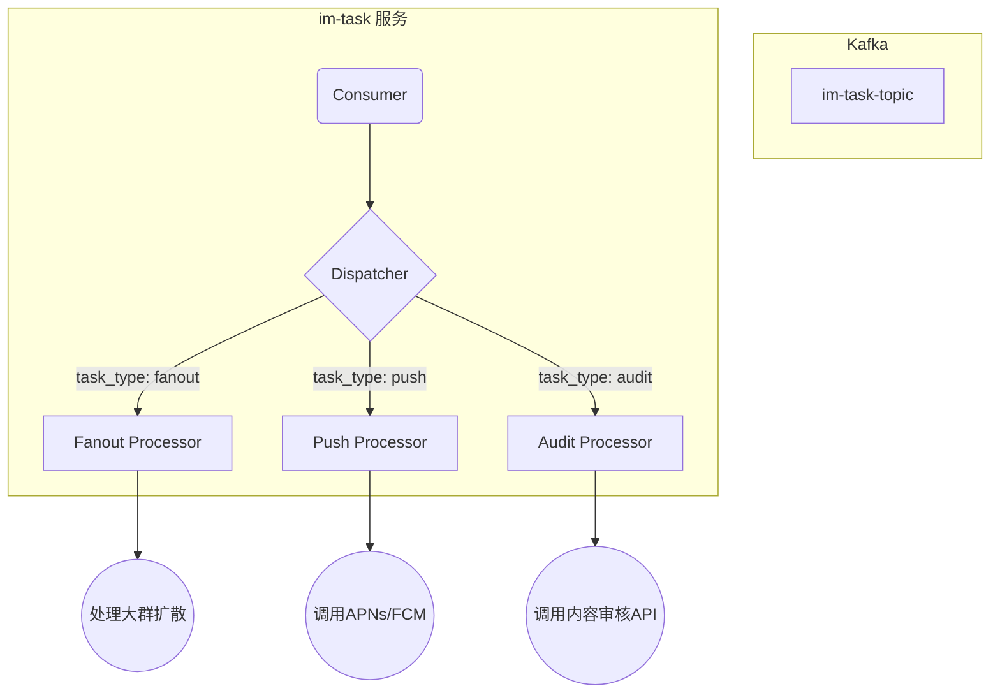
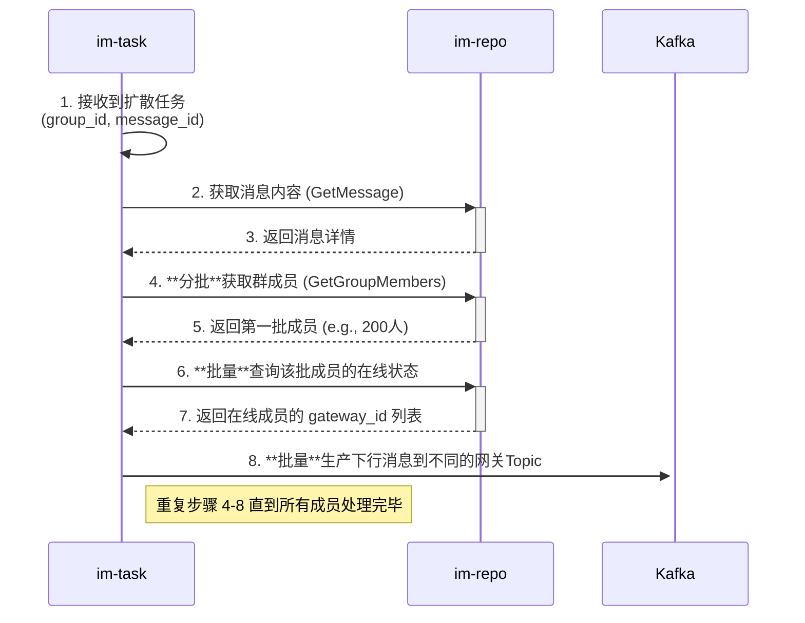

# im-task 异步任务服务设计

`im-task` 是 GoChat 系统的“重型武器库”，它负责处理所有耗时、繁重或需要与外部系统交互的异步任务。通过将这些任务从核心的 `im-logic` 服务中剥离，`im-task` 保证了核心业务的响应速度和稳定性。

## 1. 核心职责

1.  **异步任务消费者**: 它是 GoChat 系统中所有**非实时任务**的唯一消费者。它通过**消费 Kafka 中的任务消息**来驱动自己的工作。
2.  **重负载处理器**: 专门处理那些会严重消耗 CPU 或 I/O 资源的任务，从而避免拖垮核心的 `im-logic` 服务。
    *   **典型案例**: **超大群（如万人群）的消息扩散**。
3.  **外部系统集成器**: 负责与所有第三方系统进行交互。这些交互通常伴随着网络延迟和不确定性。
    *   **典型案例**: 调用苹果/谷歌的服务器进行**离线推送**；调用第三方服务进行**内容安全审核**。
4.  **后台作业执行者**: 执行所有预定的、周期性的后台任务。
    *   **典型案例**: **数据归档**、**生成统计报表**等。

**设计目标**: 开发一个**可靠、可扩展、易于增加新任务类型**的异步任务处理服务。

## 2. 架构与设计模式

`im-task` 的设计核心是**任务处理的抽象**和**插件化**。我们能够非常方便地增加一种新的任务处理器，而不需要改动核心的消费逻辑。

### 2.1 任务分发器模式 (Task Dispatcher Pattern)

1.  **Consumer**: `im-task` 的 Kafka 消费者从 `im-task-topic` 中拉取消息。
2.  **Dispatcher**: 消费者将消息交给分发器。分发器检查消息头中的 `task_type` 字段。
3.  **Processor**: 根据 `task_type`，分发器将消息路由给一个已经注册的、专门处理该类型任务的处理器（Processor）。
4.  **插件化**: 每个 Processor 都是一个独立的 Go 模块，实现了统一的 `TaskProcessor` 接口。增加新任务类型只需要编写一个新的 Processor 并注册到分发器即可。

### 2.2 技术栈

| 用途 | 库/工具 | 说明 |
| :--- | :--- | :--- |
| **基础库** | `im-infra` | 提供统一的基础能力，如配置、日志、RPC等。 |
| **Kafka 客户端** | `im-infra/mq` | 核心组件，用于消费任务。 |
| **gRPC 客户端** | `im-infra/rpc` | 用于调用 `im-repo` 服务获取任务处理所需的数据。 |
| **服务发现** | `im-infra/coord` | 通过 etcd 发现 `im-repo` 服务。 |
| **HTTP 客户端**| `net/http` | 用于调用第三方 RESTful API (如内容审核、离线推送)。 |

## 3. 核心任务详解

### 3.1 大群消息扩散 (Large Group Fan-out)

这是 `im-task` 最重要的任务之一。

**关键设计点**:

-   **分批处理**: 为了避免一次性加载数万甚至数十万群成员到内存中，`im-task` 会分批次（例如每批200人）从 `im-repo` 拉取成员列表进行处理。
-   **批量查询**: 在处理每一批成员时，会使用**批量查询**接口从 `im-repo` 获取他们的在线状态，而不是逐个查询，以极大地减少RPC调用次数。
-   **健壮性**: 任务处理器会妥善处理 `im-repo` 或 `Kafka` 的临时性故障，并包含重试逻辑。对于无法恢复的错误，任务将被投递到死信队列（Dead-Letter Queue）等待人工干预。

## 4. 可扩展性

得益于任务分发器模式，为 `im-task` 添加新功能非常简单。例如，要添加一个“内容审核”任务：

1.  **定义任务**: `im-logic` 在遇到需要审核的内容时，向 `im-task-topic` 生产一条 `task_type` 为 `content_audit` 的消息。
2.  **创建处理器**: 在 `im-task` 项目中，创建一个新的 `audit_processor.go` 文件，并实现 `TaskProcessor` 接口。
3.  **实现逻辑**: 在 `Process` 方法中，调用 `im-repo` 获取内容详情，然后通过 HTTP 客户端调用第三方审核服务。
4.  **注册处理器**: 在 `im-task` 的启动逻辑中，将新的 `AuditProcessor` 实例注册到分发器：`dispatcher.Register("content_audit", auditProcessor)`。

整个过程无需修改任何现有代码，实现了高度的解耦和可扩展性。
